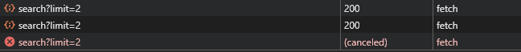

# Subscriptions in Angular 22+

In Single Page Applications lots of data are loaded asynchronously in various ways. Sometimes we just need Data once, other times we want to stay informed (through a subscription) on what is happening for as long as we have the page open.

## The Problem

If you subscribe to an observable inside a component, you need to make sure to unsubscribe when the component is destroyed. Otherwise the subscription keeps running in the background and you end up with a memory leak.

This is one of the most common sources of bugs in Angular applications. When a component subscribes to an observable (like a timer, HTTP request, or WebSocket), the subscription remains active even after the component is destroyed. This can lead to:

- **Memory leaks**: Subscriptions keep consuming memory and resources
- **Unexpected behavior**: Old subscriptions continue to update state in destroyed components
- **Performance degradation**: Multiple overlapping subscriptions accumulate over time

This post explores different approaches to solve this problem, from manual unsubscription to modern RxJS operators.

This post is organized into 5 sections:

## 1. Setup

This section establishes a complete example that we'll use to demonstrate the subscription problem and progressively improve it through different solutions.

### Data Service
We'll create a `DataService` that fetches data from an external API. This service represents any real-world data source in your Angular application (REST API, GraphQL, WebSocket, etc.):
```ts
// data.service.ts
import { inject, Injectable } from '@angular/core';
import { HttpClient } from '@angular/common/http';
import { Observable } from 'rxjs';

@Injectable({
  providedIn: 'root'
})
export class DataService {
  private http = inject(HttpClient);
  private apiUrl = 'https://api.thedogapi.com/v1/images/search?limit=2';

  getDogs(): Observable<unknown> {
    return this.http.get<unknown>(this.apiUrl);
  }
}
```

### A container component

We need a parent component that can dynamically create and destroy our timer component so we can observe subscription behavior:

```html
<!-- takeuntil-example.html -->
<button (click)="timerIsActive() ? hideTimer() : showTimer()">Toggle Timer</button>

@if (timerIsActive()) {
<app-my-timer></app-my-timer>
}
```

```ts
// takeuntil-example.ts
import { Component, signal } from '@angular/core';
import { MyTimer } from './my-timer/my-timer';

@Component({
  selector: 'app-takeuntil-example',
  imports: [MyTimer],
  templateUrl: './takeuntil-example.html',
  styleUrl: './takeuntil-example.scss'
})
export class TakeuntilExample {
  public timerIsActive = signal(false);

  public showTimer(): void {
    this.timerIsActive.set(true);
  }

  public hideTimer(): void {
    this.timerIsActive.set(false);
  }
}
```
 
### The Problematic component

This is the child component where we'll demonstrate the memory leak issue. It has both a long-running observable (timer) and a finite observable (API call):

```html
<!--  my-timer.html -->
<p>The timer: {{ secondsRunning() }}</p>
<p>The dogs: {{ dogs() | json }}</p>
```

```ts
// my-timer.ts
import { Component, inject, OnDestroy, OnInit, signal } from '@angular/core';
import { Subscription, tap, timer } from 'rxjs';
import { DataService } from '../data.service';
import { JsonPipe } from '@angular/common';

@Component({
  selector: 'app-my-timer',
  imports: [JsonPipe],
  templateUrl: './my-timer.html',
  styleUrl: './my-timer.scss'
})
export class MyTimer implements OnInit, OnDestroy {
  private dataService = inject(DataService);

  public dogs = signal<unknown>(null);
  public secondsRunning = signal(0);

  private subscription = new Subscription();
  private timer = timer(0, 1000);

  constructor() {
    // todo
  }

  public ngOnInit(): void {
    // todo
  }

  public ngOnDestroy(): void {
    console.log('on Destroy');
  }
}
```

## 2. Memory Leak Setup

Now let's implement the problematic version that demonstrates memory leaks. We'll subscribe to both observables without properly managing the subscriptions.

**Key observation**: Loading data from a service is often not a problem because HTTP observables auto-complete after emitting one response. However, if you close the component before the response arrives, the pending request continues in the background. Long-running observables (timers, WebSockets, interval) are the real culprits—they emit continuously and have no natural endpoint, so subscriptions persist indefinitely without proper cleanup.

```ts
// my-timer.ts
import { Component, inject, OnDestroy, OnInit, signal } from '@angular/core';
import { Subscription, tap, timer } from 'rxjs';
import { DataService } from '../data.service';
import { JsonPipe } from '@angular/common';

@Component({
  selector: 'app-my-timer',
  imports: [JsonPipe],
  templateUrl: './my-timer.html',
  styleUrl: './my-timer.scss'
})
export class MyTimer implements OnInit, OnDestroy {
  private dataService = inject(DataService);

  public dogs = signal<unknown>(null);
  public secondsRunning = signal(0);

  private subscription = new Subscription();
  private timer = timer(0, 1000);

  constructor() {
    // this will leak // [!code focus] // [!code error]
    this.timer.pipe(tap((value) => console.log(value))).subscribe({ // [!code focus] // [!code warning]
      next: (value: number) => { // [!code focus] // [!code warning]
        this.secondsRunning.set(value); // [!code focus] // [!code warning]
      } // [!code focus] // [!code warning]
    }); // [!code focus] // [!code warning]
  }

  public ngOnInit(): void {
    // this is fine. it's a automatically completing observable after 1 answer // [!code focus]  // [!code highlight]
    this.dataService.getDogs().subscribe({ // [!code focus]
      next: (data: unknown) => { // [!code focus]
        console.log('Dogs received:', data); // [!code focus]
        this.dogs.set(data); // [!code focus]
      } // [!code focus]
    }); // [!code focus]
  }

  public ngOnDestroy(): void {
    console.log('on Destroy');
  }
}
```

### The console output

This is the console output. You can see that the timer is now repeating multiple times

```bash
0                               my-timer.ts:24
Dogs received: (2) [{…}, {…}]   my-timer.ts:35
1                               my-timer.ts:24
2                               my-timer.ts:24
on Destroy                      my-timer.ts:42
# here the component was destroyed. Notice that the subscription is still running
3                               my-timer.ts:24
4                               my-timer.ts:24
# here we created the component again. Notice we have 2 subscriptions now
0                               my-timer.ts:24
5                               my-timer.ts:24
# The Service call is there only once
Dogs received: (2) [{…}, {…}]   my-timer.ts:35
1                               my-timer.ts:24
6                               my-timer.ts:24
2                               my-timer.ts:24
7                               my-timer.ts:24
on Destroy                      my-timer.ts:42
3                               my-timer.ts:24
8                               my-timer.ts:24
4                               my-timer.ts:24
9                               my-timer.ts:24
5                               my-timer.ts:24
```

## 3. Classic way

The classic solution has been the manual approach: collect all subscriptions and clean them up in the `ngOnDestroy` lifecycle hook. This was the standard pattern before RxJS operators like `takeUntil` became available.

**Pros**:
- Explicit and easy to understand
- Works with any subscription

**Cons**:
- Boilerplate code
- Easy to forget to add new subscriptions to the collection
- Error-prone if you have many subscriptions

```ts
// my-timer.ts
import { Component, inject, OnDestroy, OnInit, signal } from '@angular/core';
import { Subscription, tap, timer } from 'rxjs';
import { DataService } from '../data.service';
import { JsonPipe } from '@angular/common';

@Component({
  selector: 'app-my-timer',
  imports: [JsonPipe],
  templateUrl: './my-timer.html',
  styleUrl: './my-timer.scss'
})
export class MyTimer implements OnInit, OnDestroy {
  private dataService = inject(DataService);

  public dogs = signal<unknown>(null);
  public secondsRunning = signal(0);

  private subscription = new Subscription(); // [!code focus]
  private timer = timer(0, 1000);

  constructor() {
    this.subscription.add( // [!code focus]
      this.timer.pipe(tap((value) => console.log(value))).subscribe({ // [!code focus]
        next: (value: number) => { // [!code focus]
          this.secondsRunning.set(value); // [!code focus]
        } // [!code focus]
      }) // [!code focus]
    ); // [!code focus]
  }

  public ngOnInit(): void {
    this.dataService.getDogs().subscribe({
      next: (data: unknown) => {
        console.log('Dogs received:', data);
        this.dogs.set(data);
      }
    });
  }

  public ngOnDestroy(): void {
    console.log('on Destroy');
    this.subscription.unsubscribe();  // [!code focus]
  }
}
```

### The console output

This is the console output. We fixed the memory leak! But now we have to track the active subscriptions.
```bash
0                                 my-timer.ts:24
Dogs received: (2) [{…}, {…}]     my-timer.ts:35
1                                 my-timer.ts:24
2                                 my-timer.ts:24
on Destroy                        my-timer.ts:42
0                                 my-timer.ts:24
Dogs received: (2) [{…}, {…}]     my-timer.ts:35
1                                 my-timer.ts:24
2                                 my-timer.ts:24
on Destroy                        my-timer.ts:42
```

## 4. Modern way

This approach uses the `takeUntil` operator from RxJS, which is much cleaner than the classic method. With `takeUntil`, you don't need to manually track subscriptions—instead, you pipe all observables through a "destroy" subject that signals when to unsubscribe.

**How it works**:
1. Create a `Subject` called `destroy$` in your component
2. Add `takeUntil(this.destroy$)` to every observable's pipe chain
3. In `ngOnDestroy`, emit a value and complete the subject
4. All piped observables automatically unsubscribe

**Pros**:
- No need for a `Subscription` object
- Cleaner than the classic approach
- Can cancel API requests if the component is destroyed before they complete
- Works with services too

**Cons**:
- Still need to add `takeUntil` to every subscription
- Still need to implement `ngOnDestroy`

Reference: [https://www.learnrxjs.io/learn-rxjs/operators/filtering/takeuntil](https://www.learnrxjs.io/learn-rxjs/operators/filtering/takeuntil)

```ts
// my-timer.ts
import { Component, inject, OnInit, signal } from '@angular/core'; // [!code focus]
import { Subject, takeUntil, tap, timer } from 'rxjs'; // [!code focus]
import { DataService } from '../data.service';
import { JsonPipe } from '@angular/common';

@Component({
  selector: 'app-my-timer',
  imports: [JsonPipe],
  templateUrl: './my-timer.html',
  styleUrl: './my-timer.scss'
})
export class MyTimer implements OnInit, OnDestroy { // [!code focus] // [!code --]
export class MyTimer implements OnInit { // [!code focus] // [!code ++]
  private dataService = inject(DataService);

  public dogs = signal<unknown>(null);
  public secondsRunning = signal(0);

  private subscription = new Subscription(); // [!code focus] // [!code --]
  private destroy$ = new Subject<void>(); // [!code focus] // [!code ++]
  private timer = timer(0, 1000);

  constructor() {
    this.timer // [!code focus]
      .pipe( // [!code focus]
        takeUntil(this.destroy$), // [!code focus] // [!code ++]
        tap((value) => console.log(value)) // [!code focus]
      ) // [!code focus]
      .subscribe({ // [!code focus]
        next: (value: number) => { // [!code focus]
          this.secondsRunning.set(value); // [!code focus]
        } // [!code focus]
      }); // [!code focus]
  }

  public ngOnInit(): void {
    this.dataService
      .getDogs()
      .pipe(takeUntil(this.destroy$)) // [!code focus] // [!code ++]
      .subscribe({
        next: (data: unknown) => {
          console.log('Dogs received:', data);
          this.dogs.set(data);
        }
      });
  }

  public ngOnDestroy(): void {
    console.log('on Destroy');
    this.destroy$.next(); // [!code focus] // [!code ++]
    this.destroy$.complete(); // [!code focus] // [!code ++]
  }
}
```

### The console output

This is the console output.

```bash
0                               my-timer.ts:28 
1                               my-timer.ts:28 
2                               my-timer.ts:28 
Dogs received: (2) [{…}, {…}]   my-timer.ts:43 
3                               my-timer.ts:28 
on Destroy                      my-timer.ts:50
0                               my-timer.ts:28 
1                               my-timer.ts:28 
2                               my-timer.ts:28 
Dogs received: (2) [{…}, {…}]   my-timer.ts:43 
3                               my-timer.ts:28 
on Destroy                      my-timer.ts:50
0                               my-timer.ts:28 
1                               my-timer.ts:28 
on Destroy                      my-timer.ts:50
# Notice that we did not get the Dogs response after destroying the component.
```

Here we see that the request is properly canceled


## 5. State of the art

Angular now provides the `takeUntilDestroyed` operator (since Angular 16), which is the best approach. It's part of the `@angular/core/rxjs-interop` package and automatically unsubscribes when the component is destroyed—no manual `ngOnDestroy` needed!

**How it works**:
- `takeUntilDestroyed()` listens to the `DestroyRef` of the current injection context
- When the component is destroyed, the `DestroyRef` emits and automatically completes all piped observables
- Works in injection contexts (components, services, directives, etc.)
- Can pass a custom `DestroyRef` if you need to tie subscriptions to a different lifecycle

**Pros**:
- Cleanest and most modern approach
- No manual `ngOnDestroy` lifecycle hook needed
- Automatically integrated with Angular's dependency injection
- Works in services and anywhere with injection context
- Best performance and least boilerplate

**Cons**:
- Requires Angular 16+
- Still need to add the operator to each subscription

Reference: [https://angular.dev/ecosystem/rxjs-interop/take-until-destroyed](https://angular.dev/ecosystem/rxjs-interop/take-until-destroyed)

```ts
import { Component, inject, OnInit, signal } from '@angular/core';  // [!code focus]
import { tap, timer } from 'rxjs';  // [!code focus]
import { DataService } from '../data.service';
import { JsonPipe } from '@angular/common';
import { takeUntilDestroyed } from '@angular/core/rxjs-interop';  // [!code focus]

@Component({
  selector: 'app-my-timer',
  imports: [JsonPipe],
  templateUrl: './my-timer.html',
  styleUrl: './my-timer.scss'
})
export class MyTimer implements OnInit {  // [!code focus] // [!code ++]
  private dataService = inject(DataService);

  public dogs = signal<unknown>(null);
  public secondsRunning = signal(0);

  private timer = timer(0, 1000);

  constructor() {  // [!code focus]
    this.timer  // [!code focus]
      .pipe(  // [!code focus]
        takeUntilDestroyed()  // [!code focus] // [!code ++]
      )  // [!code focus]
      .pipe(  // [!code focus]
        tap((value) => console.log(value))  // [!code focus]
      )  // [!code focus]
      .subscribe({  // [!code focus]
        next: (value: number) => {  // [!code focus]
          this.secondsRunning.set(value);  // [!code focus]
        }  // [!code focus]
      });  // [!code focus]
  }

  public ngOnInit(): void {
    this.dataService
      .getDogs()
      .pipe(takeUntilDestroyed())  // [!code focus] // [!code ++]
      .subscribe({
        next: (data: unknown) => {
          console.log('Dogs received:', data);
          this.dogs.set(data);
        }
      });
  }
}
```

### The console output

```bash
0                                my-timer.ts:30
1                                my-timer.ts:30
2                                my-timer.ts:30
Dogs received: (2) [{…}, {…}]    my-timer.ts:46
3                                my-timer.ts:30
4                                my-timer.ts:30
# component killed and restarted later
0                                my-timer.ts:30
1                                my-timer.ts:30
2                                my-timer.ts:30
Dogs received: (2) [{…}, {…}]    my-timer.ts:46
3                                my-timer.ts:30
# component killed and restarted later
0                                my-timer.ts:30
1                                my-timer.ts:30
2                                my-timer.ts:30
# component killed. No Dogs log
```

# A Few Things To Keep In Mind

- **`takeUntilDestroyed` is an operator**: It must be part of a pipe chain; you cannot use it standalone on an observable. Always place it in a `.pipe()` call.
  
- **Works with subscription-based patterns**: `takeUntilDestroyed` only works with actual `.subscribe()` calls. If you're using the `async` pipe in your template (`{{ observable$ | async }}`), you don't need it because the `async` pipe automatically unsubscribes when the component is destroyed.
  
- **Compatible with higher-order operators**: If you use `switchMap`, `mergeMap`, `concatMap`, or other higher-order operators, `takeUntilDestroyed` still works correctly. It completes the outer observable, which automatically cancels any inner subscriptions.
  
- **Injection context required**: `takeUntilDestroyed()` without arguments works only within an Angular injection context (components, services, directives). If you need to use it outside an injection context, you must explicitly pass a `DestroyRef`: `takeUntilDestroyed(destroyRef)`.
  
- **Works in services too**: You can use `takeUntilDestroyed` in services by injecting `DestroyRef`. This is useful for managing subscriptions in service methods.

# Summary

**`takeUntilDestroyed` is the modern standard** for managing subscriptions in Angular. Here's a quick comparison:

| Approach | Boilerplate | Error-prone | Scalability |
|----------|------------|-------------|-------------|
| Manual unsubscribe | High | High | Poor |
| `takeUntil` + Subject | Medium | Medium | Fair |
| `takeUntilDestroyed` | Low | Low | Excellent |

If you're still using the classic `Subject` + `takeUntil` pattern or manual unsubscription, it's absolutely worth migrating to `takeUntilDestroyed`. It's cleaner, less error-prone, requires zero boilerplate, and works seamlessly in components, services, and directives. With Angular 16+, there's no reason not to use it.
