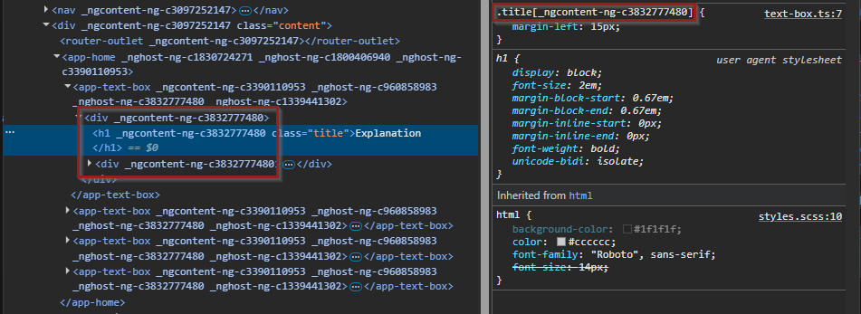
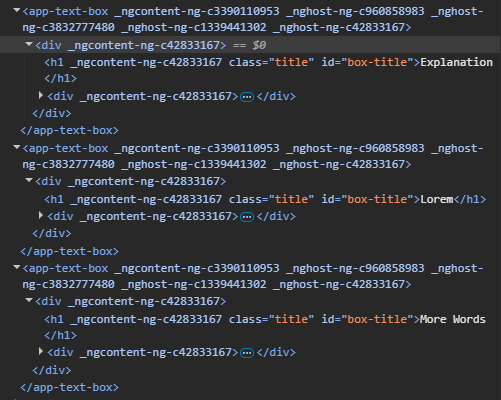
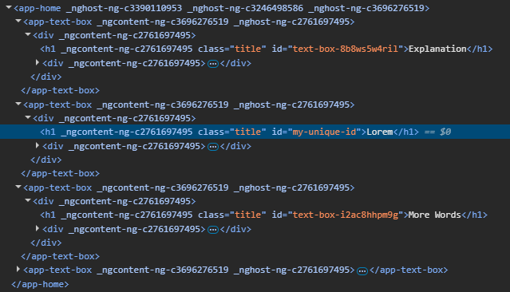

# What is an Id
The mozilla HTML documentation states the following: "The id global attribute defines an identifier (ID) that must be unique within the entire document."   
"[...], it's recommended that developers choose values for ID attributes that are valid CSS identifiers that don't require escaping."   
[https://developer.mozilla.org/en-US/docs/Web/HTML/Reference/Global_attributes/id](https://developer.mozilla.org/en-US/docs/Web/HTML/Reference/Global_attributes/id)

# Class vs Id
In Angular, every component does have their own CSS. If we want to style specific things, we can just throw classes around and reuse the same class name multiple times. That is not a problem because Angular appends a unique name to each CSS selector for each component. All components have CSS that only applies to them. There is a global CSS but you don't want to style specific things in the global CSS.   
Lets say we build a simple Component that is just a container for a title and a description. For simplicity I write this in a single file instead of a ts, html and scss:

```typescript
// text-box.ts
import { ChangeDetectionStrategy, Component, input } from '@angular/core';

@Component({
  selector: 'app-text-box',
  imports: [],
  styles: `
    :host {
      display: block;
    }

    .title { // [!code highlight]
      margin-left: 15px; // [!code highlight]
    } // [!code highlight]
  `,
  template: `
    <div>
      <h1 class="title">{{ title() }}</h1> // [!code highlight]
      <div>
        {{ description() }}
      </div>
    </div>
  `,
  changeDetection: ChangeDetectionStrategy.OnPush,
})
export class TextBox {
  public title = input<string>();
  public description = input<string>();
}

```

I used the CSS class "title". That is probably one of the most generic names you could imagine. But if I use that class name in an other compoent again, we don't suddenly overwrite CSS rules for our text-box component. Why?   
Angular gives each component a unique identifier. If we inspect the components using developer tooles we can see that each CSS class is filtering by the unique attributes. That is pretty handy.


# What's the problem
Now if we use Id's we start to have a problem. Ids are handy too if we want to style a specific item on our page. But honestly in Angular we can just use a css class that we then only use on one element inside that component. But Ids are used for other things too. Sometimes we want to link to headers on the same page and maybe share that link with someone or just keep track of something in typescript. Let's change our component.

```typescript
import { ChangeDetectionStrategy, Component, input } from '@angular/core';

@Component({
  selector: 'app-text-box',
  imports: [],
  styles: `
    :host {
      display: block;
    }

    .title {
      margin-left: 15px;
    }
  `,
  template: `
    <div>
      <h1 [id]="'box-title'" class="title">{{ title() }}</h1> // [!code focus]
      <div>
        {{ description() }}
      </div>
    </div>
  `,
  changeDetection: ChangeDetectionStrategy.OnPush,
})
export class TextBox {
  public title = input<string>();
  public description = input<string>();
}

```
Now if we inspect our page again, we have a problem:   

We have the same Id multiple times! If we go and check the source code of our page with the w3 validator [https://validator.w3.org/](https://validator.w3.org/) we get the following error: Error: Duplicate ID 'box-title'.   

Not only that, if we want to link to one of the headers, we can't do that. Our Url would look something like this: http://localhost:4200/home#box-title but to which header should the website jump now?   

# The Solution
Most of the times we might not need the Id or we need it just inside a component to keep track of said component. For example if we instantiate a modal but lets keep it simple. It would be nice to get unique Ids and if we decide so, we could give a gloabl unique Id to things that we want to link to. There is a solution for that. We add functionality to strings via extension. That is the `String.prototype.appendUniqueId` part. For Typescript to understand it too, we declare an interface for the extension and then we have to make it available in the `main.ts` so we can use it everywhere.   

```typescript
// src/app/extensions/string.extensions.ts
// eslint-disable-next-line @typescript-eslint/no-unused-vars
declare interface String {
  appendUniqueId(): string;
}

String.prototype.appendUniqueId = function(this: string): string {
  const uniqueId = Math.random().toString(36).substring(2);
  return `${this}-${uniqueId}`;
};
```

```typescript
// src/main.ts  // [!code focus]
import { bootstrapApplication } from '@angular/platform-browser';
import { appConfig } from './app/app.config';
import { AppComponent } from './app/app.component';
import './app/extensions/string.extensions';  // [!code focus]

bootstrapApplication(AppComponent, appConfig)
  .catch((err) => console.error(err));
```

Now lets update our component:   
```typescript
import { ChangeDetectionStrategy, Component, input } from '@angular/core';

@Component({
  selector: 'app-text-box',
  imports: [],
  styles: `
    :host {
      display: block;
    }

    .title {
      margin-left: 15px;
    }
  `,
  template: `
    <div>
      <h1 [id]="textId()" class="title">{{ title() }}</h1>  // [!code focus]
      <div>
        {{ description() }}
      </div>
    </div>
  `,
  changeDetection: ChangeDetectionStrategy.OnPush,
})
export class TextBox {
  public textId = input<string>('text-box'.appendUniqueId());  // [!code focus]
  public title = input<string>();
  public description = input<string>();
}

```

If we want to fix the id wherever we use our new component, we define the Id from outside the component:   
```typescript
<app-text-box
    [title]="'Explanation'"
    [description]="'Lorem ipsum is a dummy or placeholder text commonly used in graphic design, publishing, and web development.'">
</app-text-box>
<app-text-box
    [title]="'Lorem'"
    [textId]="'my-unique-id'"  // [!code focus]
    [description]="'Ut enim ad minim veniam, quis nostrud exercitation ullamco laboris nisi ut aliquip ex ea commodo consequat. '">
</app-text-box>
<app-text-box
    [title]="'More Words'"
    [description]="'Lorem ipsum dolor sit amet, consectetur adipiscing elit, sed do eiusmod tempor incididunt ut labore et dolore magna aliqua. '">
</app-text-box>
<app-text-box
    [title]="'Final straw'"
    [description]="'Duis aute irure dolor in reprehenderit in voluptate velit esse cillum dolore eu fugiat nulla pariatur. '">
</app-text-box>
```

Let's have a final look at the generated HTML:


That looks pretty awesome and the unique Id can help us in various situations, not only for HTML ids.