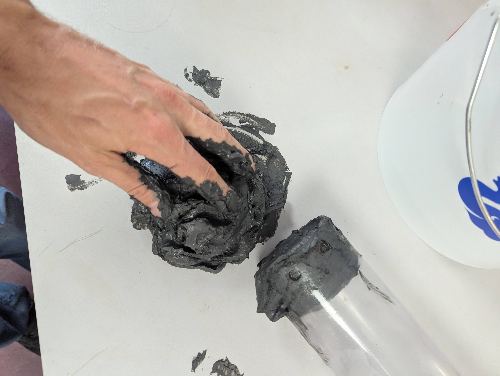
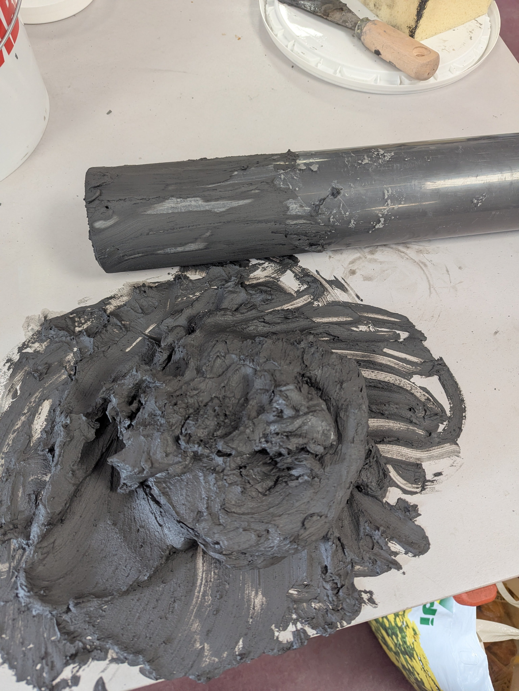
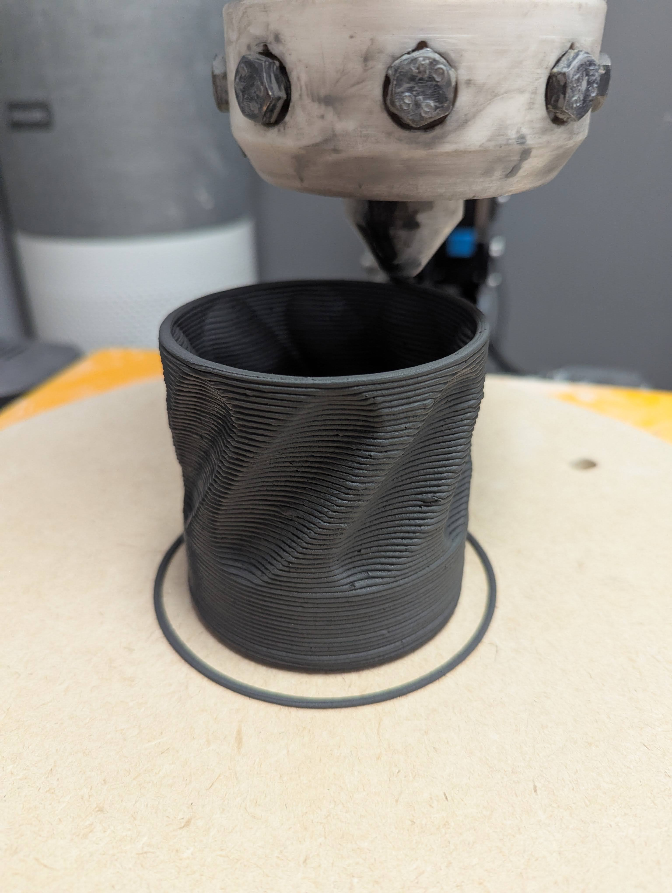

To part 1: [Project 3D Ceramics Part 1](/post/project-3d-ceramics/)

# The Job
Last week was go time. I had around 4.5kg of clay prepared in black. It was too hard already and after adding a bit of water it was too soft. However I tried with what I had.

The filling of the tube was a bit of a pain but because the clay was so wet and soft, it did not contain too many bubbles of air. It was a long day and I finished cleaning just when the fablab closed down. I still have more clay left but it's too much work to do another round.

The first prints were so soft that the cup would barely hold together. I was relieved when I saw that after the first prints the clay was a bit less wet and it actually held together quite well.
Every cup was 10 to 15 minutes of hoping that there were no bigger air bubbles in the glay.

