# Goal
Around 2 months ago I stumbled upon [https://www.ceramicastudio.com/](https://www.ceramicastudio.com/) a US-based studio specialized in 3D printing clay. I know 3D printing, but printing clay with the 3D printing technique got me super excited. Clay just brings another quality, and the pieces the studio made looked so gorgeous. I just had to get my hands on this.

# Learning
So first off, I looked at the printer prices, and I instantly knew: for a single project, this price is way outside the fun money zone. I started looking into alternative options. Around the same time I had a meetup with old friends, and one of them just mentioned that he participated in a workshop for printing clay. So naturally a couple of days later I signed up for the workshop at a makerspace in Zürich: [https://www.dynamo.ch/](https://www.dynamo.ch/). The workshop taught how to use the machine and allowed me to do my own projects after.

3D printing clay has lots of variables and needs way more labor compared to 3D printing PLA. The makerspace has always filled clay tubes prepared for printing, but soon I will have to fill my own tube for my project. See [Prep Work](#Prep-work) for more on that. Besides the filling, clay is not finished after printing. You see, the items need to be printed, dried, burned, glazed, and then burned again.

The printed goods look like the left mug, and after drying and burning the first time, they will shrink significantly in size: 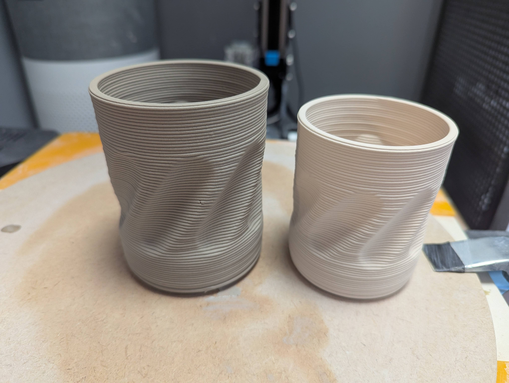

# First Result
The workshop had us modeling something and printing it, and a week later we could glaze the baked pieces. For me it was lots of new things to learn because I had never worked with clay before. I tried different glazes and in the end I was neither happy with my mug forms nor the glazes. My final pieces from the workshop look like this:
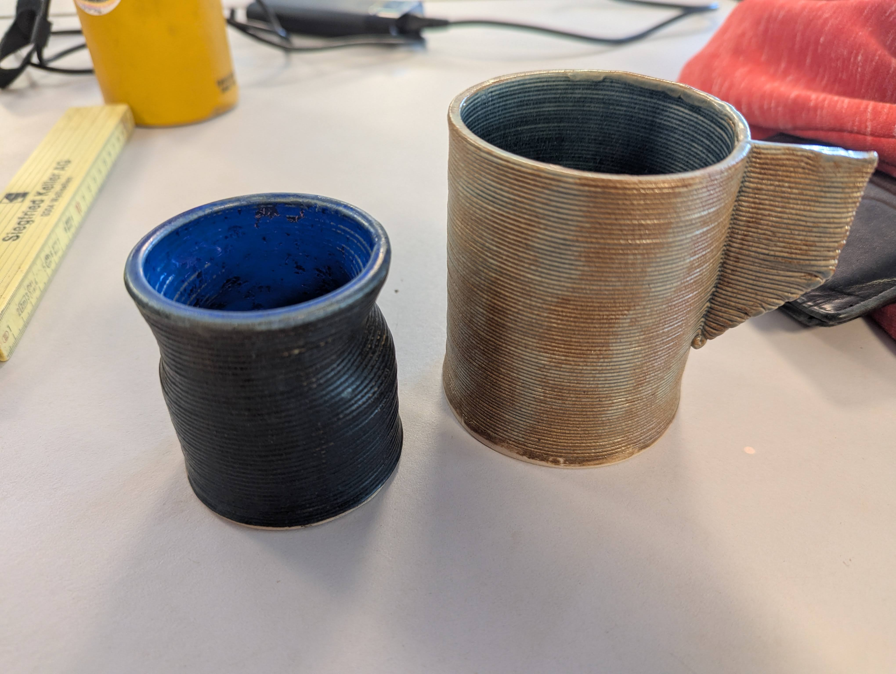

I hoped that the black glaze would be even less glossy and look really black. In the end I was not happy with the forms and the glaze.

# Prototyping
So I went to work on new forms. I switch programs and used blender from here on out because I was more familiar with that software from gamedev. I worked on some shapes and found a couple I wanted to finish.
| | |
----|----
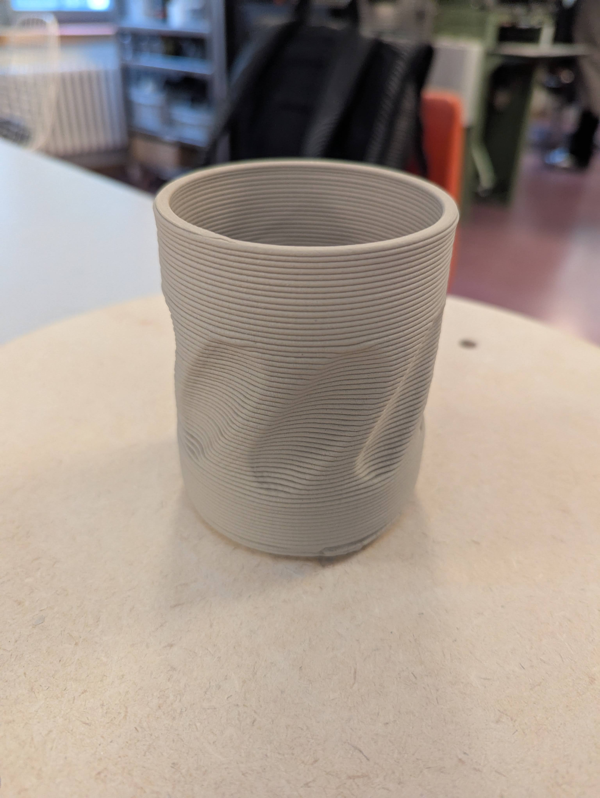 | 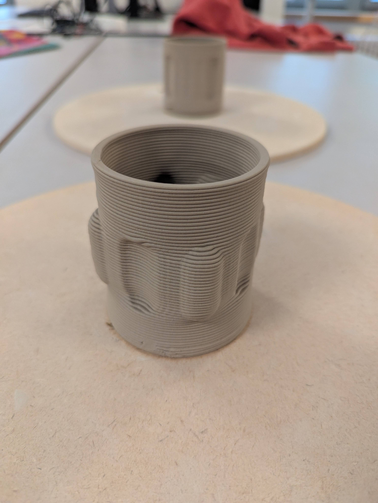
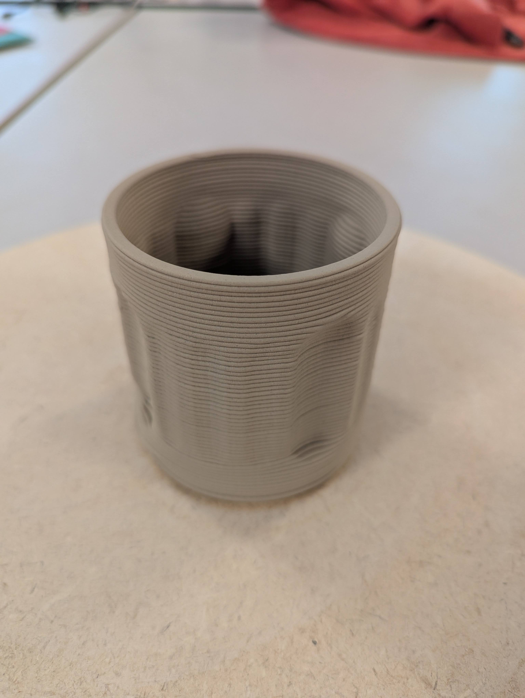 | 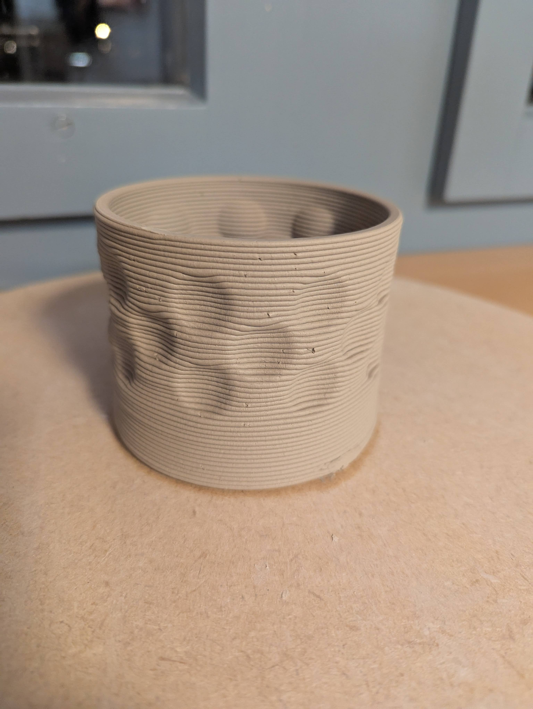

Besides the new forms, I bought my own glazes, and I glazed my new prototypes with the new glaze. This time I left the outside untreated. We'll find out how the new glaze turns out next time.
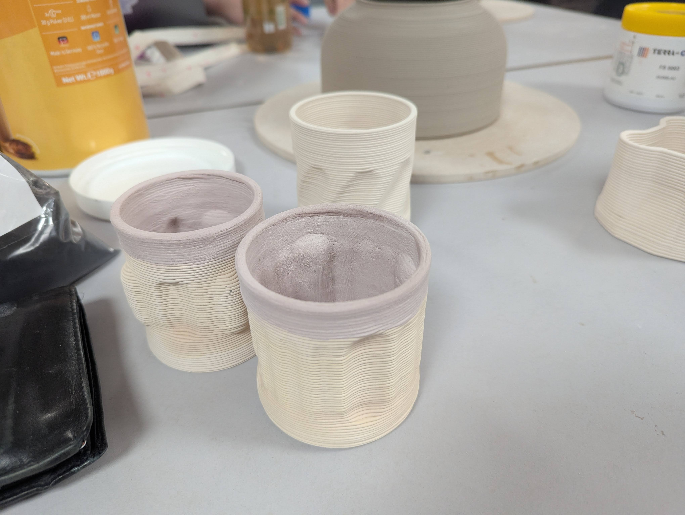

# Prep Work
Now I had settled on the shapes I wanted, and I knew, that I wanted the outside to be without glaze. So I needed black clay, and I learned that the clay had to be without chamotte to not damage the tubes and printing nozzles. I could not find any black clay. On my way back from Paris I found a store that sold clay and at first I thought that it was going to be black clay after firing. So I went and bought a 10 kg pack on my way home. Later on I found that it would burn grey and I had to find a solution to this problem. I ordered some black pigments to mix in the clay, and this is where things are at the moment.

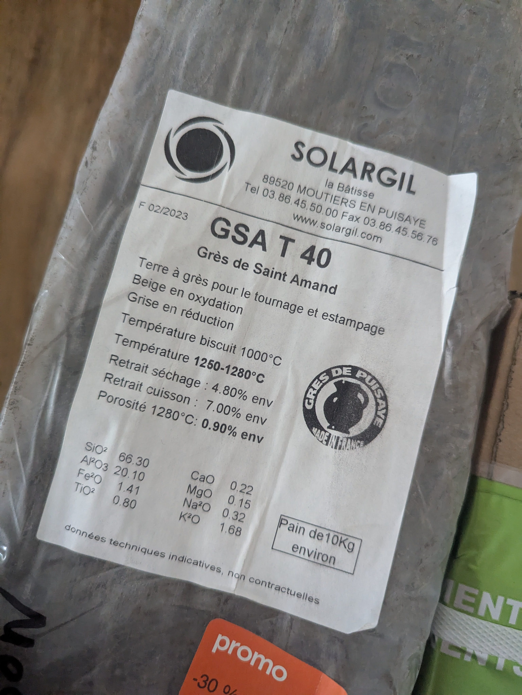
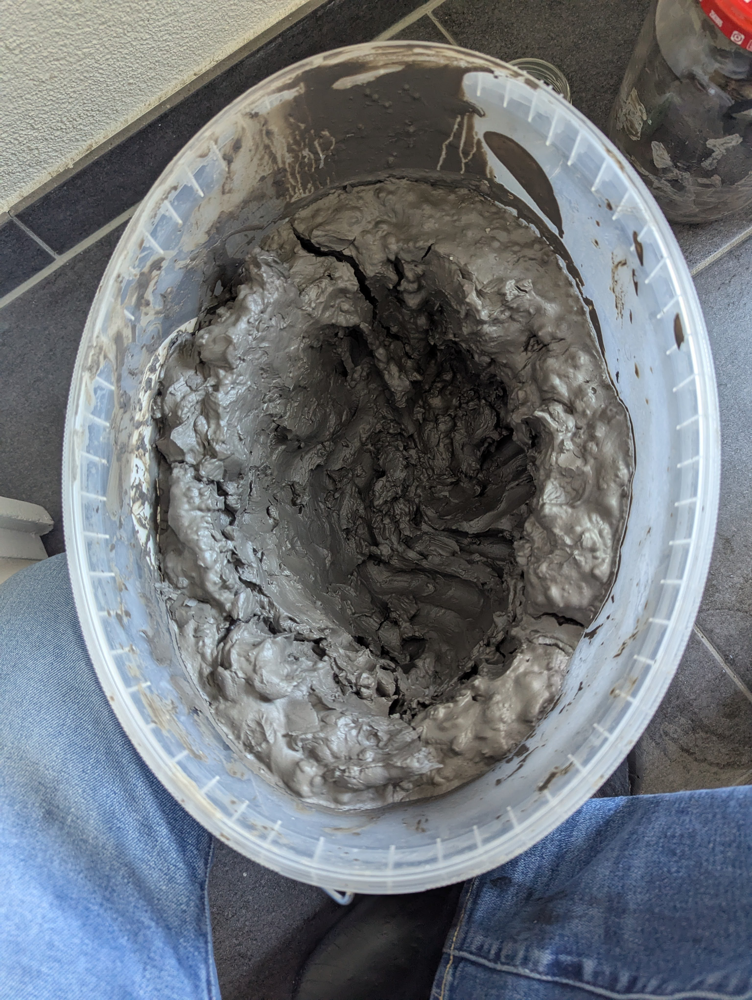
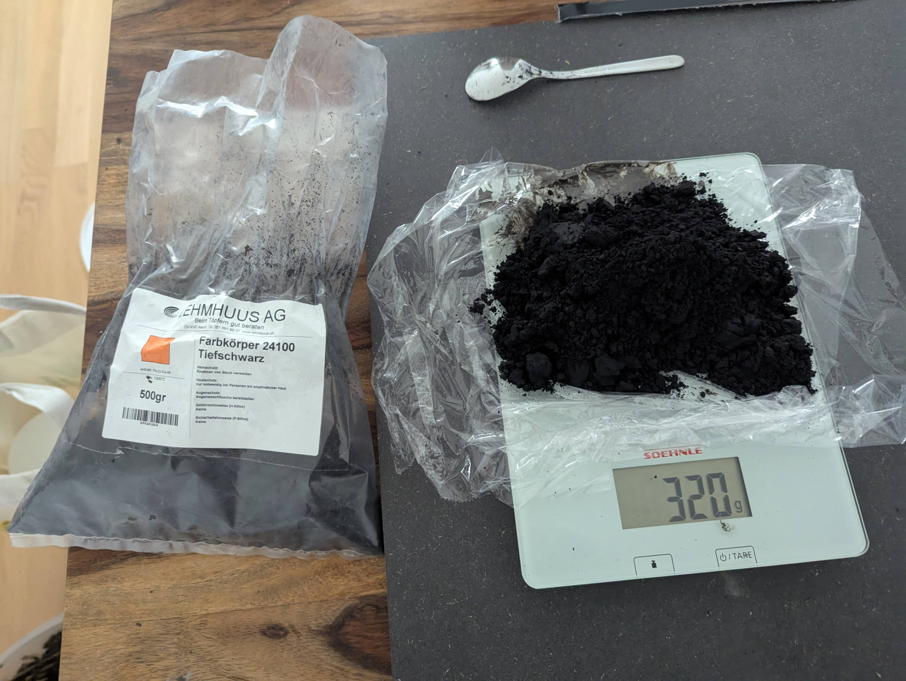
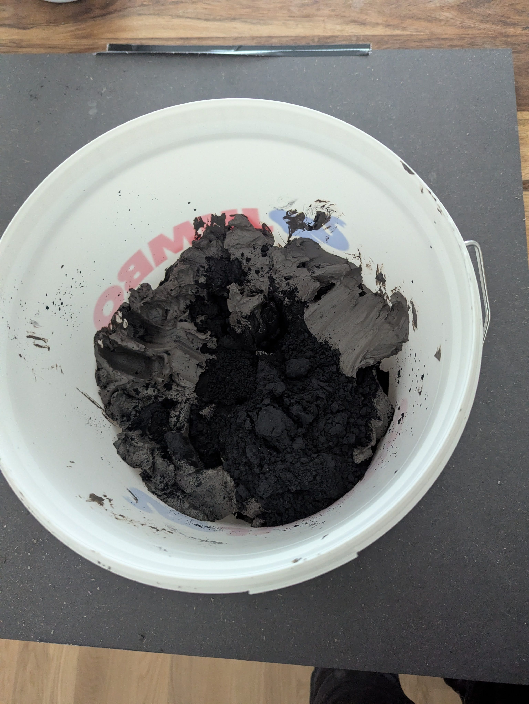
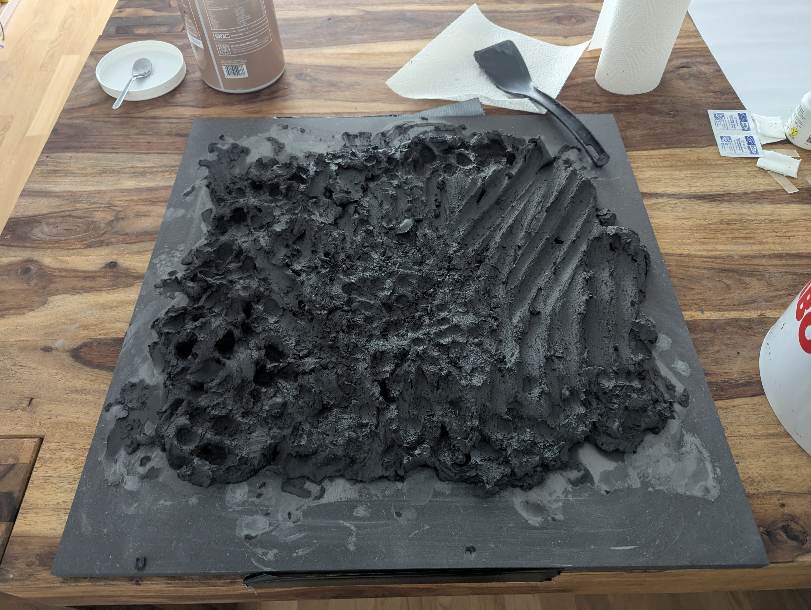
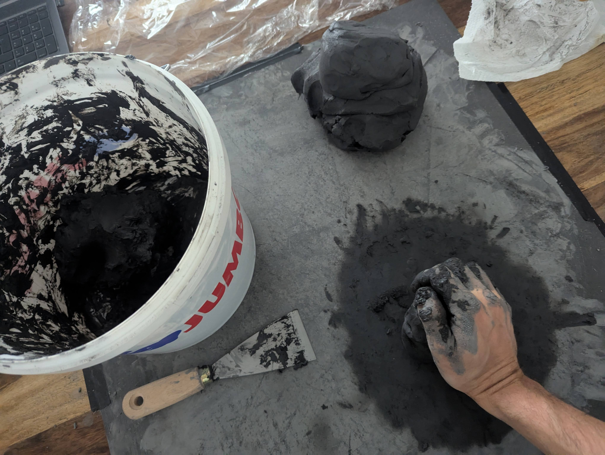