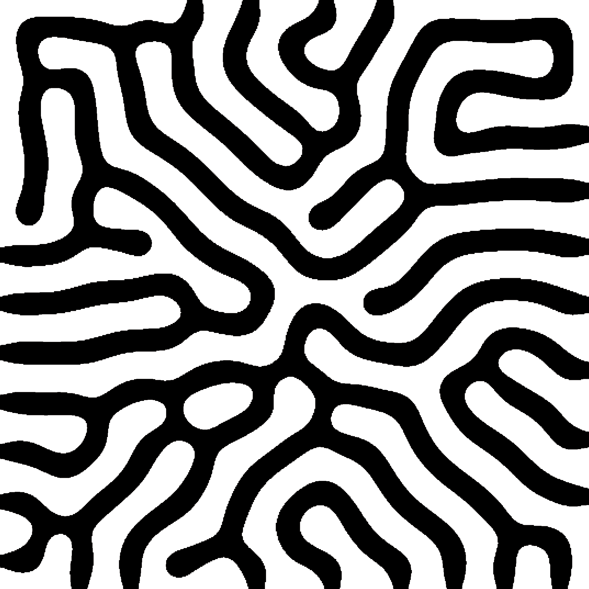
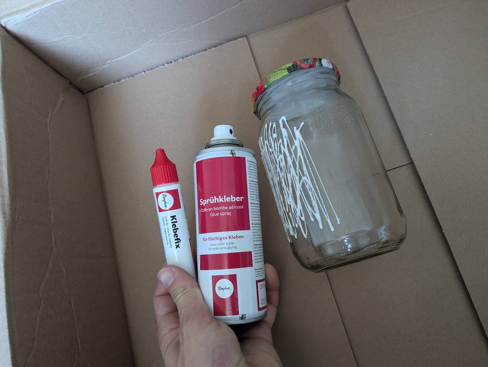
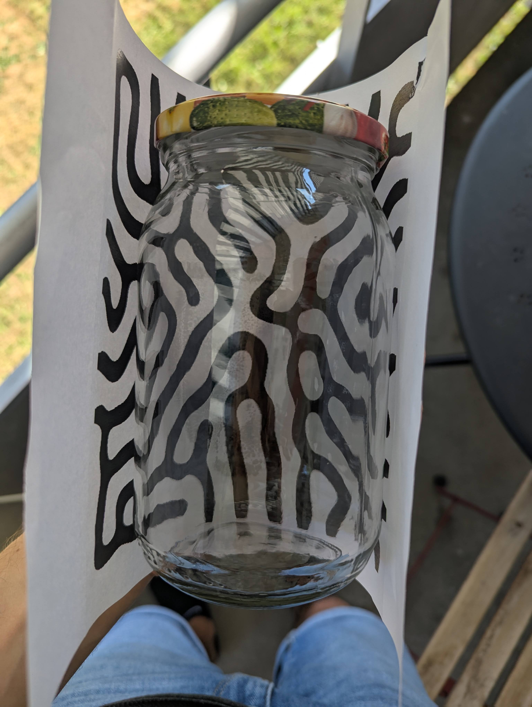
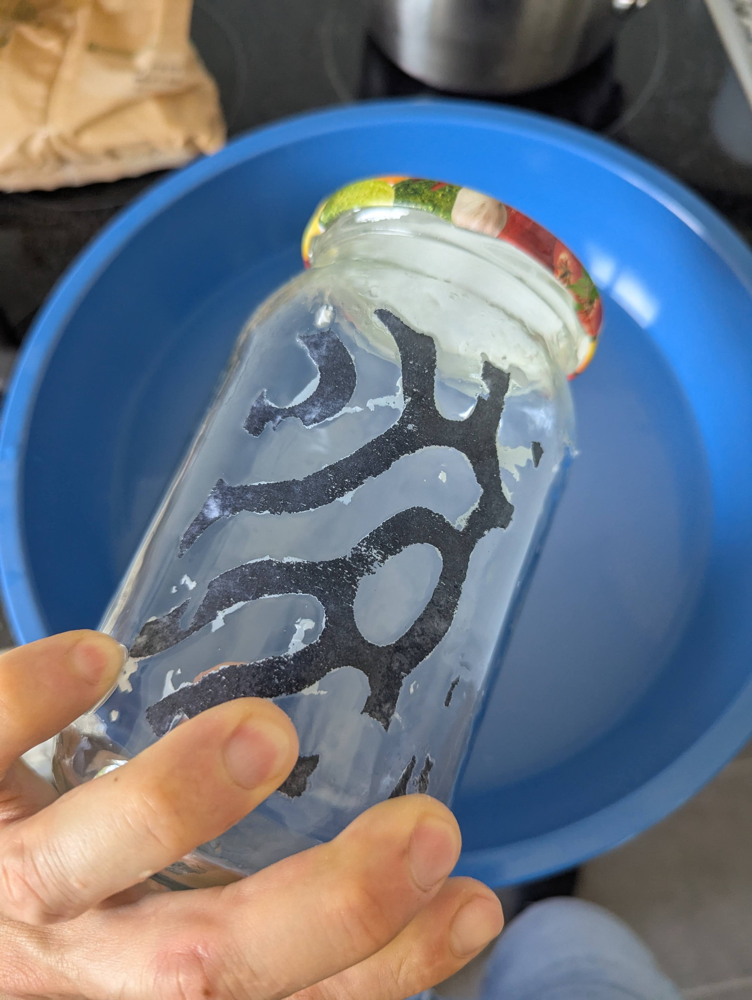
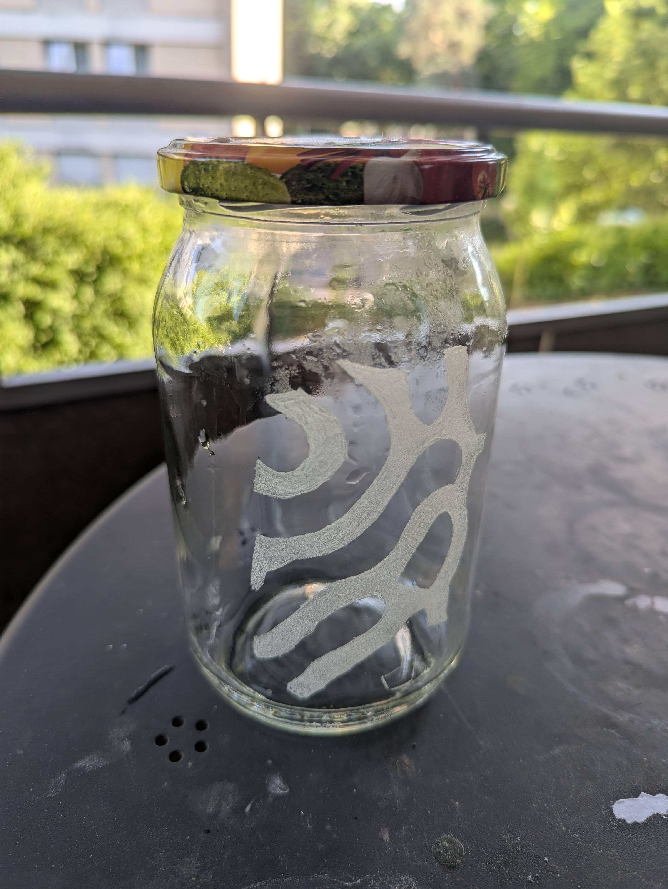
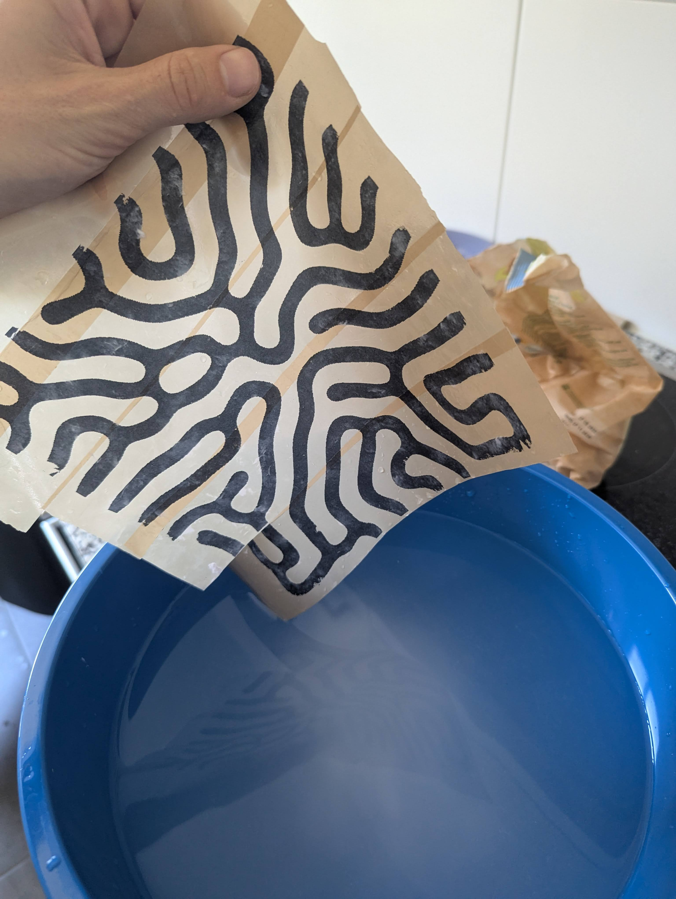
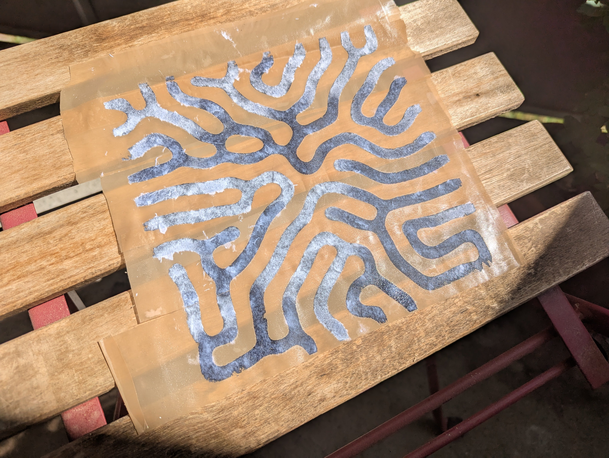
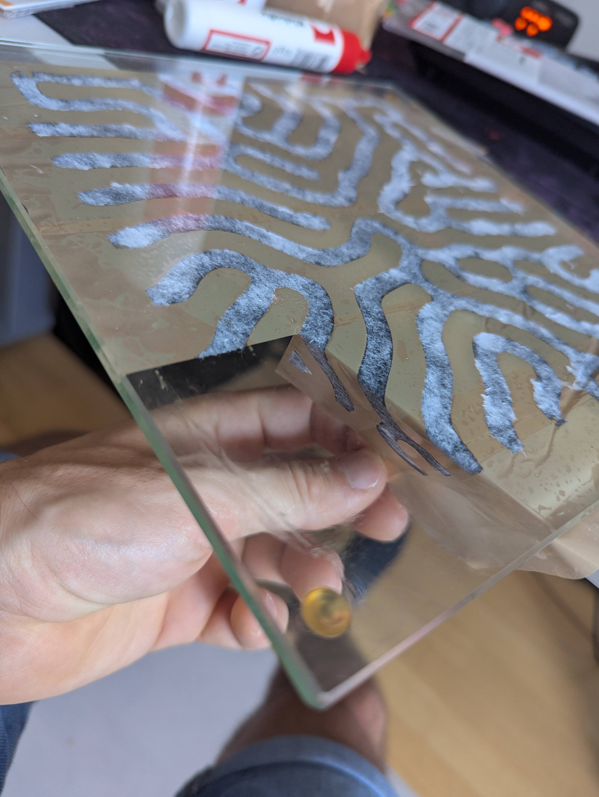
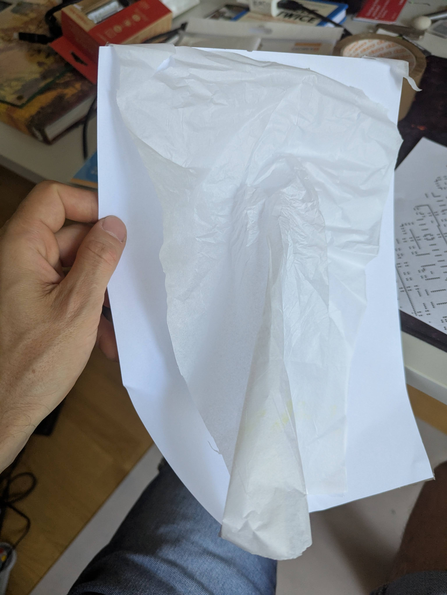

Welcome to a new project I've been thinking about. I recently changed my dinner table, and the old one was turned to scrap. I salvaged a big glass plate from the middle of the table. Now I want to turn that glass plate into a piece of art.

For this I want to program a nice picture that will be transferred onto the glass, and then I'll etch it onto it. It should then be framed in wood, and I want to use an LED light strip to highlight the etched glass parts.

This post is all about testing the concept from start to finish.

# Image preparation
As a first step I generated a Reaction-Diffusion pattern which I programmed here [https://github.com/TheCell/beautifulMathBook/tree/master/Doodling/p5js/Reaction-Diffusion](https://github.com/TheCell/beautifulMathBook/tree/master/Doodling/p5js/Reaction-Diffusion) a week earlier. The final product I postprocessed then looked like this:

# Image Transfer
After printing the image, I tried different glues. The spray-on glue did not work at all. The other glue is a water-based glue and worked much better. To get it working, I put the glue on the glass jar. Then put on the printed pattern with the ink side facing the glass. Press the paper on and then leave it to dry. After drying, soak the paper in water for 1-3 minutes and then start rubbing the paper until it turns to small pieces. Parts with ink will stay on the glass.

# Edging
For the glass etching, I used 2 Dremel bits. The Dremel bit 7134 was nice to etch the outlines of the shape. The shape was then filled in with the 7105. It was a bit of a problem to have the ink with glue still on the glass because the bits tend to clog up. It still worked to etch the glass, but it led to some imprecise edges. For the next text piece I will try to outline the ink, rub it off, and then shade. All in all I'd say it was a success.

The finished product looked like this after rinsing.

# What did not work
## Package Tape
I tested this one first. It looked promising.
Using package tape works great to transfer a print to tape. Soak it in water, then rub the paper off. All that is left is the printed ink/toner. However, you won't be able to transfer that image from tape to glass. This technique is only good if you use transparent tape and you intend to keep the tape on the glass.

Drying the package tape after rubbing the paper off. After drying, it will stick again.

The stick-on tape works great, but getting the ink off the tape is going to be a different challenge. I tried isopropanol. Maybe glue could be a solution, but then again, we are back at the direct glue-on solution.

## Silk Paper

I tried printing on silk paper because with silk paper I could just glue the paper onto the glass without the soaking and removal steps. However, after a quick test with printing directly and printing on stuck-together paper, I decided to leave it. It jammed my new printer every time. That was not worth the risk of destroying my printer.
