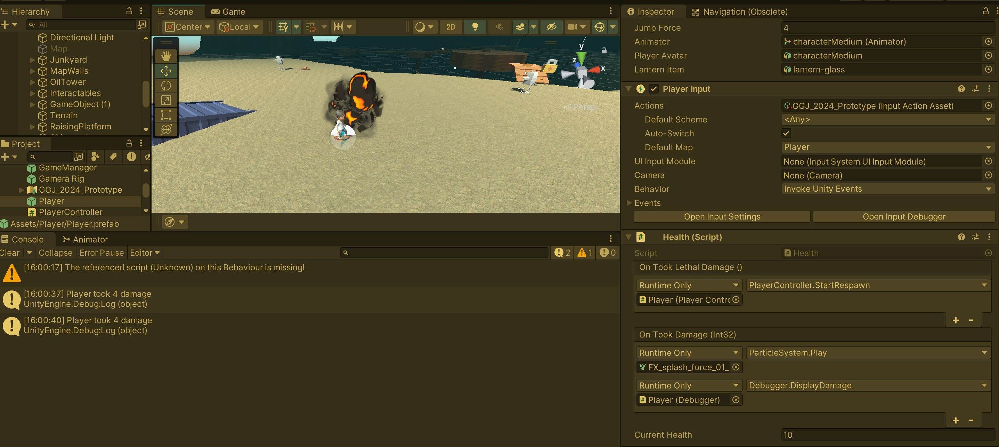

An example of how to implement your own Unity events. This is very practical to link behaviors up via inspector UI instead of code. I have used the Inspector to link objects a lot more recently. It is more flexible compared to linking via code. When presented with a new scene, you can understand much better what is being called and how things are interlocked this way. You don't need to go through the code.


# Custom Event Classes

The structure is always the same. Create a class that implements UnityEvent, followed by the type that this EventClass will emit.
The interface supports up to 4 parameters.
```csharp
public class CustomEvent : UnityEvent<T0> {}
public class CustomEvent : UnityEvent<T0, T1> {}
public class CustomEvent : UnityEvent<T0, T1, T2> {}
public class CustomEvent : UnityEvent<T0, T1, T2, T3> {}
``` 

Here are 3 classes I implement for different events. 

```csharp
// GameObjectEvent.cs
using System;
using UnityEngine;
using UnityEngine.Events;

[Serializable]
public class GameObjectEvent : UnityEvent<GameObject> { }
```

```csharp
// IntEvent.cs
using System;
using UnityEngine.Events;

[Serializable]
public class IntEvent : UnityEvent<int> { }
```

```csharp
// VoidEvent.cs
using System;
using UnityEngine.Events;

[Serializable]
public class VoidEvent : UnityEvent { }

```

And here is an example of where these UnityEvents are being used. Note that I have one event (onTookLethalDamage) where I just care about the "when" and don't need more information. The other event emits how much damage I took. This can be interesting, for example, to animate different reactions based on the amount of damage taken.

```csharp
// Health.cs
using UnityEngine;

public class Health : MonoBehaviour
{
    public VoidEvent onTookLethalDamage;
    public IntEvent onTookDamage;

    [SerializeField] private int _currentHealth = 10;

    public void SetHealth(int health)
    {
        _currentHealth = health;
    }

    public void TakeDamage(int damage)
    {
        onTookDamage?.Invoke(damage);

        _currentHealth -= damage;
        if (_currentHealth <= 0)
        {
            onTookLethalDamage?.Invoke();
        }
    }
}
```

And this is how the component looks in the inspector. I linked a script that lets me respawn and one to play different particle effects. Note that I don't care about the value emitted to play the particle effect. However, I do care about the value in the debugger log. 


The debugger script is just an example and looks like this:
```csharp
using UnityEngine;

public class Debugger : MonoBehaviour
{
    public void DisplayDamage(int damage)
    {
        Debug.Log($"Player took {damage} damage");
    }
}
```

I suggest using the events if you have independent systems that you want to hook up to each other. It's super flexible, and you can do a lot without coding. However, if you have a tidy prefab, it might be better to just have scripts that reference other scripts and call functions directly. There is always a good balance to be kept.

That's it. Have fun :)
