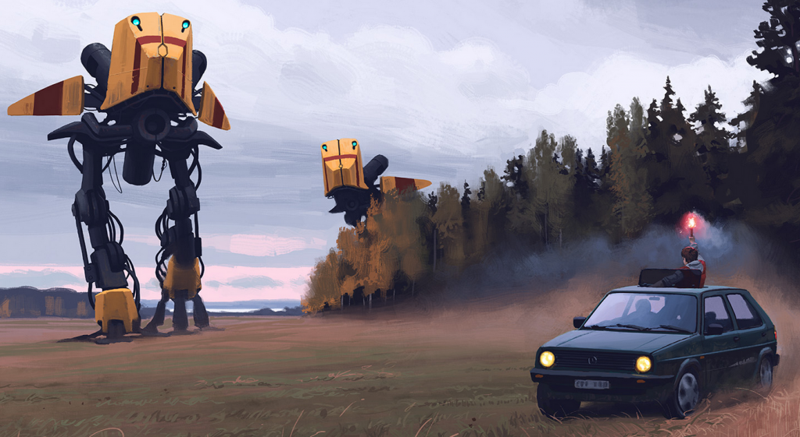

I found a real nice artist, his paintings have a Sci Fi touch. I really love the drawing style. You can even buy his drawings as Canvas, Framed, mounted, matted, photographic. Just take a look at the Pictrues they are well sized (1080px and more) and I have even changed my background to one of those.

Here's the Website with the Galerie: [www.simonstalenhag.se](http://www.simonstalenhag.se/ "Simon Stalenhag Website")
