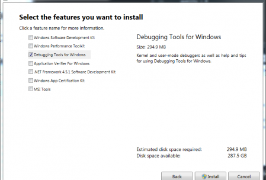

Since I struggled a lot with the setup of the Debugger for QT heres a guide. The Internet is a hostile place where you can't find a lot of usefull things for QT. Lets change that.

What do we need? I have already installed QT Creator 5.4 (Community) from their website [http://www.qt.io/download](http://www.qt.io/download/). Now QT for itself is working fine, it's just that I can't debug.

We need the Windows Standalone Debugging tools, the once included in Visual Studio won't work. Go to the Website [https://msdn.microsoft.com/en-us/windows/hardware/hh852365.aspx](https://msdn.microsoft.com/en-us/windows/hardware/hh852365.aspx) or Google it "[windows debugging tools"](https://www.google.ch/search?q=windows+debugging+tools&spell=1&sa=X&ei=D2khVYKXG8OTsAGHn4H4Cw&ved=0CBsQvwUoAA&biw=1004&bih=1028) and download the "Standalone Debugging Tools for Windows (WinDbg)" It is important to download the **standalone**. It doesn't matter if you are running Windows 7 or 8 just download the debugging tools as part of the Windows 8.1 SDK.

Once downloaded hit install. We will only need the "Debugging Tools for Windows" untick all other checkboxes and go ahead.

After the install start QT Creator, create a Project, set a breakpoint and try to start the debug (f5 to try it quickly). QT should now automatically detect the standalone debugger. If not check your settings under tools -> configuration. Under config and run there is a Tab called Debugger, there are entries for x32 and x64 when autodetected. If not add a new Debugger, normally you can locate it under:

> C:\\Program Files (x86)\\Windows Kits\\8.1\\Debuggers\\x86\\cdb.exe
> 
> C:\\Program Files (x86)\\Windows Kits\\8.1\\Debuggers\\x64\\cdb.exe

I have messed around half a day untill I got it, in the end it automatically detected the debugger. **If QT does not detect it automatically, you probably installed the wrong Windows debugger.** Tell me how to set it up manually if this didn't work so I can extend this short post.
