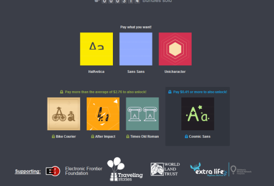
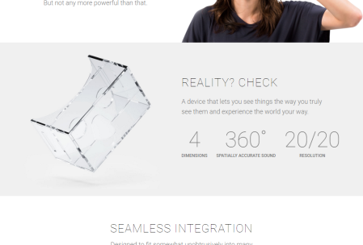
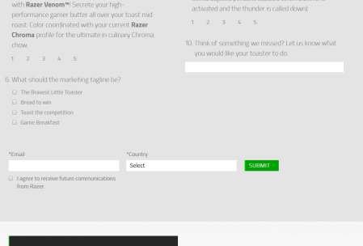
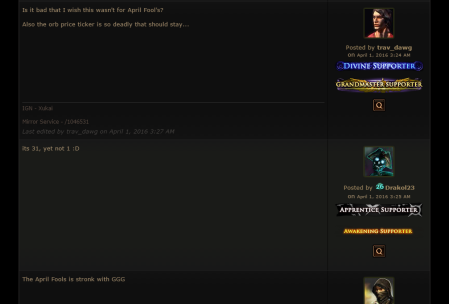
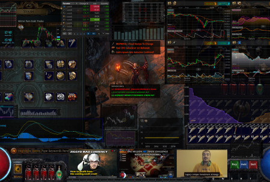
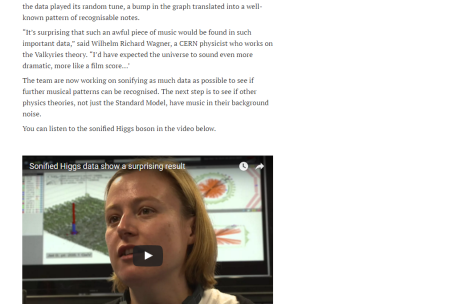
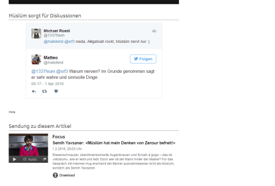

A quick list of April fools I stumbled upon this year. Let's start with [Humble bundle](https://www.humblebundle.com/):

https://www.humblebundle.com/indiefonts 

A new TYPE of bundle. Move aside, games and books — there's a hot new bundle in town: FONTS. Glorious, glorious fonts. There's no better way to express yourself than with a handcrafted, artisan font, so we've assembled these small-batch fonts, crafted at the source of our design team's desks, for your fonting pleasure.

* * *

Google went even further and created a whole Website!

[cardboard plastic](https://www.google.com/get/cardboard/plastic/)

including a promotion video

<iframe width="560" height="315" src="https://www.youtube.com/embed/VkOuShXpoKc" frameborder="0" allowfullscreen></iframe>

And they created a second video for their now delivery sytem, Google Express

<iframe width="560" height="315" src="https://www.youtube.com/embed/F0F6SnbqUcE" frameborder="0" allowfullscreen></iframe>

They also created a new feature for youtube: [SnoopaVision](https://www.youtube.com/snoopavision?v=yA4E1WpxjFE) including a promotion video. Basically you were in a cinema with snoopdog and could watch the youtube video with him. There were also various youtube celebrities accompanied snoop at various videos.

<iframe width="560" height="315" src="https://www.youtube.com/embed/DPEJB-FCItk" frameborder="0" allowfullscreen></iframe>

* * *

Blizzard announced Hearthstone the mmo

<iframe width="560" height="315" src="https://www.youtube.com/embed/nV0twbU3IhA" frameborder="0" allowfullscreen></iframe>

Valvetime gave us the news, that Valve was sold to HTC and is now going to be a VR company and HTC headquarter in the USA

<iframe width="560" height="315" src="https://www.youtube.com/embed/6KX_DN-8TuI" frameborder="0" allowfullscreen></iframe>

* * *

Razer announced [a toaster](http://www.razerzone.com/breadwinner), good times we live in!

<iframe width="560" height="315" src="https://www.youtube.com/embed/yA4E1WpxjFE" frameborder="0" allowfullscreen></iframe>

* * *

Grinding Gear Games announced Second Wave of Trade Improvements, including a exchange rate ticker on their main page.

They also included a Screenshot of ingame graphs

* * *

At Cern they made an amazing discovery while sonifiying the higgs data:

also including a video that explains it:

<iframe width="560" height="315" src="https://www.youtube.com/embed/70ZGqhzsxxw" frameborder="0" allowfullscreen></iframe>

* * *

Dark Souls III - The Movie

<iframe width="560" height="315" src="https://www.youtube.com/embed/fETc77XokxE" frameborder="0" allowfullscreen></iframe>

* * *

Draw with Jazza announced the Draw World. It is a platform where you can license the ability to create drawing content on the internet. If that is not great nothing is.

<iframe width="560" height="315" src="https://www.youtube.com/embed/lonZ8HFk064" frameborder="0" allowfullscreen></iframe>

* * *

Linus Tech Tips announced that he would retire and that Nvidia is acquiring Linus media group.

<iframe width="560" height="315" src="https://www.youtube.com/embed/CMTUZtF27kA" frameborder="0" allowfullscreen></iframe>

* * *

Vat 19 is selling the Stōn: The World's First App-Enabled Rock

<iframe width="560" height="315" src="https://www.youtube.com/embed/yqynvR-HNiE" frameborder="0" allowfullscreen></iframe>

* * *

Even [Pornhub](http://www.pornhub.com/) changed their main theme to Corn:

* * *

Dan Bull announced that he is going to be daddy, egg daddy.

<iframe width="560" height="315" src="https://www.youtube.com/embed/G8D5lckUS0M" frameborder="0" allowfullscreen></iframe>

* * *

[The Swiss Radio](http://www.srf.ch/radio-srf-3/aktuell/muesluem-liess-es-eine-stunde-live-on-air-la-bambele) has replaced a radio moderator with a comedian 

<iframe width="560" height="315" src="https://www.youtube.com/embed/hzB5T5aemoI" frameborder="0" allowfullscreen></iframe>

* * *

Youtuber Manniac announced 4 new Youtube features

<iframe width="560" height="315" src="https://www.youtube.com/embed/Gq0uQEbicW8" frameborder="0" allowfullscreen></iframe>

* * *

Nvidia presented their new drink

<iframe width="560" height="315" src="https://www.youtube.com/embed/JmK3a5ahNm0" frameborder="0" allowfullscreen></iframe>

* * *

Matthias Wandel presented a new way to work with wood. It saves a lot of time over the historical craftsmanship. It really looks promising.

<iframe width="560" height="315" src="https://www.youtube.com/embed/Qu4qL-aKJD8" frameborder="0" allowfullscreen></iframe>

* * *

[Newgrounds](http://www.newgrounds.com/) made their Website great again - thanks Trump. 
