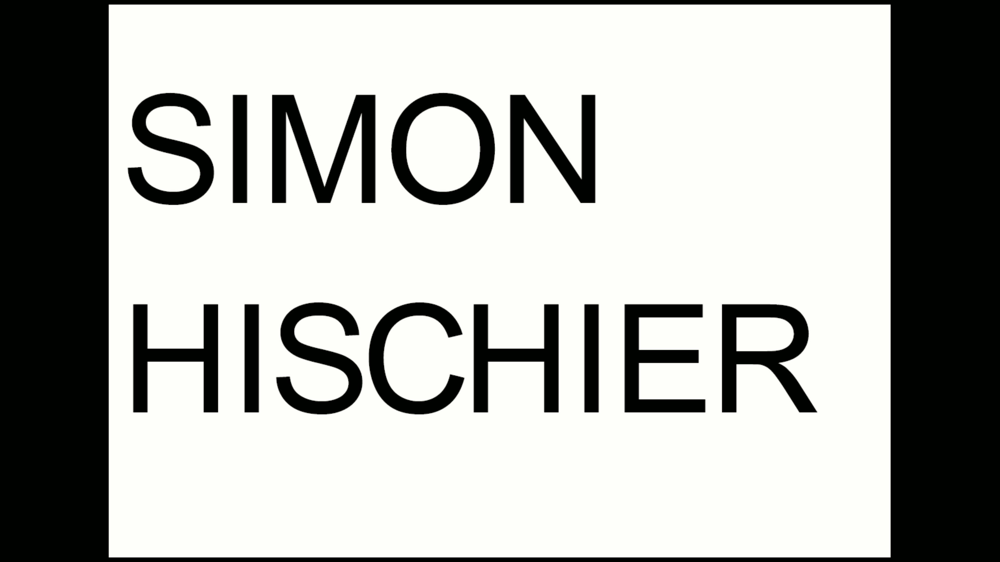
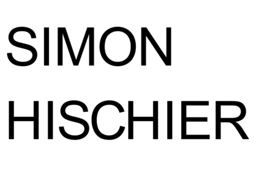
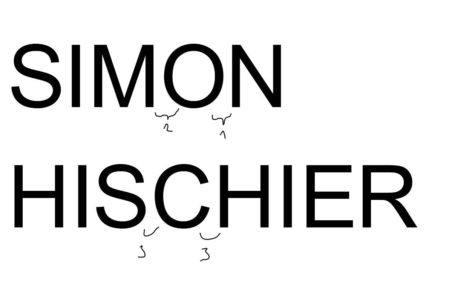
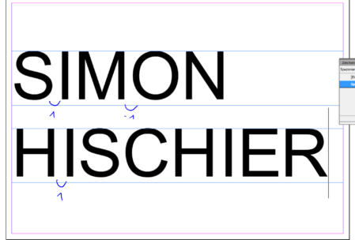

TIL: Eingeschlossene leerräume nennt man Punzen. Es gibt geschlossene Punzen (z.B. im O) und offene Punzen (z.B. C)

Das Ziel der Aufgabe ist es, die Schrift wie aus einem Block aussehen zu lassen. Damit dies klappt wähle ich eine Arial und verändere den Abstand zwischen den Buchstaben bis es von weitem betrachtet wie ein Block aussieht. Die "Hellen" Stellen sollten regelmässig sein bzw. dürfen den Lesefluss nicht unterbrechen. Wenn man sich damit noch nicht beschäftigt hat, klingt es wie unnötige kleinstarbeit. Nach ersten versuchen merke ich schnell, dass beim verändern des Zeichenabstandes Buchstabengruppen auszumachen sind. Man fängt an, sich vermehrt gedanken über das Schriftbild zu machen. Wenn die Aufgabe gut gelöst ist, sollte es keine Ermüdenden stellen beim Lesen geben. (Stellen bei denen man von Buchstabe zu Buchstabe hüpfen muss).

Als besonderer Knackpunkt stellt sich dabei das O und das C heraus.

Als beginner tendiert man dazu, alles zu nah zusammen zu rücken.

Indesign: w bzw Shift + W hilft beim betrachten. Damit werden Hilfslinien bzw. alles sonst ausgeblendet

Prozess: 

