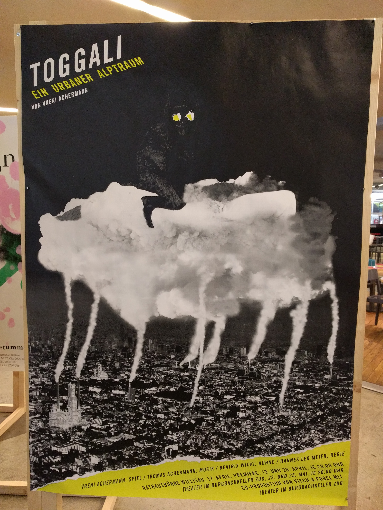

Gestern waren wir am Poster Festival in Luzern, eine Aufgabe war es 1-2 Poster die uns besonders interessiert oder beschäftigt haben heraus zu suchen. Meine Posterwahl waren diese:

Das erste Poster enthält verschiedene interessante Ebenen und man sieht auf den ersten Blick noch nicht das grosse ganze. Ich musste 3x hinsehen bis ich alles auf dem Bild gesehen habe. Das erste was mir aufgefallen ist, ist die weisse Wolke di von weitem eher wie ein Tier mit vielen Beinen aussieht. Alles andere ist zu dunkel und durch den hohen kontrast breche ich das Poster in schwarz und weiss hinunter. Wenn man sich länger mit dem Poster beschäftigt, kann man die Stadt sehen und weiss direkt, dass das weisse die Wolke über der Stadt ist. Erst nach weiterer auseinandersetzung fällt die schwarze böse Figur auf, die auf der Wolke sitzt und erst jetzt wird "ein urbaner Albtraum" wirklich sinnvoll.

Dieses Poster ist äusserst interessant, es benutzt 3 Farben, 2 Vektorfiguren. Das Poster erfordert viel vom Betrachter und gibt selbst nicht viel Preis. Beim Poster wird vom Betrachter erwartet, dass er über das Weltgeschehen bescheidweiss und zum Zeitpunkt der Ausstellung hat das Poster auf den Russland - Türkei konflikt hingewiesen. Es geht um ein Flugzeug der Russen, dass über Türkischem Boden abgeschossen wurde. Dies wird sehr simpel angedeutet. Das interessante an diesem Poster ist, dass es in Zukunft eine andere Bedeutung haben kann und deshalb zeitgemäss bleibt. Dies ist vermutlich Vor- & Nachteil, da solche Werke nicht sehr einprägsam sind.
