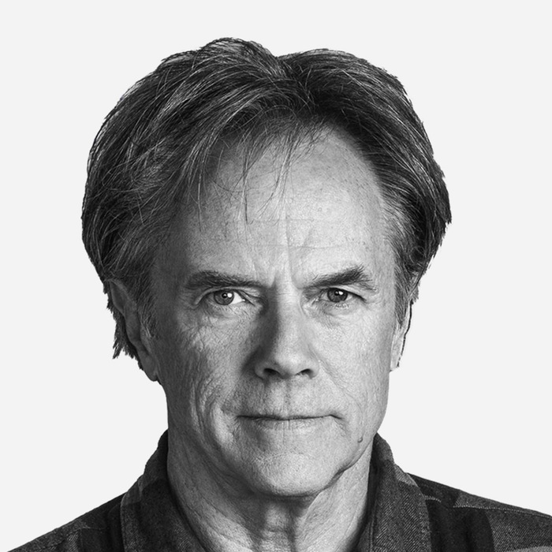

[Wikipedia](https://de.wikipedia.org/wiki/David_Carson_(Grafikdesigner)) [davidcarsondesign.com](http://www.davidcarsondesign.com/)

Sein Stil ist geprägt von Bildausschnitten und einem dreckigen look.

Experimentiert gerne. Wurde von südkalifornien geprägt. Soziologie studiert und als Lehrer gearbeitet, surft gerne und war schon in den top 10 der Surfer.

Er wurde von Hans-Rudolf Lutz geprägt, den er in der Schweiz besucht hat. Er selbst hat Typografie nie studiert.

Für verschiedene Magazine gearbeitet. Später für Ray Gun bei dem er sich entfalten konnte und bei dem ihm niemand Vorgaben machte. Er konnte von der Entwicklung bis zum druck alles selbst Überblicken und überall selber Entscheiden. Sein Konzept: Die Musikfachzeitschrift sollte nicht nur unvorhersehbar sein, sondern man sollte sie auch nicht kopieren können.

Er provoziert gerne und sagt sachen nur um zu schockieren. Entscheidet sich auch spontan ein Interview nicht zu führen.

Er hat für verschiedene Kunden wie Armani, Audi. Diese Werke haben einen starken kontrast zu seinen privaten Werken.

Sein Magazincover für "blue" wurde auf Platz 20 der besten Magazincovers gewählt.

