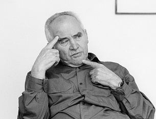
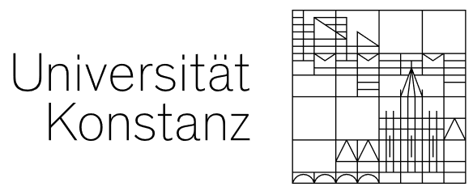
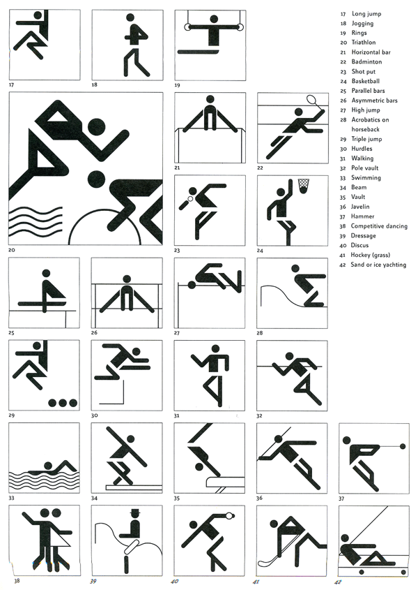
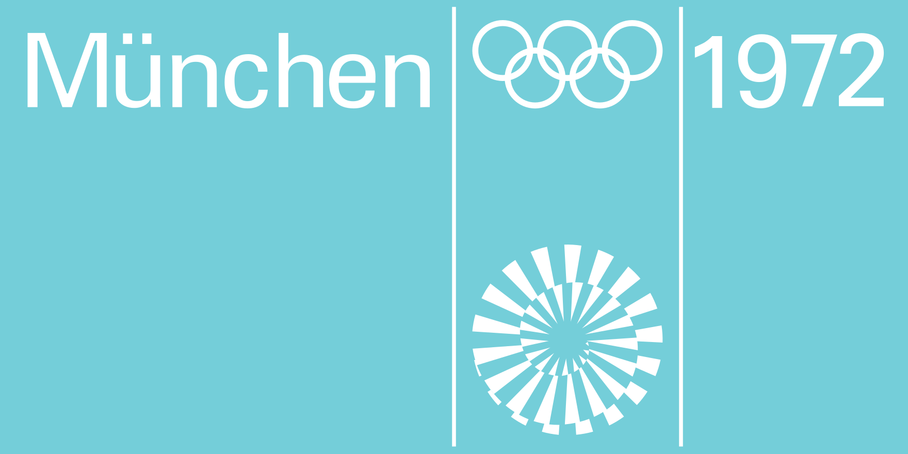

[Wikipedia](https://de.wikipedia.org/wiki/Otl_Aicher)

Er hat die Schrift Rotis erschaffen.

Piktogramme für die Olymiade 1972 entwickelt, mehr als 180 Piktogramme entwickelt. Für die Olympischen Spiele von München definierte er konsequente Gestaltungsrichtlinien, die von der Uniform bis zur Eintrittskarte reichten.

Aicher ist einer der Wegbereiter des **Corporate Designs**.

Eines der Logos für ZDF wurde von Ihm entwickelt und das Logo für die Universität Konstanz, Lufthansa, Braun.

Ein Zitat von Ihm lautet "Wer es mit Kommunikation zu tun hat, muss auf Kunst verzichten". Dies könnte aus der Zeit sein, in der er die Piktogramme entwickelt hat. Diese müssen möglichst einfach kommunizieren und nicht künstlerisch ansprechend sein.

