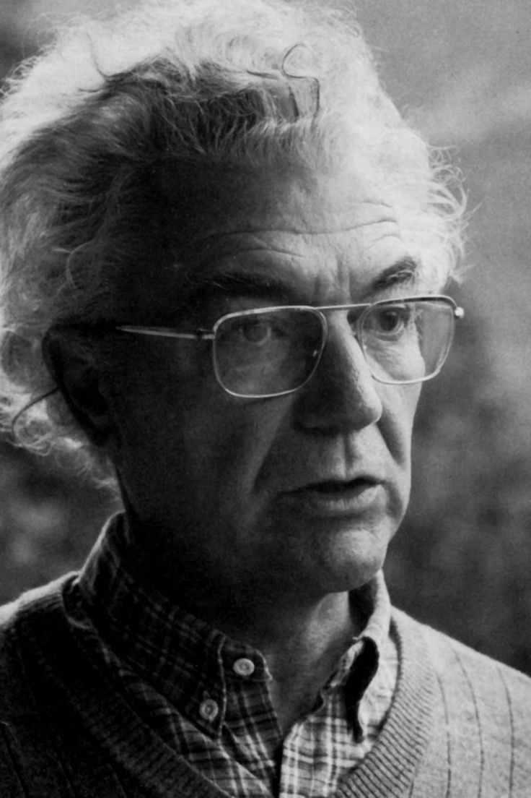
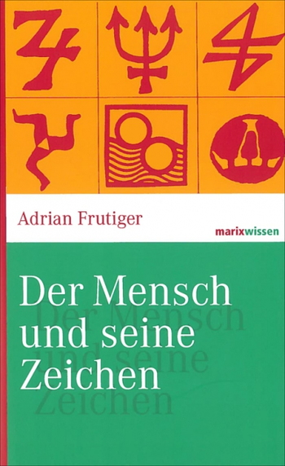
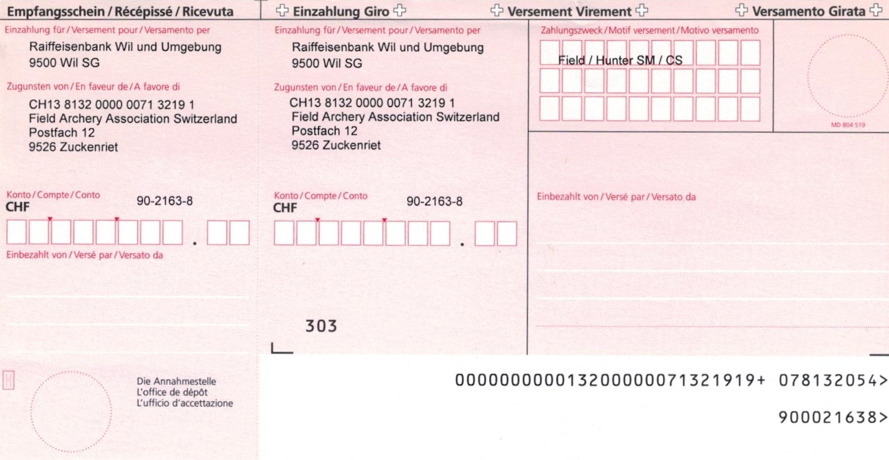
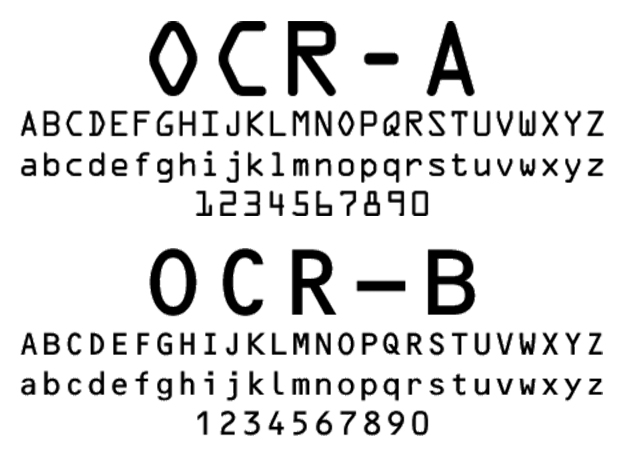
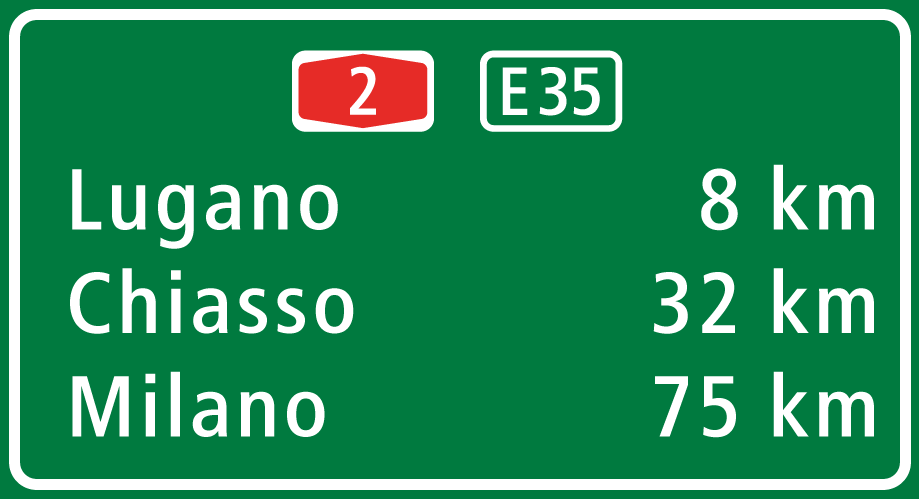

[Wikipedia](https://de.wikipedia.org/wiki/Adrian_Frutiger)

Schriftsetzerlehre

Veröffentlichte "Univers" und viele weitere Schriften. Er hat unter anderem ein Buch geschrieben namens "Der Mensch und seine Zeichen". Die Schweizer **Verkehrsschilder** werden mit Frutiger beschriftet.

Helvetica und Univers hatten keine Serifen mehr, dies führte international zu Furoren. Universe war auch ein Vorreiter der Schriftschnitte. Vorher gab es das konzept der Schriftschnitte nicht. (Italic, Bold etc.) Vorher wurden Schriftschnitte bei bedarf zusätzlich erstellt.

OCR-B war eine Maschinenlesbare schrift, die von ihm entwickelt wurde. Schriften mussten für ihn immer lesbar sein.

Seiner Meinung nach musste eine gute Schrift von Hand entworfen werden, hat aber selber diese dann auch digitalisiert.

Auf den Einzahlungsscheinen ist eine Schrift von Adrian Frutiger.

