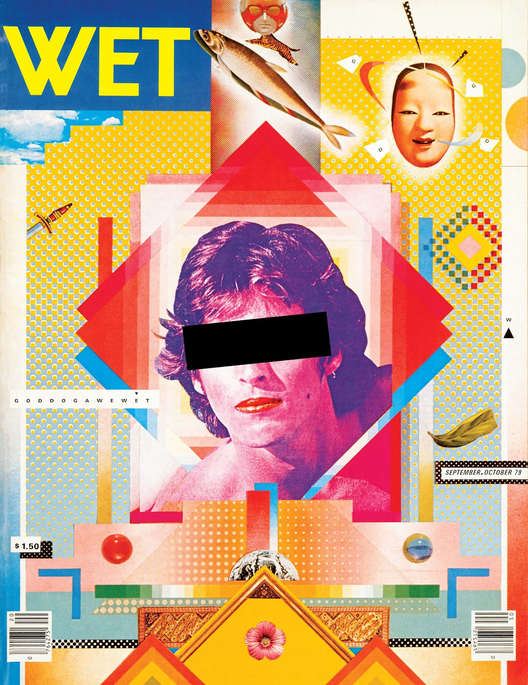
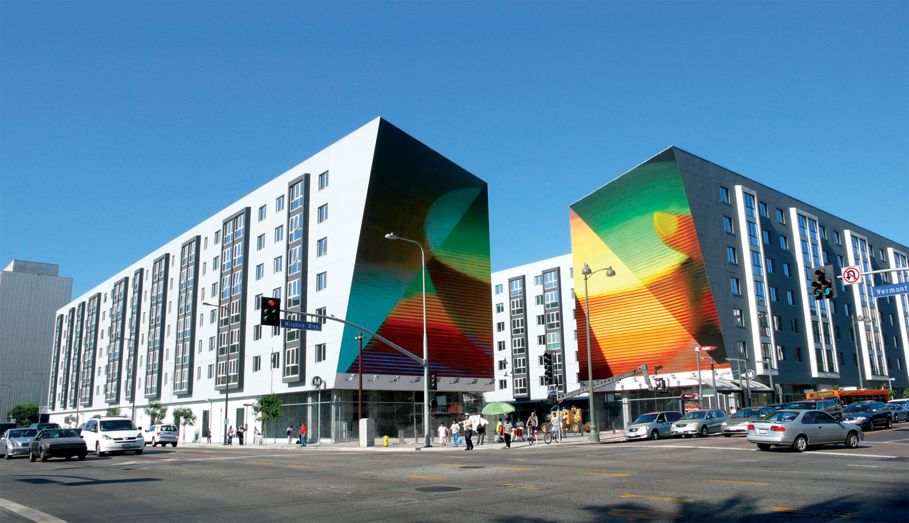
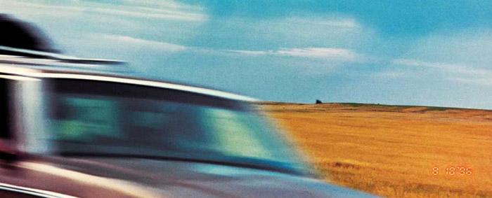
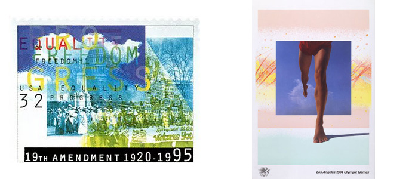
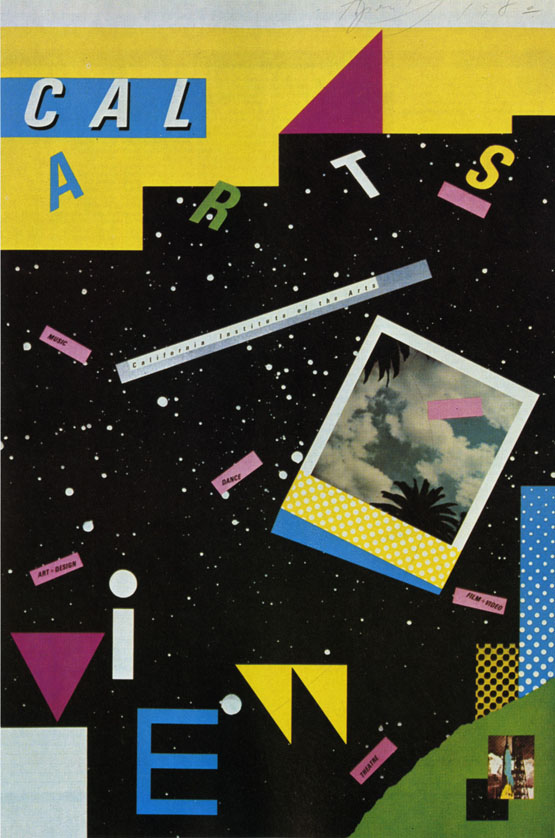
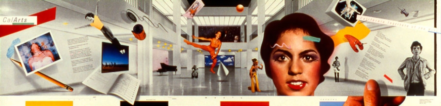

[aprilgreiman.com](http://aprilgreiman.com/) [Wikipedia](https://en.wikipedia.org/wiki/April_Greiman)

Sie ist eine new wave designerin und eine der ersten, die mit dem Computer gearbeitet hat. Als Sie mit dem Computer arbeitete brauchte es noch intensive Manuelle arbeit. Es wurden am Computer schwarz/weiss Bilder erstellt und später dann an Druckmaschinen und mit verschiedenen Druckverfahren weiterverarbeitet. Sie hat Schriften wie "New Wave" und "Swiss Punk Typography" entwickelt. Wolfgang Weingard hat April Greiman stark geprägt.

Sie hatte den new wave stil in Amerika bekannt gemacht.

Für die LA Olympics hat sie ein Bild kreiert. Das Bild wurde auf einem Mac gemacht und enthält eine optische Täuschung weil der Fuss aus dem viereck tritt.

Eine US Postmarke wurde mit ihrem Design abgedruckt.

Das new wave design zeichnet sich aus durch knallige Farben, verschiedene Materialien und sieht generell etwas "trashig" aus.

Ihre Arbeit liest sich wie das Gegenteil zu Adrian Frutiger. Weg von lesbaren Schriften und chaotisch.

Eine Ausstellung von ihr nannte sich "drive-by shooting" und enthielt Fotografien, die aus dem Auto gemacht wurden und Farbverläufe bzw schlieren enthält. Meist sind die Fotos nicht scharf.

