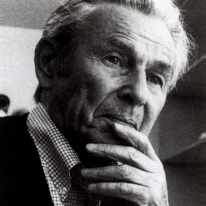

[Wikipedia](https://de.wikipedia.org/wiki/Josef_M%C3%BCller-Brockmann)

Wurde in Rapperswil, CH geboren und wurde an die Kunstgewerbeschule Zürich aufgenommen. Später unterrichtete er auch dort für 3 Jahre. Sein Reformvorschlag war, dass man das ganze Personal entlassen sollte. Nebenbei war er Redaktor von "Neue Grafik". Später war er an der Hochschule für Gestaltung in Ulm tätig. Zu seinen Publikationen gehören: Gestaltungsprobleme des Grafikers. Teufen 1961 Grid systems in graphic design / Raster Systeme für die visuelle Gestaltung. Teufen 1981

Er arbeitete für die SBB, CWS, Rosenthal, IBM, olivetti als Gestalter oder Berater bei den Logos.

Er kämpfte stets gegen gewaltsam herbeigeführten tot. Er hatte eine Installation in Zürich, die die Verkehrsunfälle in der Stadt bezifferte.

