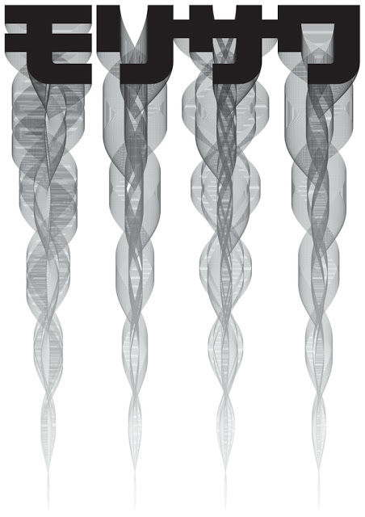
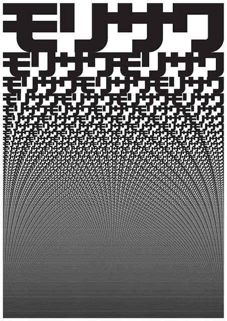
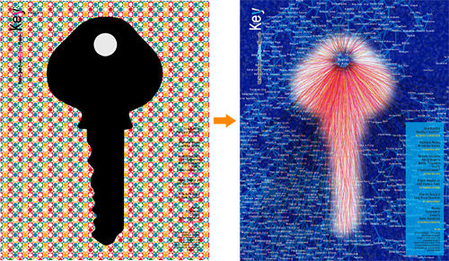
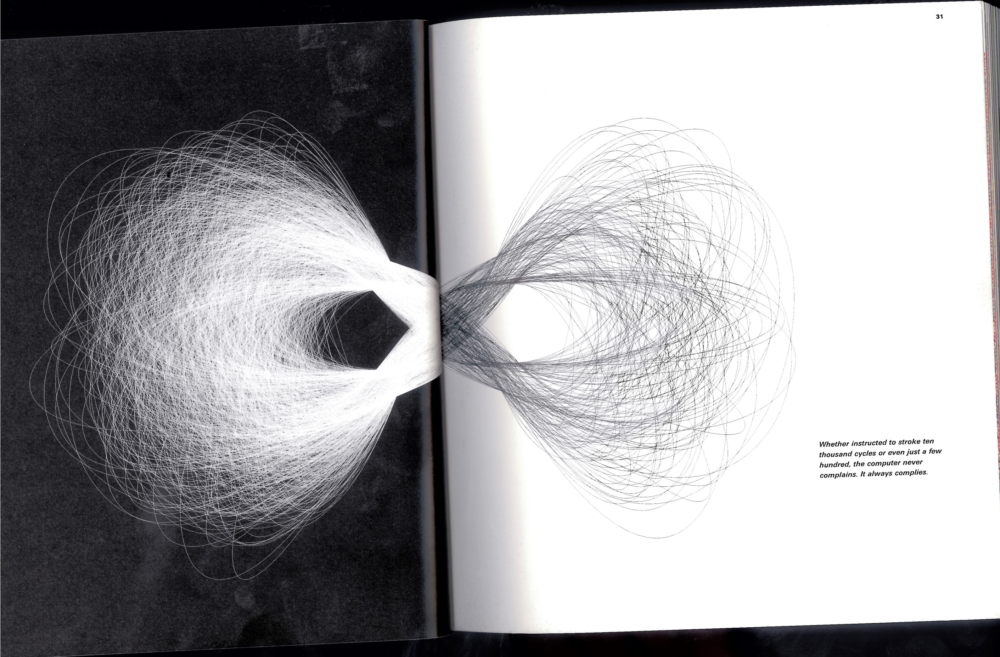
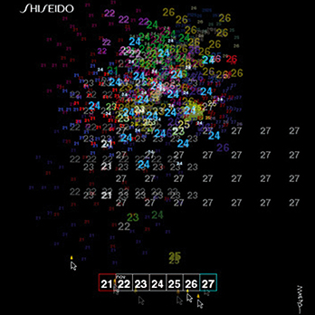

Er ist für das Feld Digital Ideation eine prägende Figur. Er verknüpft Kunst und Technologie. Er musst schon früh bei seinem Vater arbeiten und er liebte daher die Schule, weil er da informationen aufsaugen konnte und nicht arbeiten musste. Sein Vater zwang ihn zu einem Studium als Informatiker obwohl er lieber Kunst studiert hätte. Er hat das Buch Die zehn Gesetze der Einfachheit geschrieben, indem er ein Gerüst für Einfachheit weitergeben möchte. Einfachheit ist seiner meinung nach Gesundheit.

Die 10 Gesetze: 1. Reduzieren (so viel wies geht durchdacht weglassen ohne, dass etwas verloren geht.) 2. Organisieren (Durch Organisation sieht ein System aus vielen Elementen nach weniger aus.) 3. Zeit (Zeitersparnis fühlt sich wie Einfachheit an) 4. Lernen (Wissen macht alles einfacher) 5. Unterschiede (Einfachheit und Komplexität brauchen einander) 6. Kontext 7. Gefühle 8. Vertrauen 9. Fehlschläge 10. Leben (Einfachheit bedeutet, das Offensichtliche zu entfernen und das Sinnvolle hinzuzufügen)

Er programmiert hauptsächlich, sein Code ist aber wenig dokumentiert.

