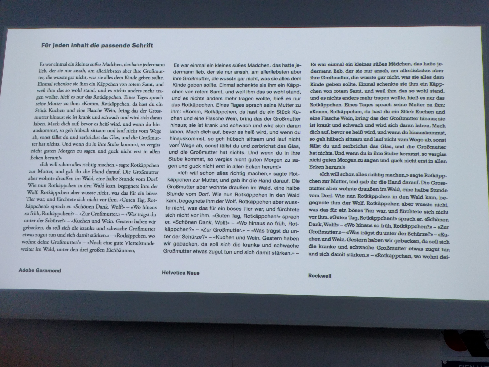

Tipps Zeilenlänge sollte in der Regel ca 60 Zeichen enthalten. (45-70 Zeichen es kommt auf den Kontext an) Bei absätzen in einem Buch bei Abständen zwischen Absätzen nur einen halben Abstand nehmen. Bei Ganzen Abständen fällt der Text etwas auseinander. Das Problem beim halben Abstand ist, dass der Text dann versetzt sein kann. Anstelle der Abstände macht man z.B. einen Einzug bei neuen Absätzen.

Für jeden Inhalt die passende Schrift verwendet. Schriften haben immer auch einen Ausdruck, den sie mitbringen. Z.B. eine Helvetica verbinde ich mit offiziellen Briefen.

Blocksatz: Beim Blocksatz werden die Abstände zwischen den Wörtern verändert. Darunter kann der Text stark leiden. Dies tritt vor allem bei vielen schmalen Spalten hervor. -> bei kleinen Spalten sehr bewusst damit umgehen Als alternative bietet sich der Flattersatz an. Hier gilt jedoch zu beachten, dass am ende der Zeile nicht zu Formen kommt.

Zeilenabstand Kleine Zeilenabstände sind bei kurzen Absätzen ok, bei längeren Absätzen wird es mühsam. Auch vom Zeilenende an den Zeilenanfang der nächsten Zeile zu springen wird bei kleinen Zeilenabständen schwierig.

Blindtext Bei Blindtext sollte man mit richtigen Texten arbeiten und nicht mit Lorem Ipsum weil es anderst aussieht. Man sollte Texte benutzen die zum Inhalt passen.

Laufweite / Kerning Wenn Schriften gross sind, darf man die Buchstaben etwas näher zusammenrücken. Bei kleinen Texten darf man etwas mehr Laufweite geben, das hilft beim Lesen. Man muss es ausprobieren, was passt. Sans Serif schriften dürfen etwas näher zusammen sein, Serifenschriften brauchen eher etwas mehr Platz.
