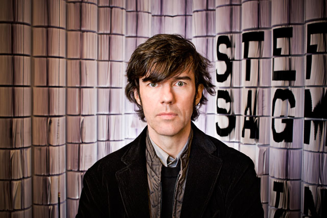
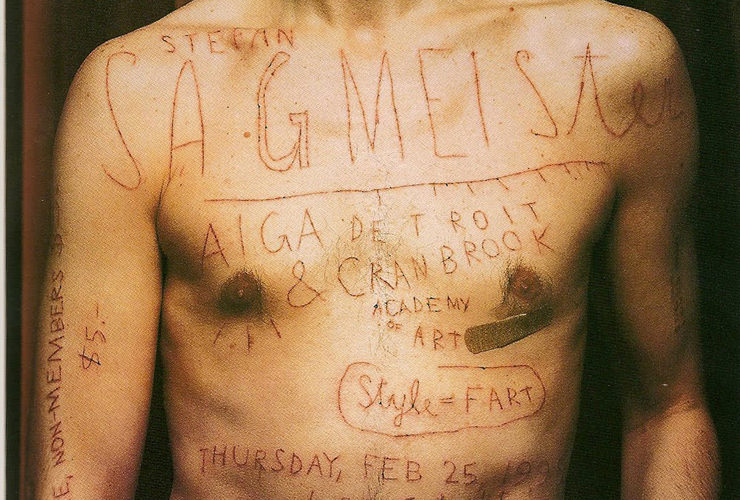
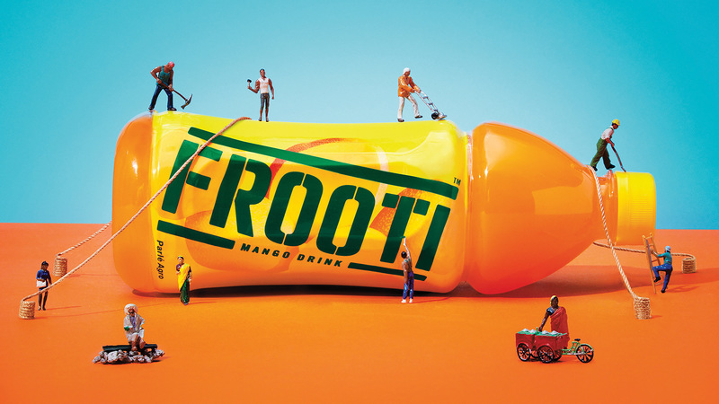
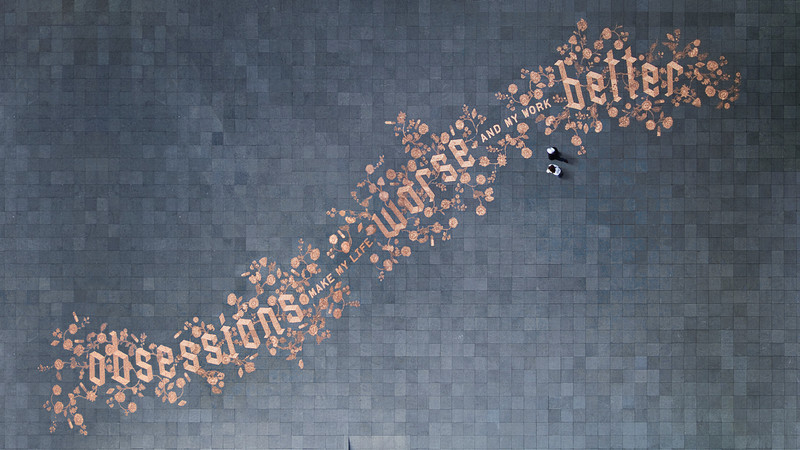

Er spielt mit den Sinnen des Betrachters. Er arbeitet Analog. Seiner Meinung nach braucht es mehr Mum eine Firma zu gründen statt sich nackt in der Öffentlichkeit zu zeigen. Er kommt aus der Technischen Welt (Ingenieurschule) in die Kunst (Universität für angewandte Kunst in Wien). Hat "Sagmeister Inc." gegründet. 2000 hat er ein Jahr Sabbat gemacht. Er vertieft sich stark in seine Arbei. "Obsessions make my life worse and my work better" Er hat mit seinen Werken regelmässig provoziert.

Sagmeisters Masterthesis

Er hat Albumcover gestaltet etwa von Rolling Stones, Lou Reed und weitere.

Er macht sich vorgängig sehr detailierte Zeichnungen und setzt diese ziemlich genau um.

Er arbeitet sehr eigenständig, setzt die Bedürfnisse des Kunden aber in den Mittelpunkt.

