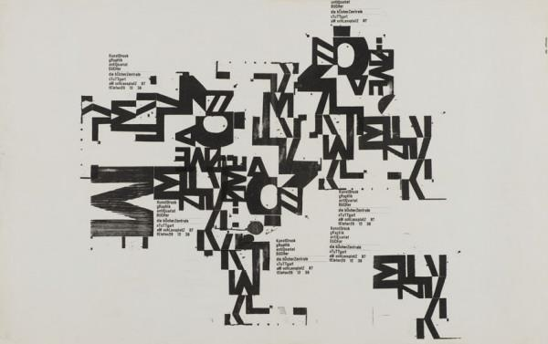
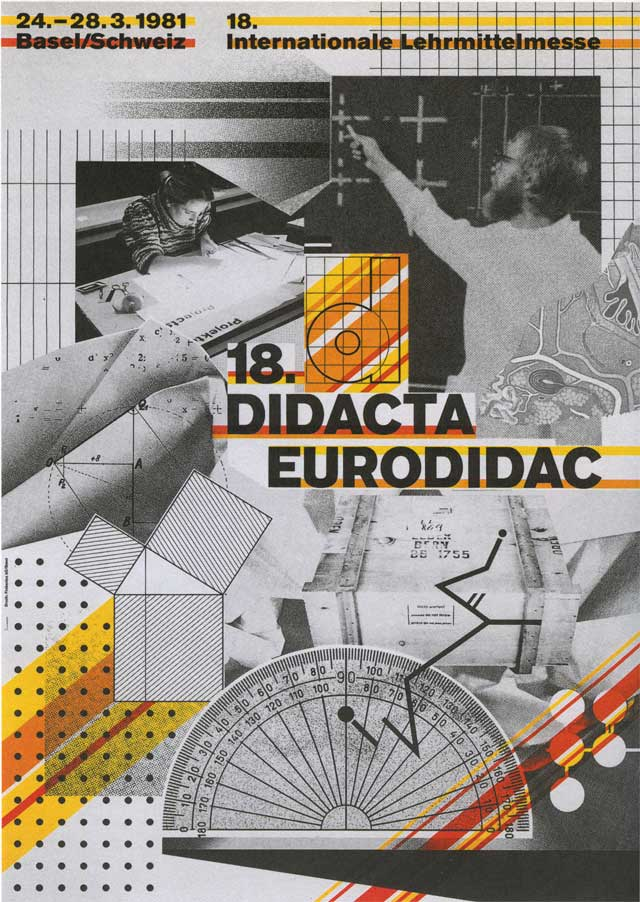
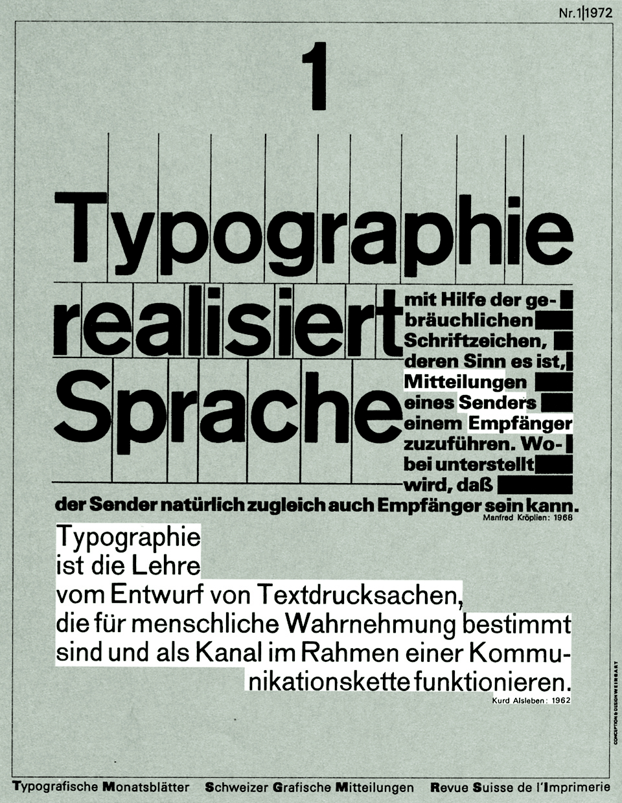
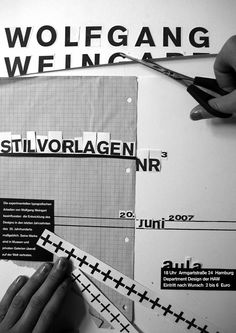
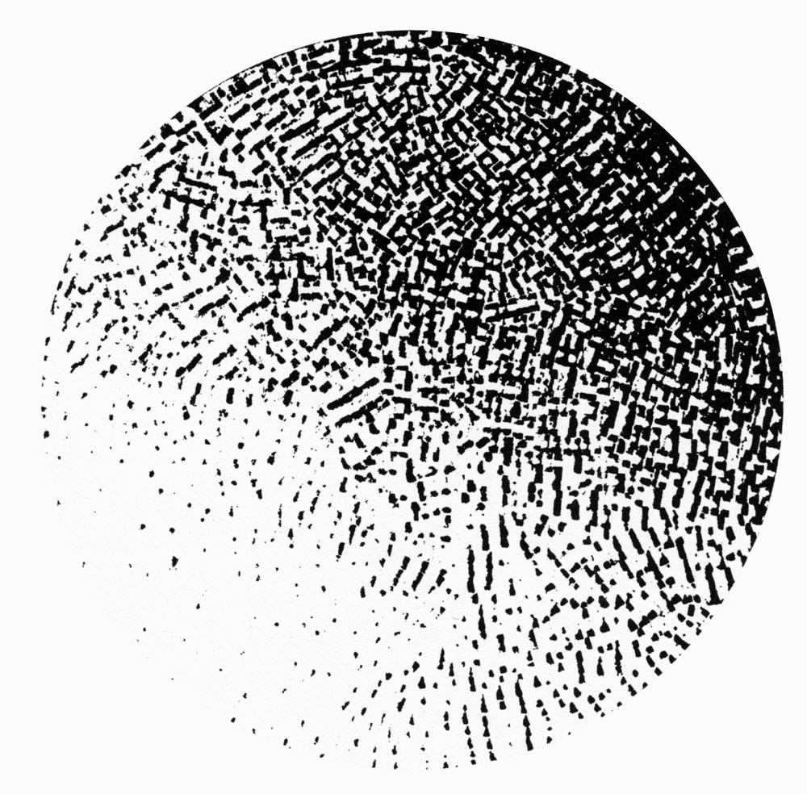

 "Electronic equipment replaces neither Eyes, Hands, nor Heart."

Father of Swiss Punk Typography Er wurde in Deutschland Geboren, hat zuerst eine Ausbildung an der Merz-Akademie und hat eine Lehre als Schriftsetzer. Er war eine Zeit lang Typografielehrer in Basel. Weingart wurde in Basel von Armin Hofmann und Emil Ruder unterrichtet. Er hat Schriften verformt, abgeändert oder verfremdet. Sein Stil sorgte anfangs für furore. Unter anderem wurde April Greiman von ihm unterrichtet. Ihm war immer sehr wichtig, dass seine Studenten einen eigenen Stil entwickeln.

Er hat New Wave vorbereitet und eingeführt, ohne ihn wäre wahrscheinlich April Greiman nicht so bekannt geworden. New Wave veränderte wie man Texte liest und anschaut.

Er hat mit Litho Film gearbeitet. Z.B. Litho collagen.

Sein Buch "My Way to Typography" hat er selbst erstellt und er war über 5 Jahre lang damit beschäftigt. Jede Seite wurde von ihm gestaltet.

2014 wurde ihm eine Ausstellung gewidmet.

