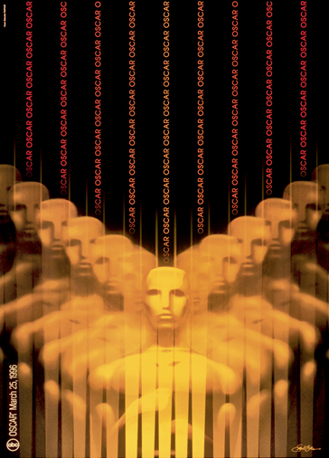

Freier Designer in NY Titelsequenzen in div. Filmen (über 40): - Hollywood Story - das verflixte 7 Jahr - Der Mann mit dem Goldenen Arm

Revolutionierte wie die Sequenzen aussehen und was sie für eine Rolle gespielt haben.

Sollten Atmosphäre und Stimmung aufbauen.

Bei "Der Mann mit dem Goldenen Arm" geht es um Drogenmissbrauch. Die Titelsequenz zeigt eine zerissene Hand in schwarz-weiss.

Vertigo Frau nur Umrandet, soll deren Tod darstellen. Titelsequenz beginnt mit einem Gesicht einer Frau und bleibt bei der Pupille stehen.

Logos: Lawrense war sein erstes Logo. Er hat das Logo von Bell gestaltet, als sie noch die grösste Firma der Welt waren. Das Logo für Ajinomoto gefiel der Firma so gut, dass die restlichen Produkte mit dem Logo redesigned wurden.

