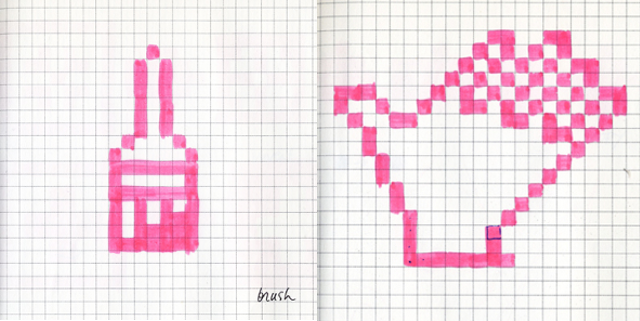

"Be confident, believe in yourself, try!" She is the icon of icons

Sie arbeitete bei Apple, IBM, next und Microsoft

Sie sollte die Grafischen Elemente für den Macintosh gestalten. Sie kannte sich jedoch nicht mit Computergrafik aus und eignete sich das Wissen kurzerhand in der Bibliothek an. Sie wurde nach 5 min Vorstellungsgespräch bei Apple eingestellt.

Als erstes sollte sie eine Schrift entwickeln, was sie noch nie gemacht hatte. Die Schrift nennt sich Chicago. Die Chicago war die Systemfont des ersten Macintosh, später auch beim ersten Ipod. Später hat sie noch mehrere Schriften entwickelt.

Die ersten Icons gestaltete sie auf Häuschenpapier. Einige ihrer Icons werden heute noch in Illustrator, Photoshop, Paint etc. verwendet (etwa das Lasso oder der Farbeimer). "be simple, be meaningful." Ihrer Meinung nach sollten Icons wie Verkehrsschilder funktionieren: Auf den ersten Blick soll klar sein, was das icon bedeutet.

Die Commandtaste von Mac war ein Schwedisches Symbol. Sie war sich zuerst nicht sicher was man unter Command zeigen sollte. Sie experimentierte mit Polizeimarken und vielen anderen dingen. Am ende war es ein Abstraktes Symbol, was erst später einen Sinn bekam. Es könnte etwa ein Schloss mit 4 Türmen darstellen.

Sie war zuständig für die Gestaltung von Microsofts Solitair.

Bei Facebook sollte sie Icons gestaltet. Die Sticker waren 64x64 Pixel und kosteten 1$. Deshalb wollte sie so gute Icons wie nur möglich gestalten.

