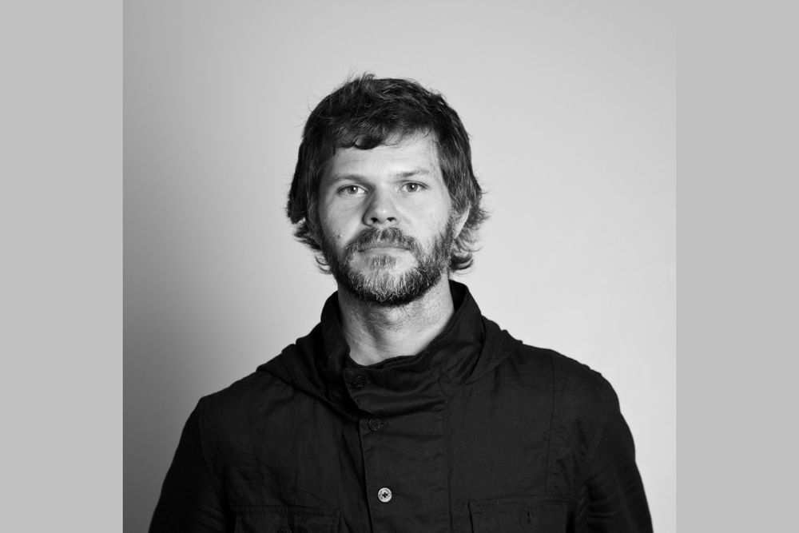

Er malt Bilder mit Code. Seine Bilder werden zwar am Computer erstellt, er druckt diese dann aber teilweise aus, projeziert sie oder erstellt Skulpturen mit den Bildern. Er hat den Bachelor in Design erhalten, hat dann als Grafiker gearbeitet und lernte mit 26 Jahren Programmieren.

2001 ging er dann ans MIT in die Aesthetics and Computation Group. Am MIT traff er dann John Maeda, der sein Lehrer wurde. Casey hat die Prinzipien von Maeda gelernt und angewand.

Casey Reas arbeitet sehr viel mit Code, macht sich aber erst eine Skizze auf Papier bevor er mit dem Programmieren beginnt.

Beim programmieren fasziniert ihn, dass mit wenigen Änderungen an Parametern etwas komplett neues generiert werden kann.

3 Phasen 1. Ersten Jahre viel experimentiert. Prinzip von Maeda angewendet und gelernt. 2. Nicht mehr nur spielerei sondern Medien einfliessen lassen. NY times oder Bilder aus dem Internet eingearbeitet. 3. Kleinraum des Bildschirms verlassen und Projektion auf Hauswand. Collaborationen mit anderen.

Er ist neben seiner Künstlerischen karriere auch Dozent und schreibt Bücher. [www.processing.org](https://processing.org/) wird von ihm gewartet.

