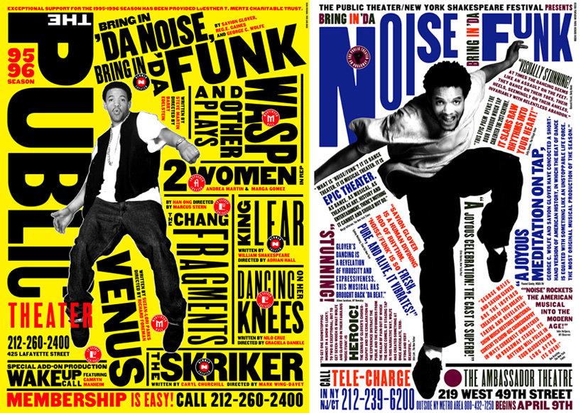
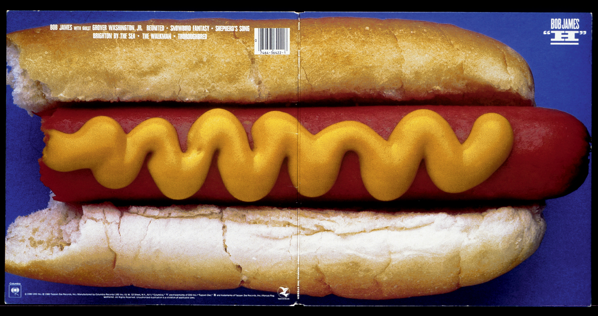
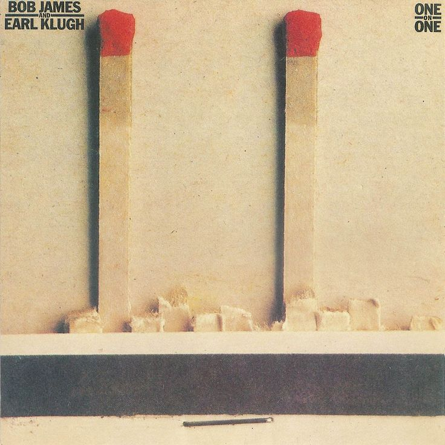
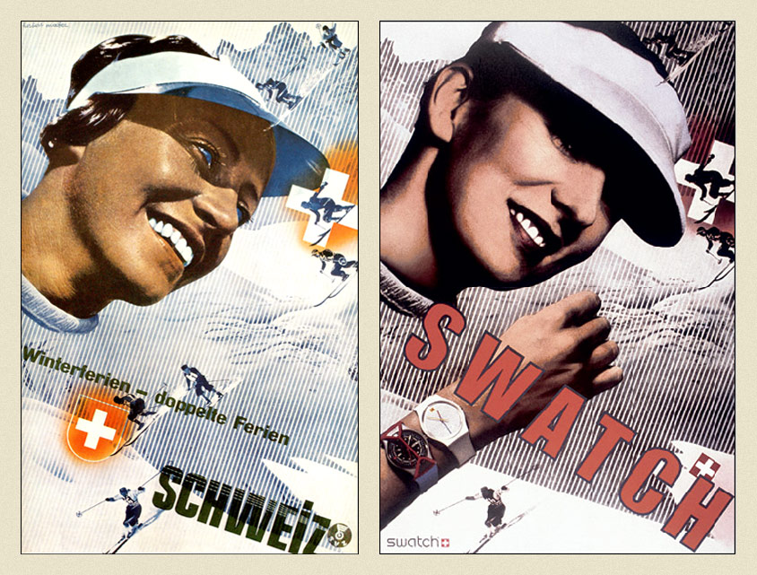
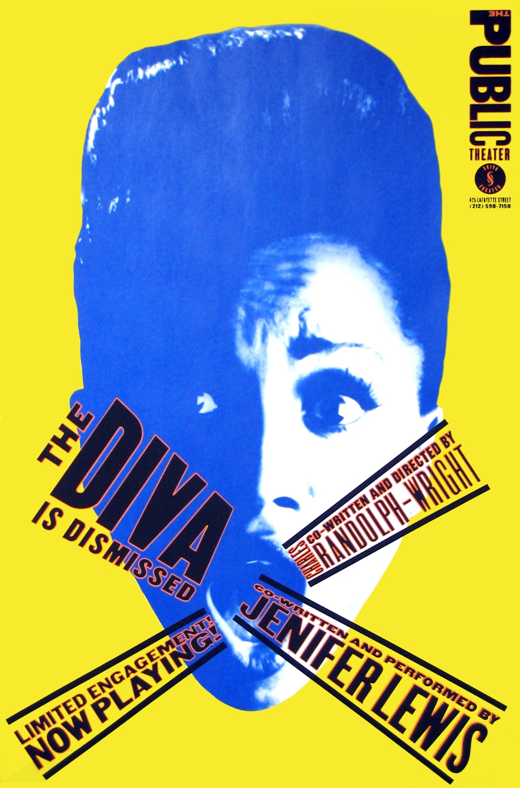
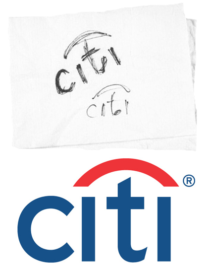
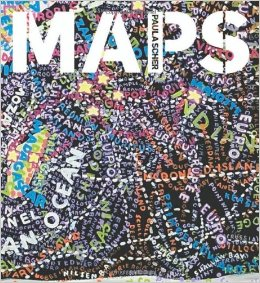
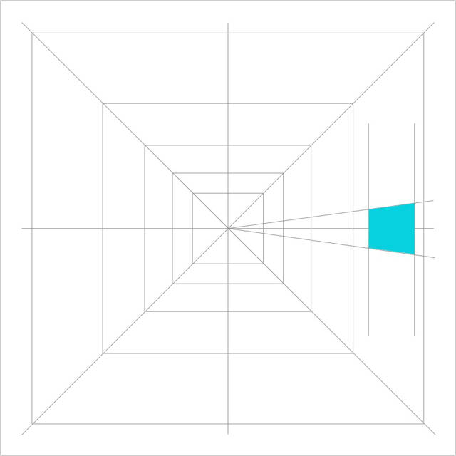

Sie hat einen Grafiker geheiratet, später haben sie sich geschieden. 10 Jahre später haben sie dann wieder geheiratet und sind seither zusammen.

Sie war Layouterin beim Random House's Children Books. Später arbeitete sie in einer Werbeagentur, dann hat sie Album Cover gestaltet.

Sie gründete Koppel und Scher, Koppel verliess 8 Jahre später die Firma. Sie arbeitete dann mit Pentagram zusammen.

Interieur design des Public Theaters mitgestaltet.

Das citibank Logo wurde von ihr gestaltet. Im ersten Meeting hat sie ein Logo auf eine Serviette gezeichnet und dann 1 Jahr lang gekämpft um das Logo umsetzen zu können. Für das Museum of modern arts hat sie das layout der Plakate gestaltet & strukturiert. Das New York city ballet Logo durfte sie neu gestalten.

Das Windows Logo für Microsoft wurde von ihr neu gestaltet und ist nun das Logo von Windows 10. Microsoft konnte dann die Logos der anderen Anwendungen anpassen und einheitlich gestalten.

