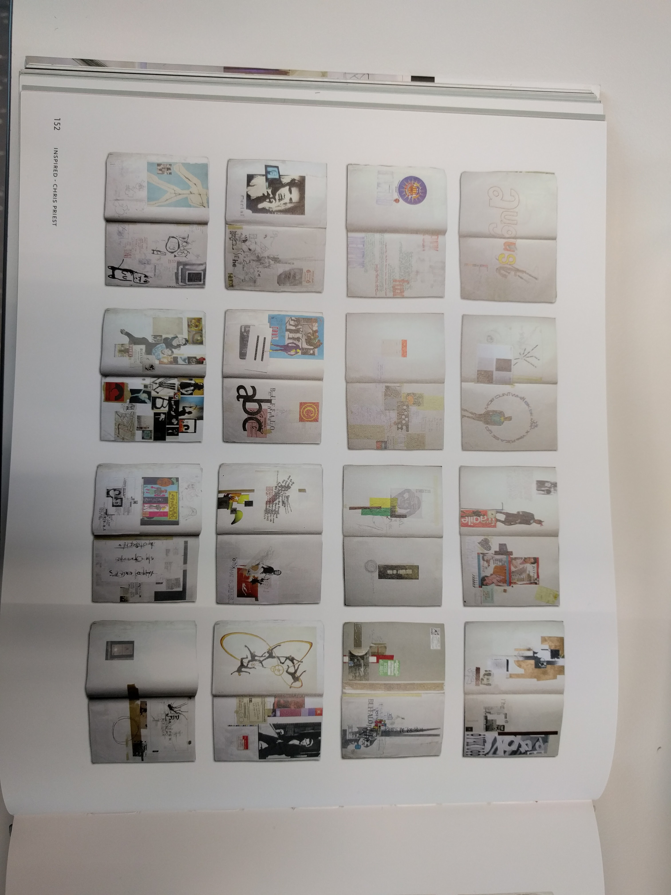
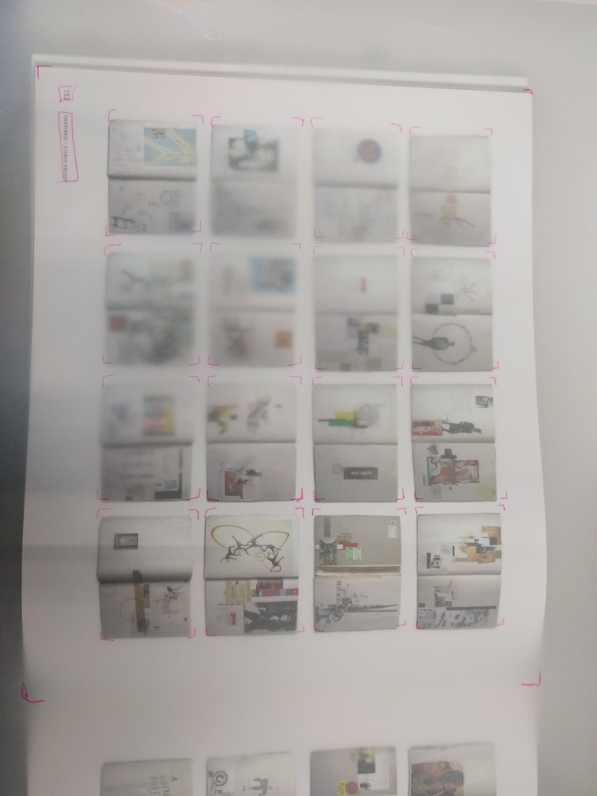
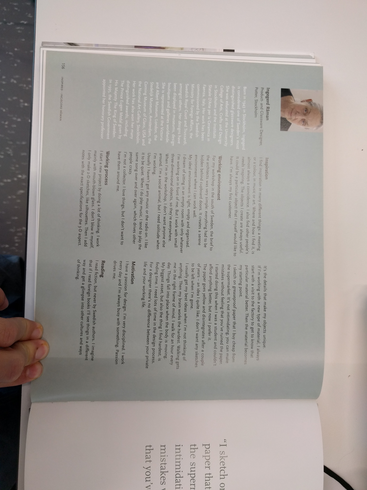
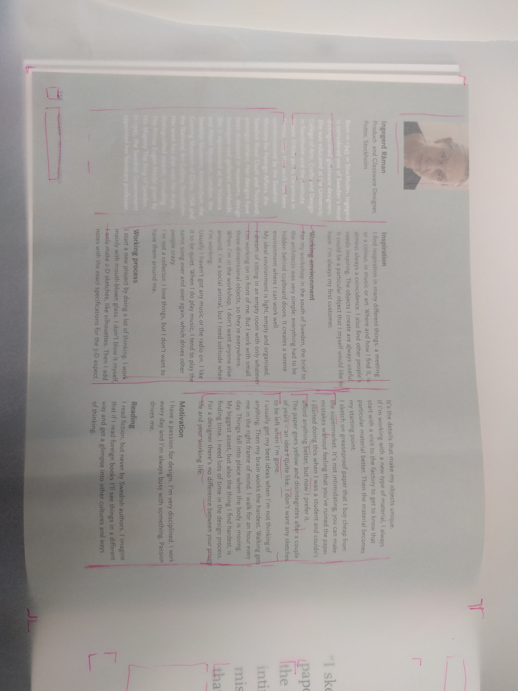
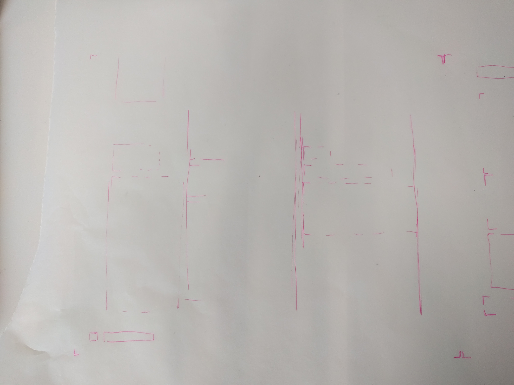
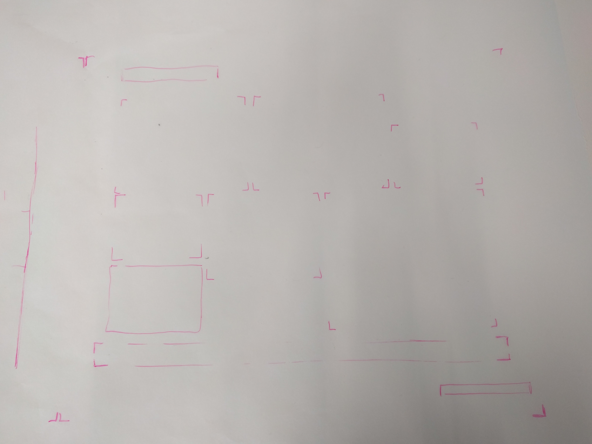
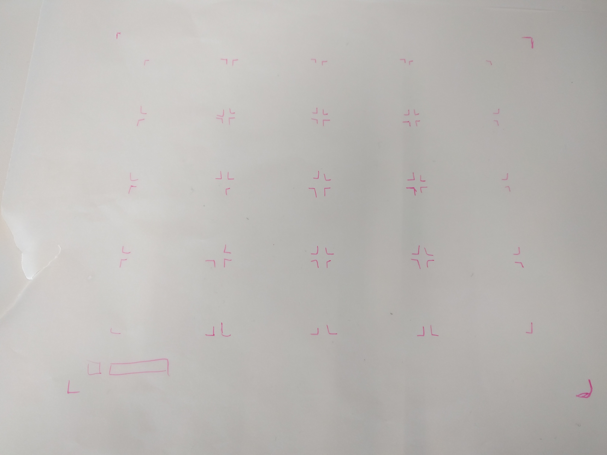

Beim kennenlernen von Rastern hilft es, wenn man Bücher analysiert. Bei Büchern gibt es extrem einfache Raster aber auch viele komplexere Raster. Es ist möglich viele verschiedene Raster in einem Buch zu haben und es ist nicht nötig einen einzigen Raster durch das ganze Buch zu ziehen. Es ist aber wichtig, dass sich gewisse konstanten durchs ganze Buch ziehen. Bei Büchern kann man ganz bewusst 2 unterschiedliche Raster verwenden. Das dient dem optischen trennen von Inhalten. Zum analysieren kann man Kalkpapier über eine Seite legen und dann die Ränder der Raster abbilden. Beim durchblättern kann man nun verifizieren ob der Raster gleich bleibt. Dabei ist interessant zu sehen, welche Linien über das Buch konstant bleiben und man lernt viel über die verwendeten Raster.

