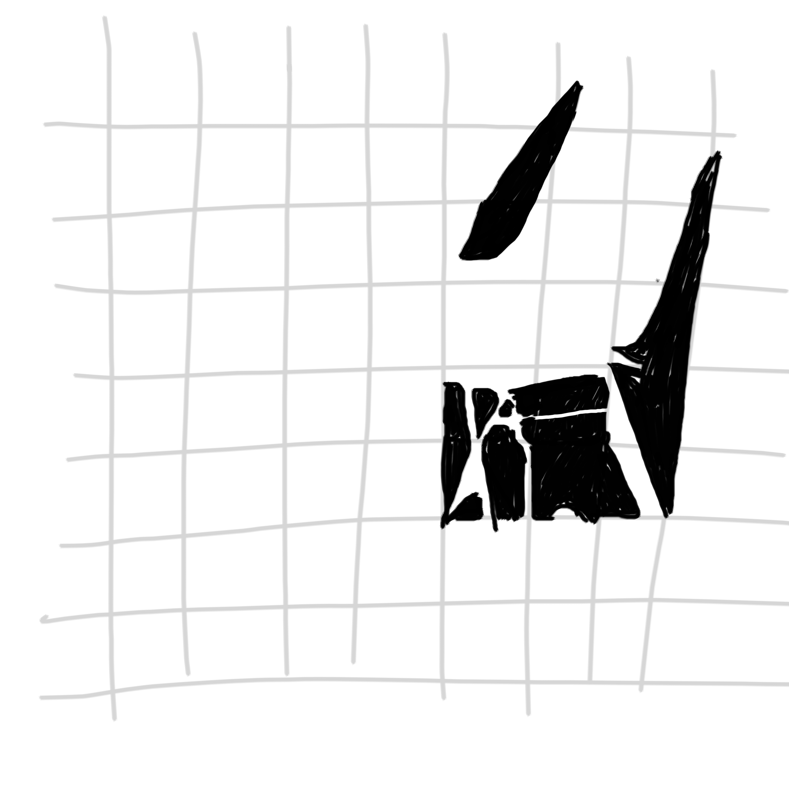
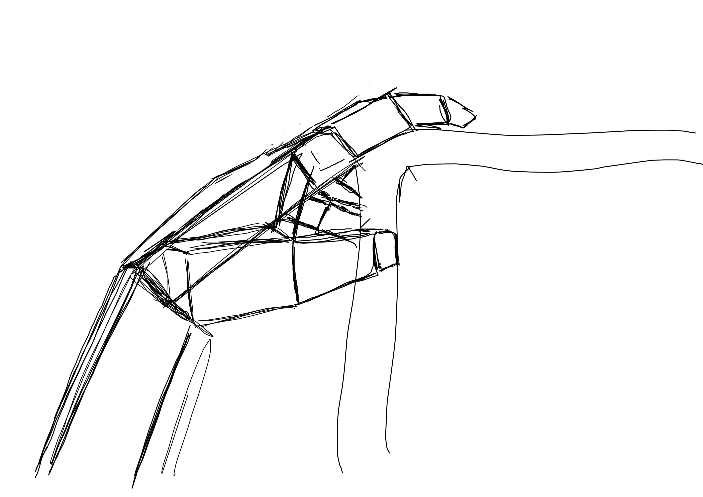
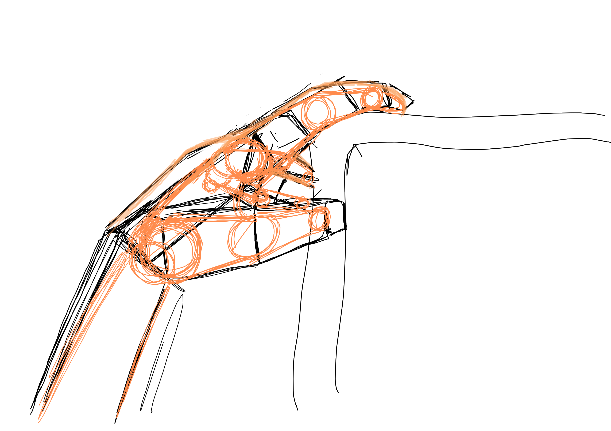

Daumen benutzen als Messinstrument. Beim Zeichnen wird mit dem Daumen oder dem Stift nicht gemessen sondern die Proportionen gemerkt zum Abtragen.

Übungen

Hand Zeichnen Eine Zeichenübung kann sein, die eigene Hand abzuzeichnen. Dabei legt man die Hand in einer interessanten Position hin und zeichnet dann mit der der anderen Hand auf ein Papier. Dabei gibt es verschiedene Vorgehensweisen. Z.B. kann man sich die Hand erst abstrakt als Kartonschachteln zeichnen. Eine andere Methode ist es etwa, erst die Knöchel und Gelenke als Kugeln zu platzieren und dann die Kugeln mit Zylindern verbindet.

Rasterzeichnen Das Rasterzeichnen ist eine interessante Zeichenübung. Beim Rasterzeichnen nimmt man ein Plexiglas und zeichnet ein Raster drauf. Man nimmt Papier und Stift, zeichnet sich ein Raster auf das Papier und sucht sich ein Objekt. Die kunst hierbei ist es, den Raster immer gleich zu halten. Zusatzchallenge: Man versucht etwa bei Stühlen nicht die Stühle zu zeichnen sondern alle "Flächen" die nicht von den Stühlen verdeckt werden als schwarze Flächen.

Techniken Bilder betrachten: Beim betrachten von Bildern hilft es, wenn man die Bilder drehen kann. Bilder haben eine bewegung oder Geschichte die sich komplett ändert wenn das Bild gedreht wird. Dynamik geht verloren oder wird hinzugefügt.
