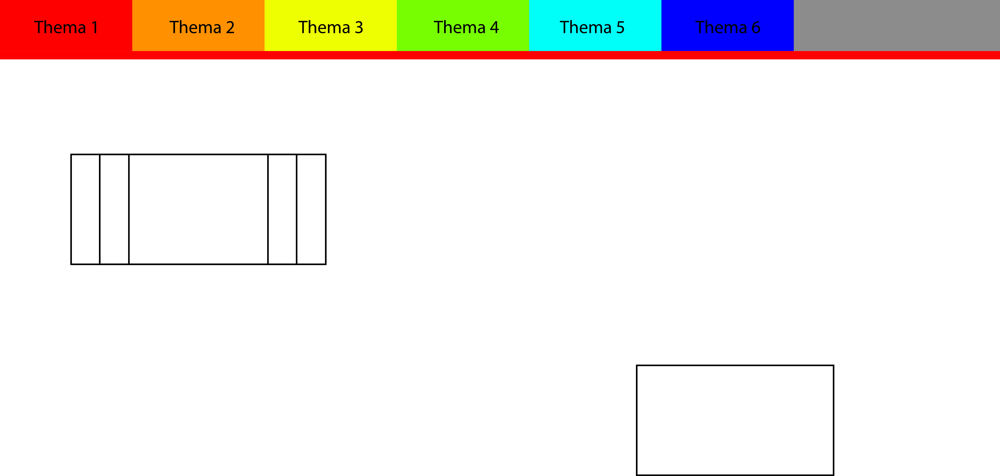
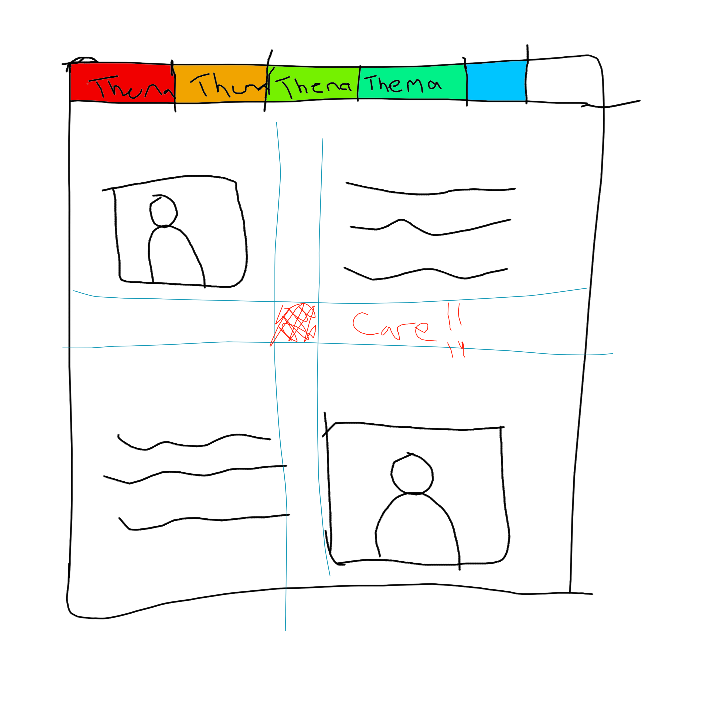
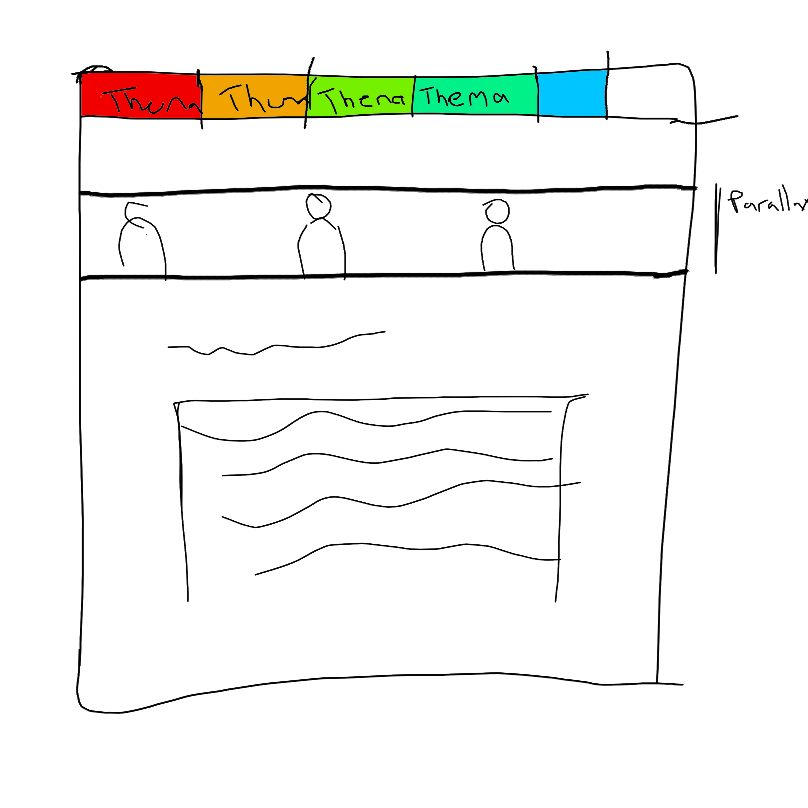
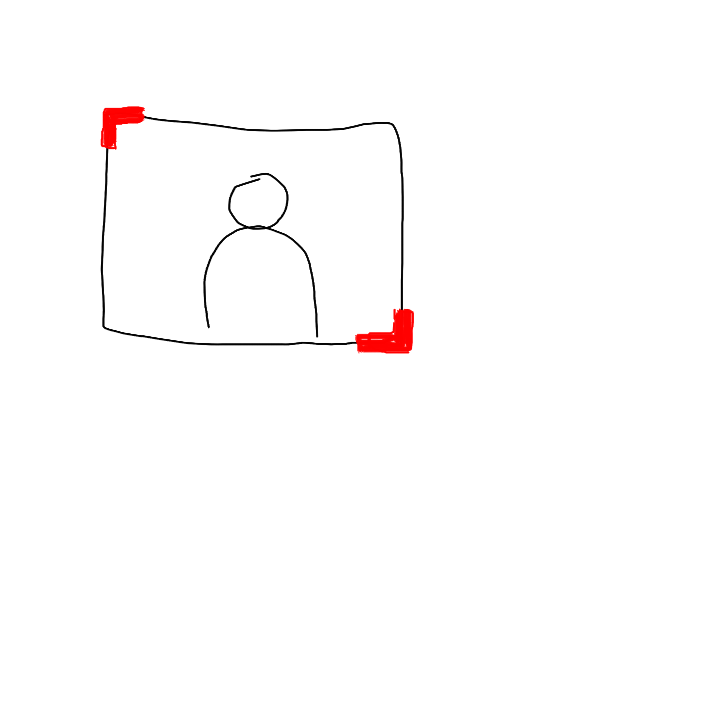
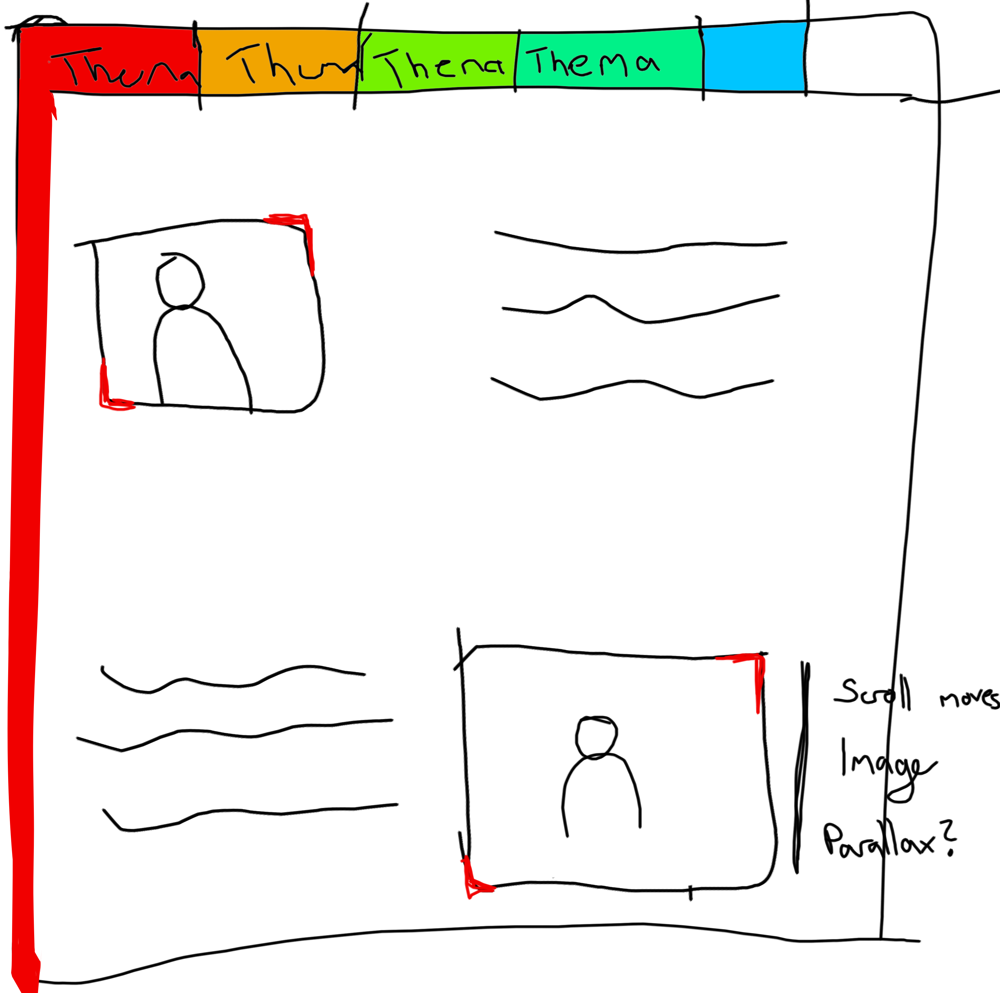
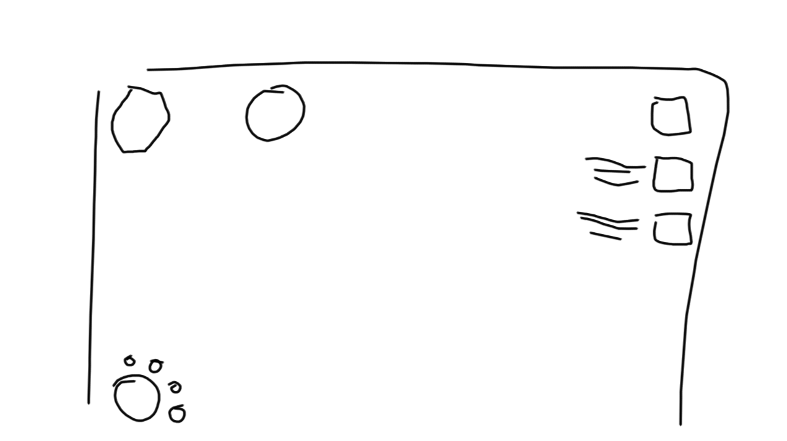
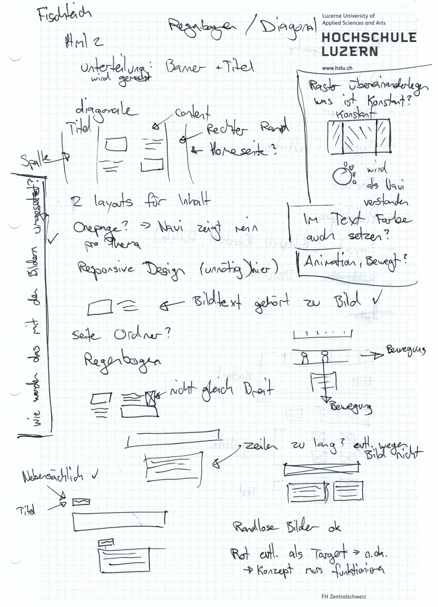
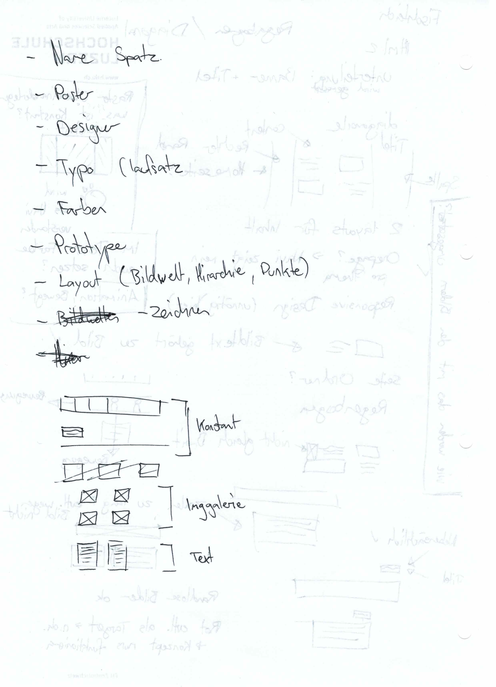
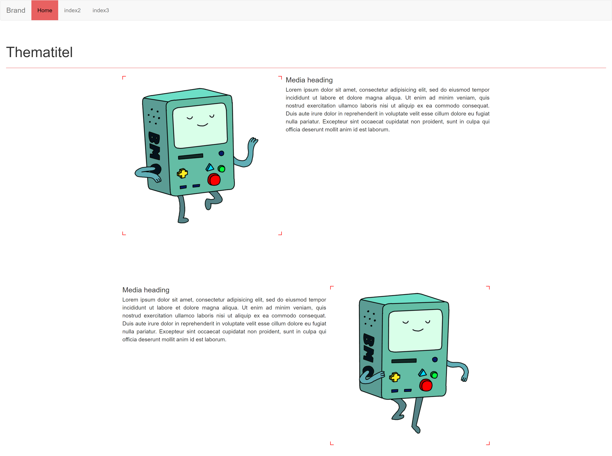

€: hier die fertige Webseite [Kickstart Visual Design](http://kvd.thecell.eu/)

Welcomescreen

Diese Webseite zeigt und vertieft, was wir im Semester bei Kickstart Visual Design gelernt haben.

Gestaltung > Basteln > schleifen

Themen: Präsentieren, was dieses Semester alles gemacht wurde. Genauer und beschreiben und auf Webseite nur Prozess.

Freihandzeichnen Hausperspektive Rasterzeichnen Körperteile abstrahieren zum zeichnen (Schachtel / Gelenke als Kugeln)

Kreise ausdruck auf verschiedenen Positionen auf Blatt. Kreise sasgen verschiedenes Aus

Komposition (Baum frisst haus, Kreise, Name im Bild verteilen), Typografie (block, flattersatz), Plakate, Designer, Layout (Raster), Licht schatten, Lesbarkeit

Technisch: Bootstrap Font? Parallax?

Kernsatz formulieren? Wenn ich Geld hätte wo ginge ich weiter? Was bringts mir?

Website Fazit ziehen? Emotionenbox Reflektieren

Register In Boxen verpacken?

Was gibt es sonst noch für organisationsmöglichkeiten?

Slider im Header als Konstante? Buch Schrift mit den Buchstabenfüsslein oben hineinragend

Erst Inhalt schauen und dann was gibts für ein Raster um das einzuarbeiten. Webseite schwarz? Abwechseln?

Website schwarz und weiss abwechselnd. 2 Stile? 2 Ideen zusammenfügen? Spatzionierung schwarzer hintergrund Weisse schrift.

Musterseiten machen mit Inhalt um zu sehen welcher inhalt mit was funktioniert

Dokumentation aus Bildern. Was ich mir dazu überlege schreiben.

Webseite Soll Farbspektrum "abdecken" wenn alle Themen drauf sind. AkA: Unterricht hat die ganze Bandbreite abgedeckt

Zwischenstand, Notizen "Fischteich":

"feature complete": 

