[To the english version](http://blog.thecell.eu/orientationtips-for-path-of-exile/)

Path of Exile hat zufällig generierte Maps, es gibt aber immerwieder kleine Orientierungspunkte damit man schneller durch die Welt reisen kann. Hier eine Liste der mir bekannten Punkte.

**Akt 1** [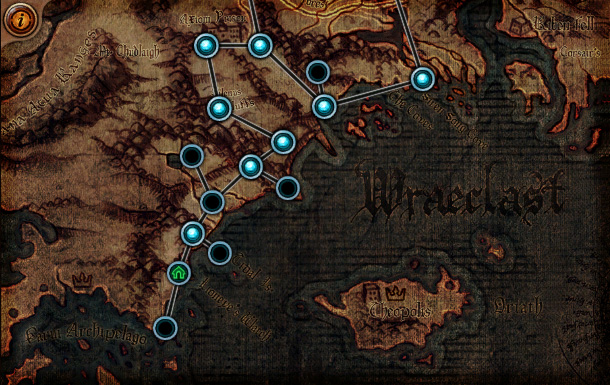](http://blog.thecell.eu/wp-content/uploads/2017/01/A1_Waypoint_map_act_1.jpg)

**The Submerged Passage** [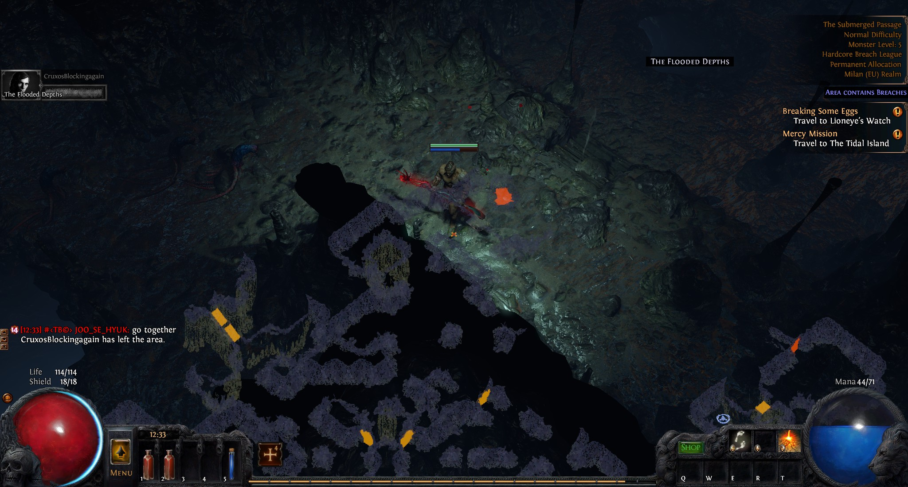](http://blog.thecell.eu/wp-content/uploads/2017/01/A1_SubmergedPassage.jpg) Die Doppeltreppen führt weiter zu The Ledge. Die Flooded Depths befinden sich meistens in der Nähe der Treppen. Die Treppen sind normalerweise rechts unten auf der Karte und die Flooded Depths bei den Treppen richtung links.

**The Ledge** [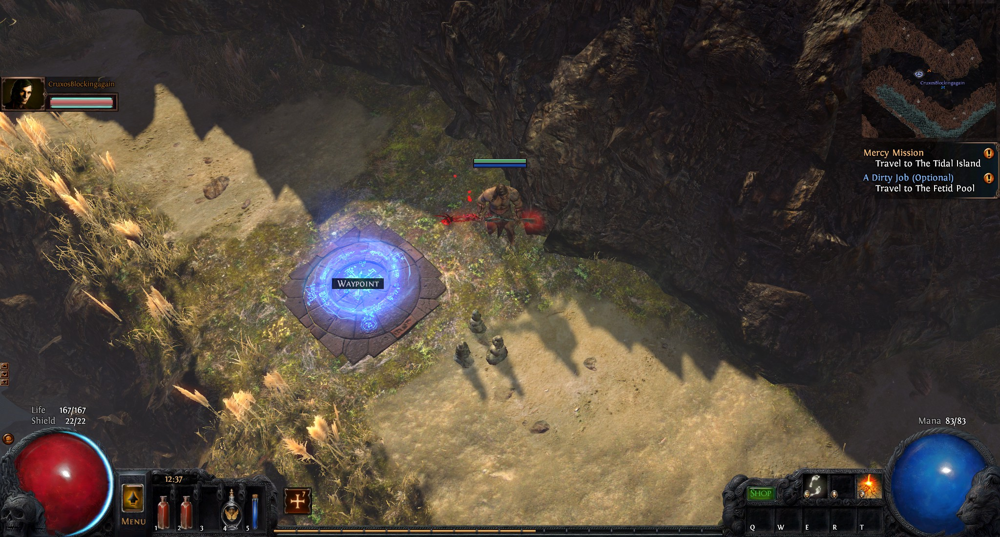](http://blog.thecell.eu/wp-content/uploads/2017/01/A1_Ledge.jpg) Beim Wegpunkt stehen 3 kleine Steinmännchen. Diese Steinmännchen zeigen, in welcher Richtung sich Kuduku und The Climb befinden.

**Prison** Hier folgt man der Blutspur um zu Brutus zu gelangen.

**Prisoner's Gate** [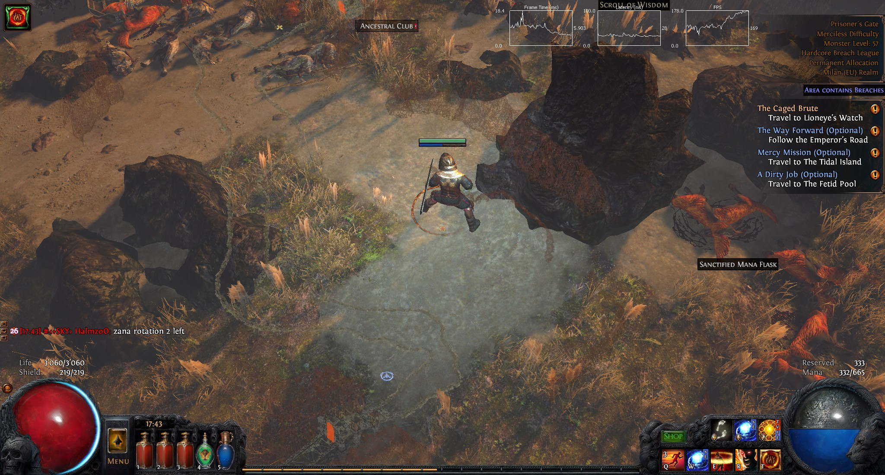](http://blog.thecell.eu/wp-content/uploads/2017/01/A1_PrisonersGate.jpg) Man Orientiert sich an der Strasse. Auf einer der beiden Seiten gibt es eine Steinwand auf der anderen ein Kliff. Auf der Seite des Kliffs gehts weiter. Man muss Piety auch nicht erst den Eingang schliessen lassen.

**Akt 2**  **The Riverways** [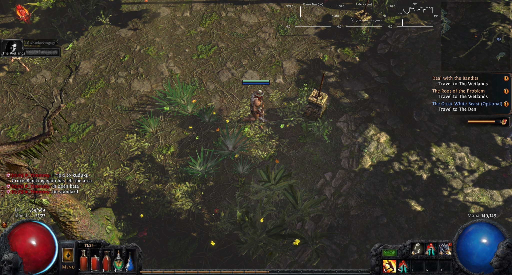](http://blog.thecell.eu/wp-content/uploads/2017/01/A2_Riverways.jpg) Beim Wegpunkt sucht man nach den 2 Pfeilern und der verwachsenen Strasse. Dieser folgt man dann um zu den Wetlands zu gelangen. Wenn man der Strasse nach links folgt, gelangt man in die Western Forests.

**The Western Forest** [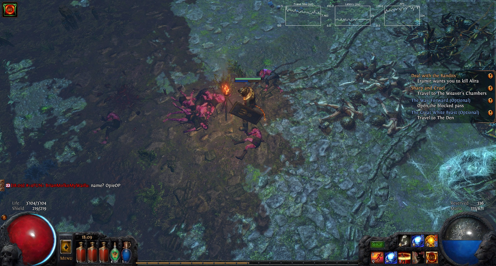](http://blog.thecell.eu/wp-content/uploads/2017/01/A2_WesternForest.jpg) Hier folgt man dem Pfad bis dieser Aufgebrochen wird. Der verwachsenen Strasse folgend kommt man zu Alira. Die Andere Strassenseite führt zu The Weaver's Chambers.

[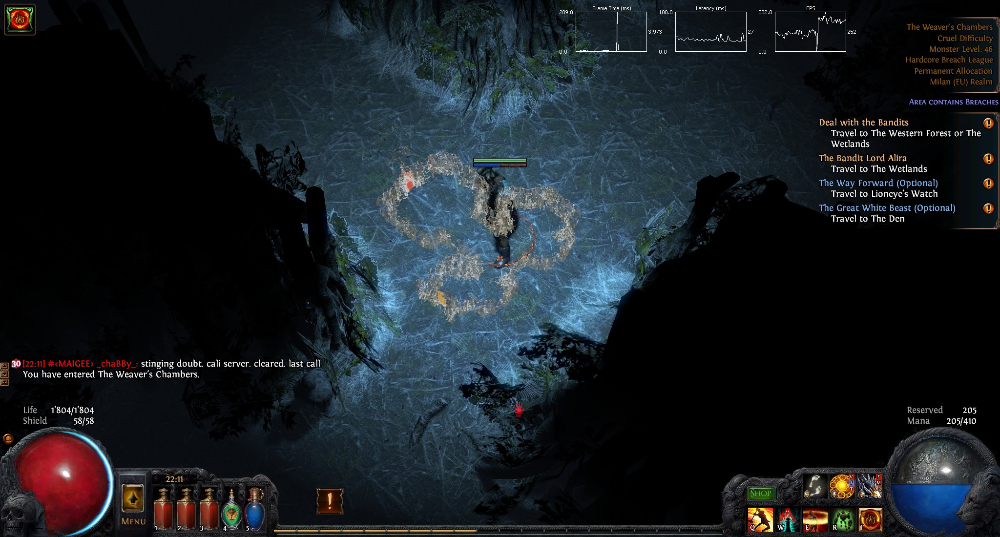](http://blog.thecell.eu/wp-content/uploads/2017/01/A2_WeaversChambers.jpg) Hier gibts nichts zu sehen, ausser einem Penis

**The Chamber of Sins Level 1** [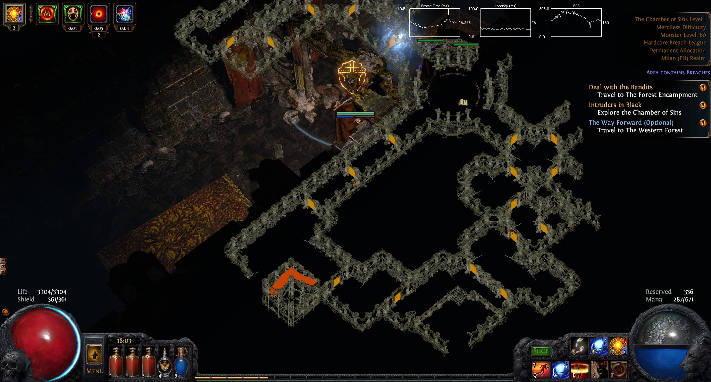](http://blog.thecell.eu/wp-content/uploads/2017/01/A2_ChamberOfSins1.jpg) Die Treppe nach unten befindet sich immer an einer der 2 südlichen Ecken der Kammern. Die falsche untere Ecke enthält ein grosses Monster-Bluepack.

**The Chamber of Sins Level 2** [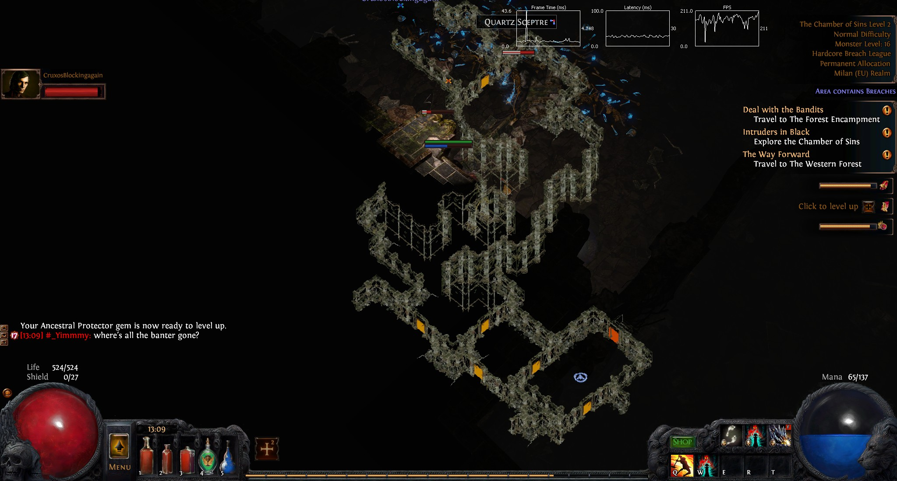](http://blog.thecell.eu/wp-content/uploads/2017/01/A2_ChamberOfSins2.jpg)

[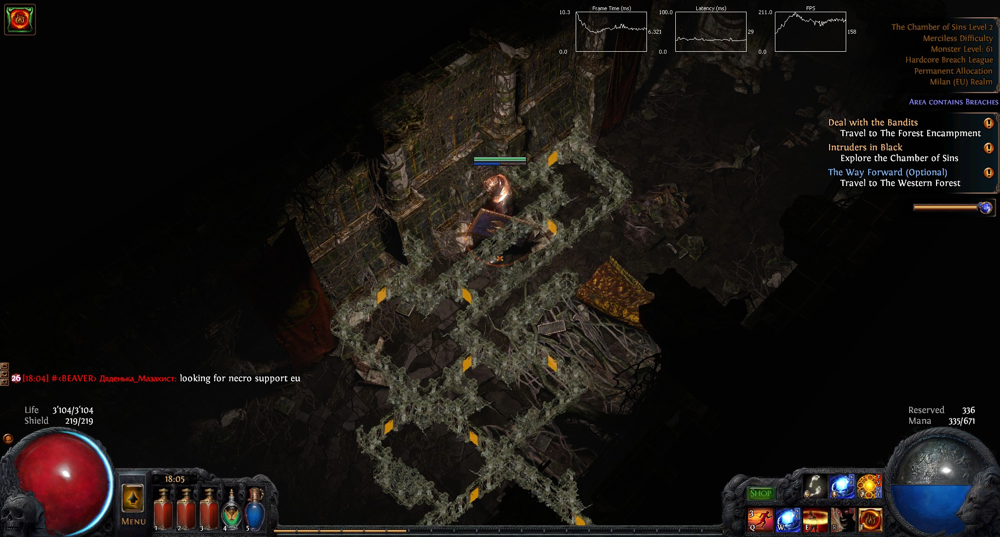](http://blog.thecell.eu/wp-content/uploads/2017/01/A2_ChamberOfSins22.jpg)

[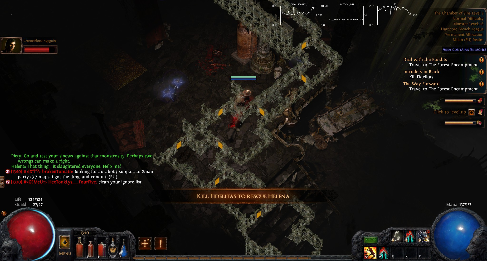](http://blog.thecell.eu/wp-content/uploads/2017/01/A2_ChamberOfSins23.jpg) Fidelitas befindet sich vom Wegpunkt immer nördlich. Im Süden befindet sich die Trial. Im Norden hält man sich rechts und hält ausschau nach einem länglichen gang nach Rechts meist mit einem Teppich in der mitte des Ganges auf dem Boden

**The Caverns** [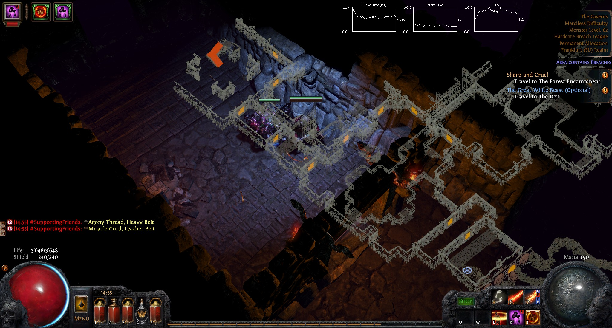](http://blog.thecell.eu/wp-content/uploads/2017/01/A2_Caverns.jpg) Sobald man bei den Caverns angekommen ist, hält man sich links. Der Eingang zur Ancient Pyramid ist immer Links. Es gibt jedoch auch links Türen die nicht weiter führen. Daher nicht strikt jeweils die erste linke Tür nehmen.

**The Ancient Pyramid** [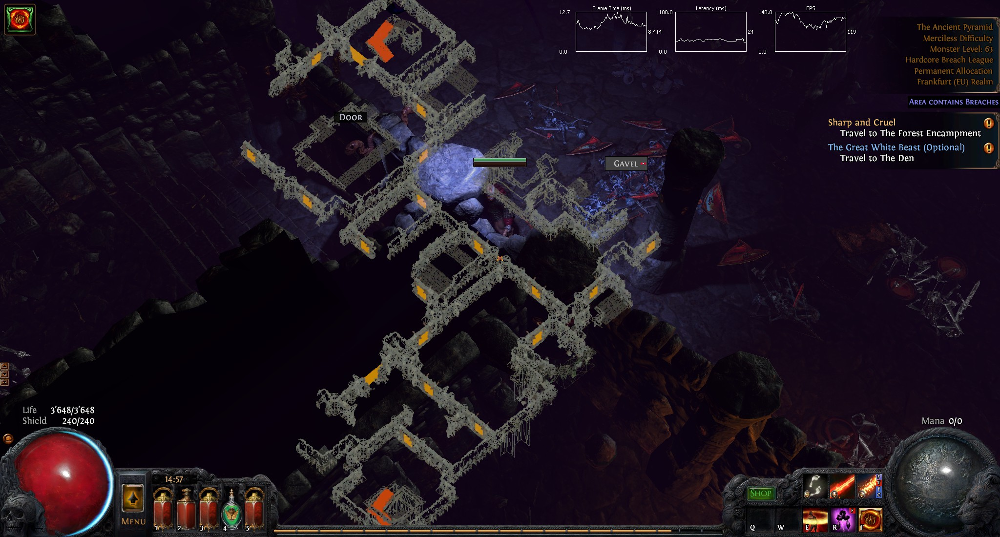](http://blog.thecell.eu/wp-content/uploads/2017/01/A2_AncientPyramid.jpg)

[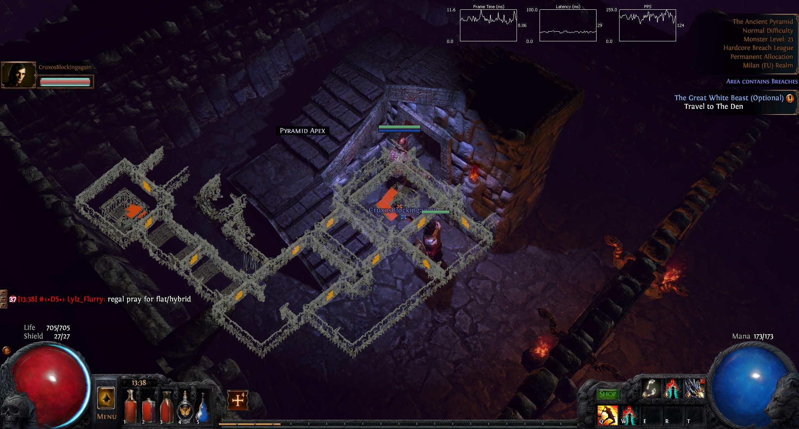](http://blog.thecell.eu/wp-content/uploads/2017/01/A2_AncientPyramid4.jpg)

[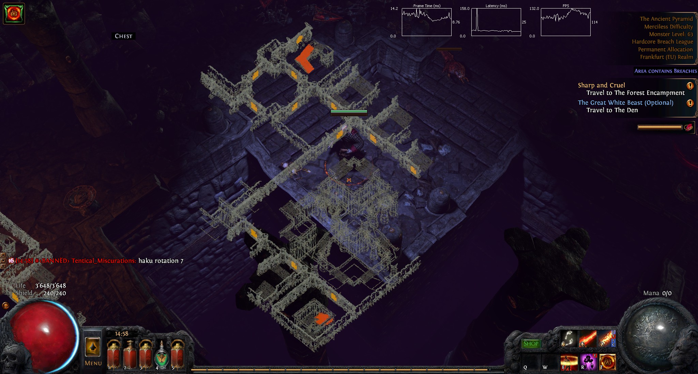](http://blog.thecell.eu/wp-content/uploads/2017/01/A2_AncientPyramid3.jpg)

[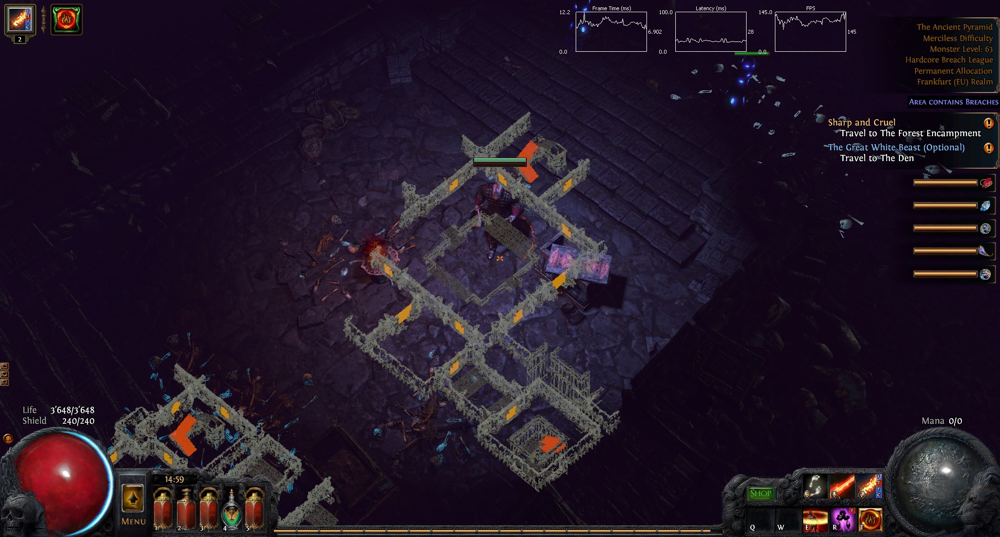](http://blog.thecell.eu/wp-content/uploads/2017/01/A2_AncientPyramid2.jpg) Die Pyramide ist immer Diagonal angelegt. Zur Orientierung sieht man sich die Ecke an und weiss dann in welcher Ecke man sich befindet. Diagonal dazu befindet sich die nächste Treppe.

**Akt 3**  **The Warehouse District** [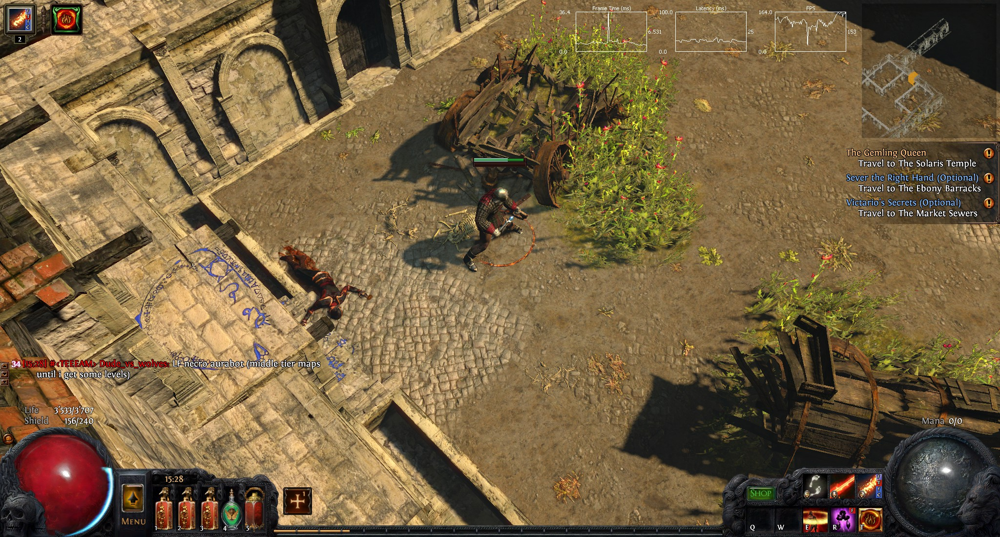](http://blog.thecell.eu/wp-content/uploads/2017/01/A3_WarehouseDistrict2.jpg)

[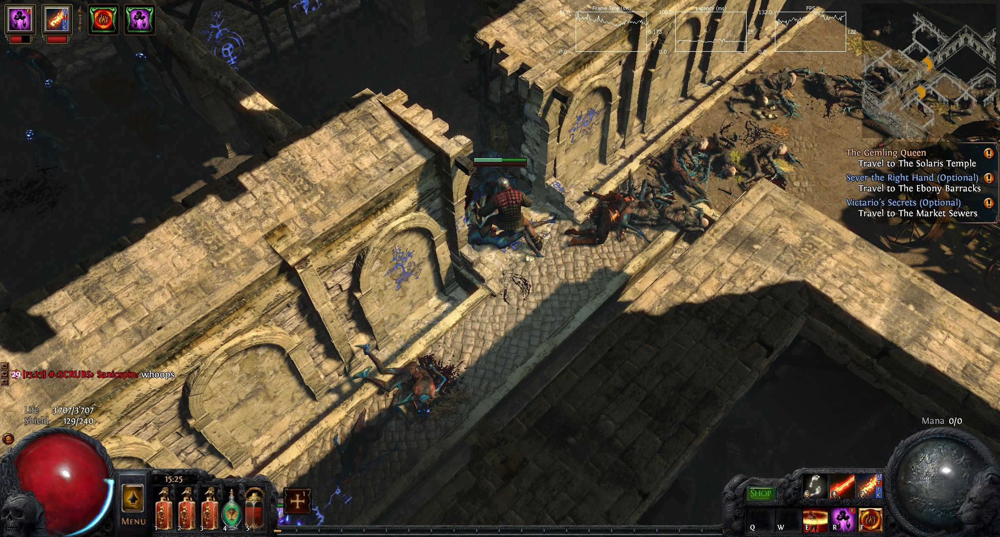](http://blog.thecell.eu/wp-content/uploads/2017/01/A3_WarehouseDistrict3.jpg)

[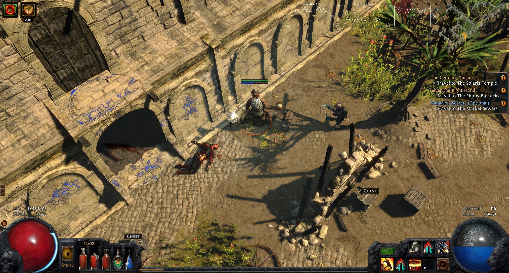](http://blog.thecell.eu/wp-content/uploads/2017/01/A3_WarehouseDistrict4.jpg)

[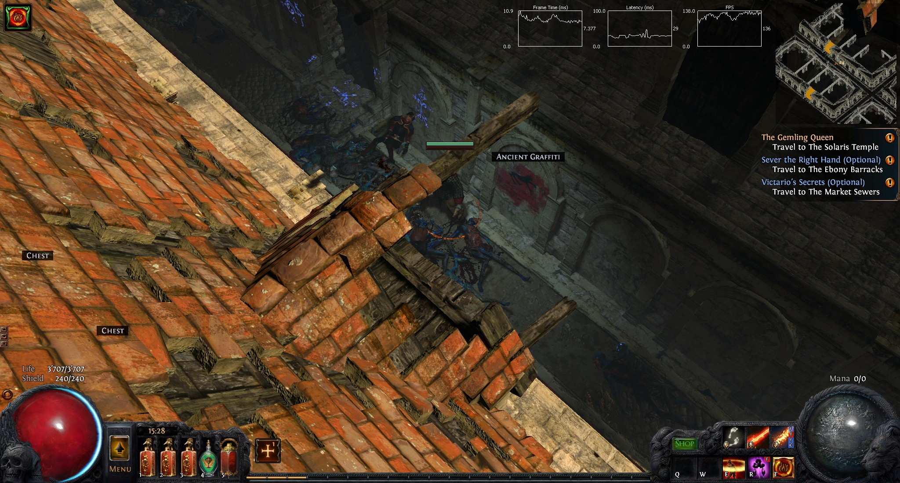](http://blog.thecell.eu/wp-content/uploads/2017/01/A3_WarehouseDistrict.jpg) Die Leichen an den Hauseingängen zeigen an, welcher Eingang weiter führt. Der Weg führt immer nur durch Häuser mit Leichen.

**The Lunaris Temple Level 1** [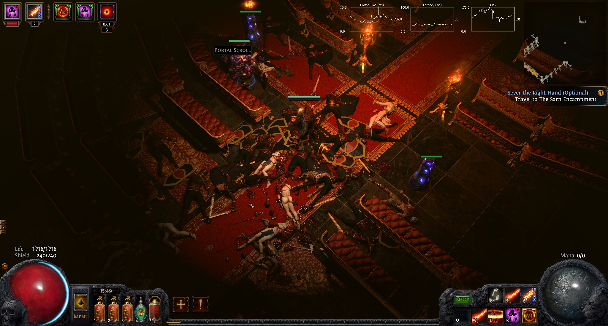](http://blog.thecell.eu/wp-content/uploads/2017/01/A3_LunarisTemple.jpg)

[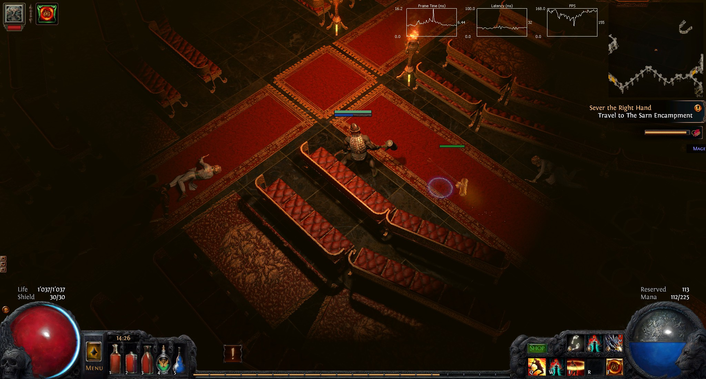](http://blog.thecell.eu/wp-content/uploads/2017/01/A3_LunarisTemple0.jpg) Im Lunaristempel orientiert man sich am Teppich. Dies stimmt nicht immer, aber im grossen Raum zeigt der Teppich immer in Richtung des nächsten Ganges.

**The Lunaris Temple Level 2** [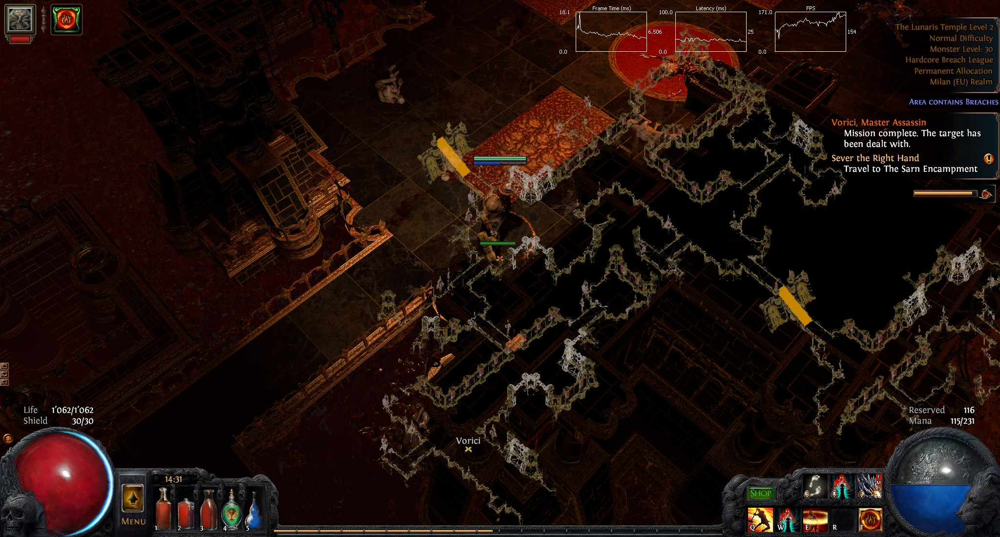](http://blog.thecell.eu/wp-content/uploads/2017/01/A3_LunarisTemple3.jpg) Um zu Piety zu gelangen muss man immer die Treppen steigen. Die Treppen sind aber meist nicht schön auf einer Linie angeordnet.

**The Lunaris Temple Level 2** [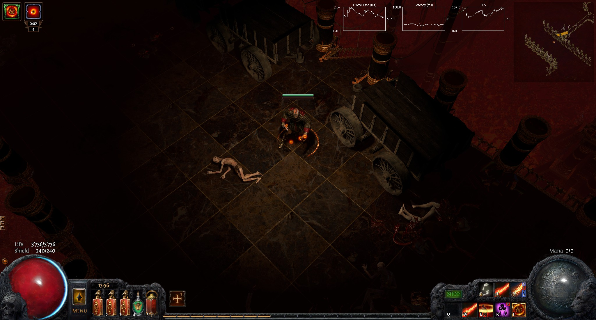](http://blog.thecell.eu/wp-content/uploads/2017/01/A3_LunarisTemple2.jpg) Bei den letzten Treppen befinden sich auf beiden Seiten Wagen. Die Seite mit nur einem Wagen zeigt den Weg an. Die andere Seite führt in eine Sackgasse

**The Imperial Gardens** [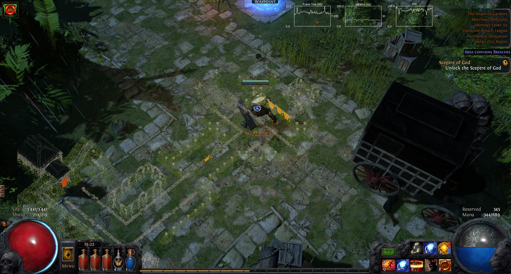](http://blog.thecell.eu/wp-content/uploads/2017/01/A3_ImperialGardens.jpg) Beim Wegpunkt angelangt gibt es 3 Richtungen. Gerade weg von der Strasse befindet sich das Hedge Maze. Der Weg links führt zur Library. Rechts gehts weiter richtung Scepter of God.

**The Sceptre of God** [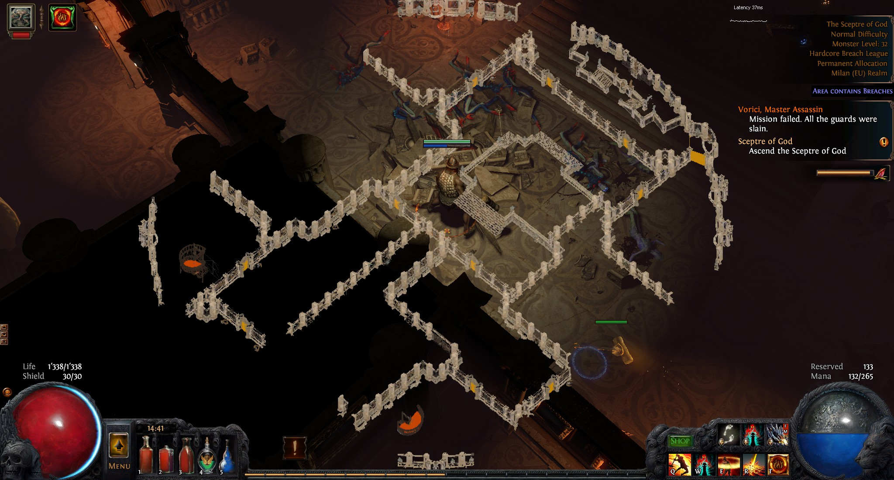](http://blog.thecell.eu/wp-content/uploads/2017/01/A3_SceptreOfGod.jpg) Beim Scepter of God gibt es keine sicheren Orientierungen. Aber die Treppen befinden sich immer in einer der 4 Ecken.

**Akt 4**  Hier sind mir keine Hinweise zur Levelorientierung bekannt.

Zum Forschen: Akt 4 Daresso's Dream: Immer rechts halten.

Akt 4 Daresso: Beim Wegpunkt immer erster Weg link.

Der Ausgang der Arenen in The Grand Arena liegt immer beim Eingang gerade aus.

https://dd.reddit.com/r/pathofexile/comments/5mcq80/orientation\_tips\_to\_get\_through\_wraeclast\_faster/

**The Lord's Labyrinth** [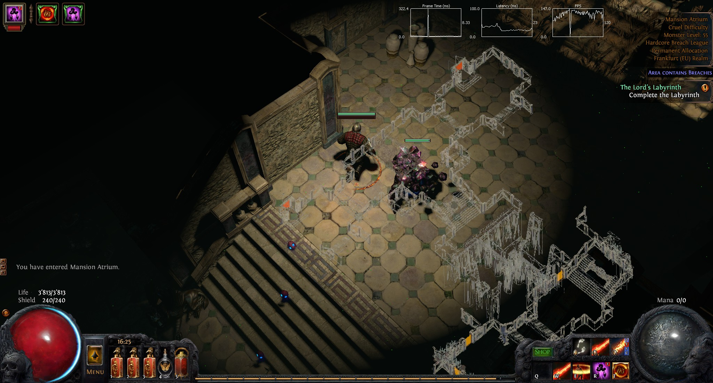](http://blog.thecell.eu/wp-content/uploads/2017/01/LabExits.jpg) Im Lab muss man immer die Area durchqueren. Wenn man einen Ausgang gefunden hat, sind die anderen meist auf der selben höhe weiter links und/oder rechts.
