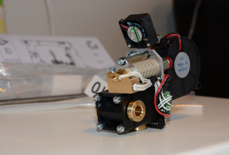
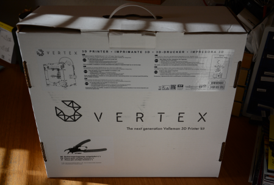
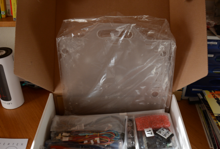
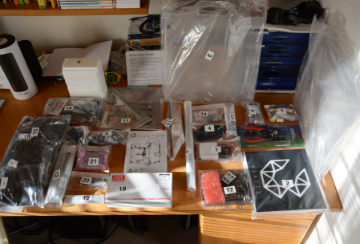
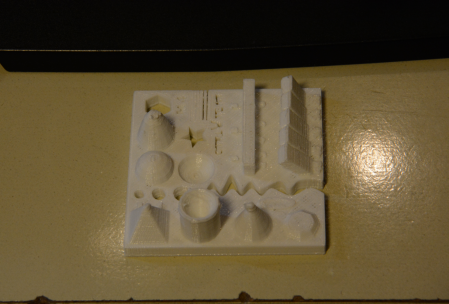
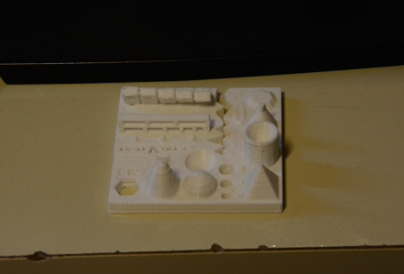
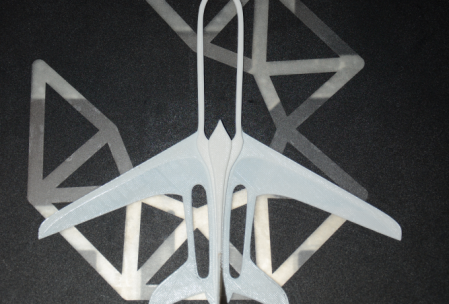
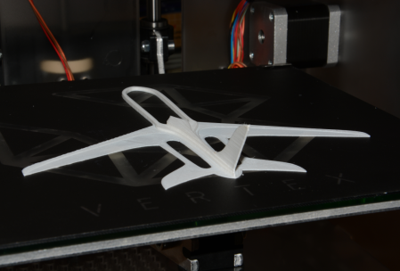

Fuck it this Post was in draft state for 2 years and i likely won't write anything new to it so here you go.

I wanted to write this guide to show what it's like to build a 3D printer and use one after that. I want to show what all the 3d printing is about. I had almost no contact with 3d printing before this project and have only seen 3-5 models printed with one. I ultimately bought one because there was a 24h sale and I wanted a printer for quiet some time. As the printers get cheaper and the variety gets bigger the interest on 3d printers will rise. I have no further experience on the subject and do not claim to be neutral. I do not have experience with other types of printers and other models. Let's get into it:

There are a wide variety of printers already available. A lot of them are FFF printers. Thats the kind of printer that uses 1.75mm (or 3mm etc.) of plastic string to "build" the object. The plastic is fed into a nozzle, melted and then pushed trough a nozzle onto a plate which is sometimes heated to make sure the plastic sticks to the plate. The nozzle looks like this:  The printer I bought is working with this technology. Beside the FFF technology there are a lot of other technologys and you can 3D print objects made of stone or metal. I won't go into detail on those other processes but [wikipedia](http://en.wikipedia.org/wiki/3D_printing) should help you out if you are curious. Another type of 3D printer is a [doodle pen](https://www.google.ch/search?q=3d+doodle+pen&oq=3d+doodle+pen&gs_l=serp.3..0i67j0l2j0i22i30l7.14951.15178.0.15312.3.3.0.0.0.0.114.114.0j1.1.0....0...1c.1.64.serp..2.1.114.Ulf66lcxnYs) where you can draw plastic in 3D. It is very intuitive and non technical - great to introduce younger people to 3D printing or to show older folks what all this 3D printing thing is about. So, what did I get myself into?

I bought a **Vertex K8400** as my first printing device. This was a rather short decision and I did only read a couple of reviews before I bought it, there might be better options but I found this Printer perfectly suited for my needs. It's very cheap, provides a good printing dimension and is upgradeable to 2 Printheads (nozzles). The Specs can be found on the website ([http://www.vertex3dprinter.eu/#specs](http://www.vertex3dprinter.eu/#specs)) but to have all information gathered here and providing it longer then the usual halftime of websites do, here they are:

**Printing:** print technology: Fused Filament Fabrication (FFF) layer resolution: standard: 0.1 mm (maximum: 0.2 mm - minimum: 0.05 mm) build plate: 215 x 240 mm (8.46" x 9.45") build volume: 180 x 200 x 190 mm (7" x 7.8" x 7.5") print speed: 30 mm/s - 120 mm/s travel speed: 30 mm/s - 300 mm/s build plate surface: Removable layer of BuildTak™ (consumable; also sold separately) filament diameter: 1.75 mm (accepts all filament spools with a mounting hole = 53 mm). Open filament policy. prints: PLA, ABS Testing with other materials in progress. nozzle 1&2 diameter: 0.35mm One nozzle supplied. Second nozzle optional. distance between nozzles: 23.7 mm Maximum nozzle operating temperature: 270 °C

**Software:** firmware: Modified Open Source Marlin 3D Printer Firmware - user upgradable software: Repetier - CuraEngine - Slic3r (RepRap compatible)

**Hardware:** dimensions: X Y Z 360 - 380 - 395 mm (14" x 15" x 15.5") (without filament spools) frame: Polycarbonate panels and fibre reinforced molded ABS parts weight: 10 kg average noise level during operation: 52 dBA (at 1 m) ambient operation temperature: max 25 °C storage temperature: - 10 °C to + 40 °C

**Electrical:** communication: USB 2.0 or SD card controller board: AVR ATmega2560 based

As it turnes out this printer has a good printingquality compared to some other printers (judging by the pictures of other makers). It is crucial to be very accurate when building the machine, since your prints will depend on the buildquality. After ordering I got a package looking like this: 

There is no instruction inclueded but there is a great guide online. The [guide](http://manuals.velleman.eu/category.php?id=2/) walks you through every step in great detail including the calibration and first use.

I spent a weekend on building the printer and after calibration everything went smooth. For calibration: This model has the plate as z axis. The printhead is only moving x/y and you really should oil the z Axis threaded rod before use! Make sure you oiled it and did turn it enough to get the oil between the moving part of the threaded rod. Make sure you set the Z stoper like they suggest in the guide. Calibrate the plate manualy by leveraging the plate not by moving the z stoper, you could brake your nozzle or the glas plate by doing it the other way! Try to calibrate it as accurate as possible, this will influence the printing quality.

After you finished calibrating, you can start your first print. I suggest you print the [testobject](http://www.thingiverse.com/thing:704409) provided by ctrlV. This print shows what your printer is capable of and where the printer meets its limits. How to print this? To use the 3D printer there is a slicer and printer software needed. Repetier-Host can be used for both and it comes with a Slicer engine. The 3D printer needs commands in form of G-Code and the software can generate this G-Code from a sliced object. Whats a slice? Thats an object that is recalculated into lines with specific spaces between them. Whats G-Code? That's just a bunch of commands like move x amount of steps to x, lower the printing plate 1 step etc. I did print the testobject and it looks like this: 

I am very pleased by the outcome. But my printer has a few problems: - Printing very small parts like pyramid points tend to melt the point and smear. - If the overlap has 30° or more it gets inaccurate on the overlap

At least the point problem should be fixable by tinkering in the configurations. Heres another print (already removed some printing rests) 

**f** supportmaterial **TODO**

**Model and print** Todo Blender Photogeometry

**pulley adjusting** if enccounter x/y hops

There are a few problems you can run into while tinkering with your 3D printer. There is a great [Wikipedia entry](http://reprap.org/wiki/Print_Troubleshooting_Pictorial_Guide) on reprap to for troubleshooting those, I won't go into detail about that.

**printing materials** There are a lot of different printing materials. beside the normal fillament there is fillament for support structures that is removable etc. More about printing materials can be found [here](http://www.matterhackers.com/3d-printer-filament-compare).

**Sites for 3D prints** [http://www.yeggi.com/](http://www.yeggi.com/) [http://www.thingiverse.com/](http://www.thingiverse.com/)

**Tips and tricks when buying this kit:** -Get a Typ13 plug if you live in switzerland. The printer comes with a german plug and an adapter (in Switzerland). -Use the newly added M3x6 instead of the M3x4 for the pulleys -There are 2-3 minor errors in the instruction guide (at the time i built it) e.g. 11. Assembling the Extruder: Needs a M5x16 not M5x12 -Get a cleaning scraper, they are awesome to get prints off of the plate -The footstands tend to leave black stains on the table -Buy a longer USB cable, the one provided ha just 1 meter in length -Keep the rods well oiled, otherwise the printer can have x / y motor hops screwing your print. After a hop the printhead is not where the software thinks it is.

check https://www.youtube.com/watch?v=QSGj8l5-uUs check https://all3dp.com/3d-printing-vs-cnc-milling/
