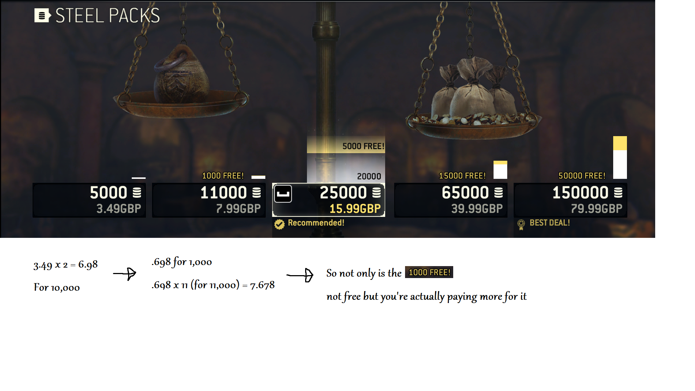

It's sad to see that Ubisoft is creating new games but (as it seems) there are a bunch of financial managers trying to kill every game they have. For Honor had a beta which showed that they don't to hide shit. At the same time the microtransaction Shop with pay2win elements was brought online only in the final version. So nobody could point it out beforehand. \[1\]

Also there is false advertisement when checking the price for steel. If 11'000 steel would have 1000 steel for free then why is it that 5000 steel is 3.5£ and 11000 is 8£? shouldn't it be more like 11000 for 7£ then? \[2\]

1\. [mtx Shop](https://www.vg247.com/2017/02/14/for-honor-in-game-microtransactions-store-now-open-currency-packs-go-as-high-as-100/) 2. 
