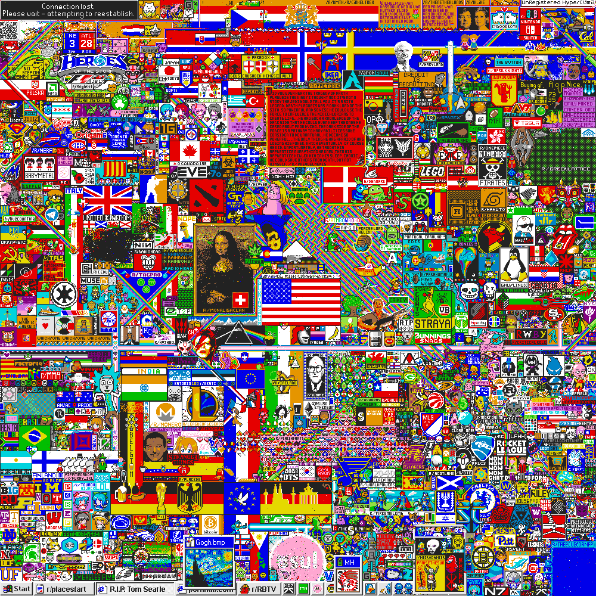
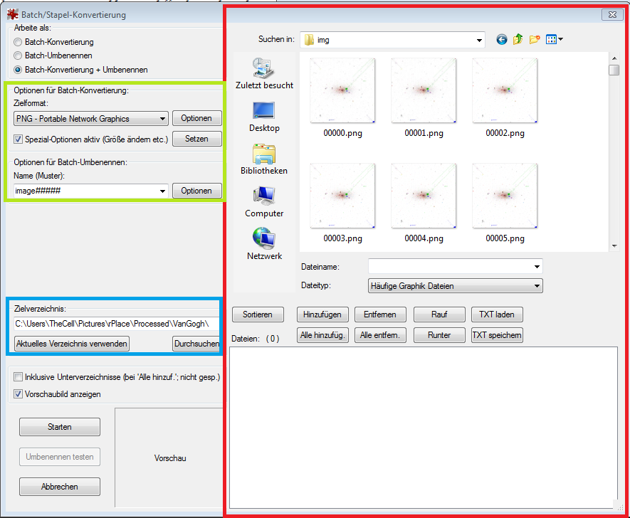
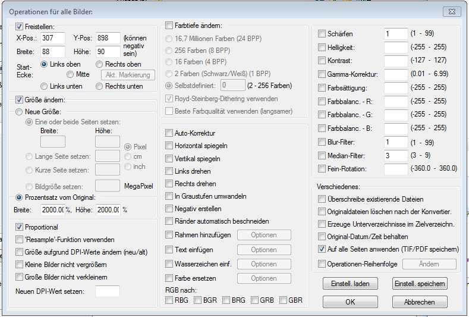
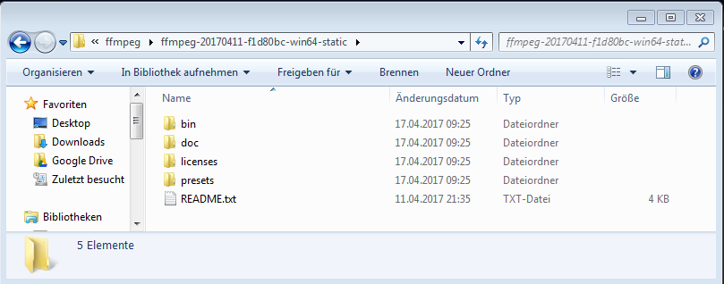
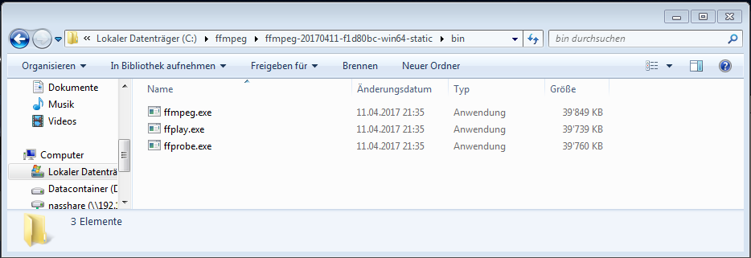
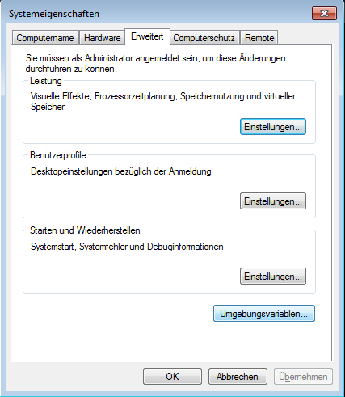
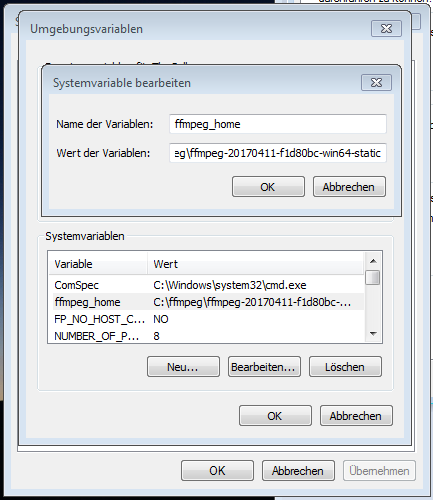
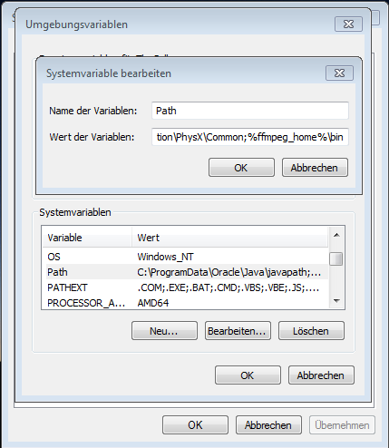

Der Blogpost soll als schriftliche Unterstützung zum [YouTube](https://www.youtube.com/watch?v=HXcMnjOElUI) video. Zum Bildverarbeiten wird [Irfanview](http://irfanview.de/) verwendet. Die Videos werden mit der [Videolibrary](http://ffmpeg.org/) FFmpeg erstellt. Aus dem  wird das \[video width="1760" height="1800" mp4="http://blog.thecell.eu/wp-content/uploads/2017/04/A\_vangogh.mp4"\]\[/video\]

# Bildverarbeitung

Angefangen wird mit Irfanview. Unter Datei > Batch(Stapel)-Konvertierung/Umbenennung.

Im Roten Kasten können Bilder ausgewählt werden. Bilder müssen in die Liste unten eingefügt werden, damit sie verarbeitet werden. Alle Bilder in der Liste unten werden abgearbeitet.

In Blau wird das Zielverzeichnis für die Verarbeiteten Bilder angegeben.

Im Grünen Kasten kann man den Namen für die Dateien angeben ein # steht als Platzhalter für die Fortlaufende Zahl. Bei Optionen für Batch-Konvertierung kann neben dem ausgabenformat auch viele Optionen wählen:  Neben teilen ausschneiden kann man auch die Grösse anpassen, Wasserzeichen oder Text einfügen oder etwa Filter üb die Bilder legen.

# Videoverarbeitung

Falls ffmpeg schon installiert wurde:

Sobald die Bilder vorbereitet wurden öffnet man die Commandline/Terminal/Konsole unter windows mit windowstaste + r -> `cmd`. Dann wechselt man in das Bilderverzeichnis mit `cd "C:\Users\TheCell\Pictures\rPlace\Processed\VanGogh"` (Bei euch steht dann natürlich euer Verzeichnis). dort kann dann der Befehl `ffmpeg -r 60 -i image%05d.png -c:v libx264 -pix_fmt yuv420p out.mp4` eingegeben werden und es erstellt aus den Bildern ein mp4 Video mit 60 Bildern pro Sekunde. Der Paramter -r steht für die Bildwiederholrate (also 60 Bilder pro Sekunde) -i steht für welche Bilder sollen dafür genommen werden. Das %05d steht als Platzhalter (%) 5 Stellen (05) von Zahlen (d). Dann fehlt noch welche Library zum verarbeiten verwendet werden soll und welches Format es haben soll. (yuv480p heisst hier nicht, dass ein 480p Video rauskommt!)

# Falls ffmpeg noch nicht installiert wurde, so wirds installiert:

[Laden](http://ffmpeg.org/download.html) der aktuellsten ffmpeg library. Entpacken der Library (hier als Beispiel) ins Verzeichnis `C:\ffmpeg` Das Verzeichnis sieht dann so aus:  

Nun muss bei Windows eine Systemvariable hinterlegt werden und das geht so: windowstaste + r `sysdm.cpl` Dort Erweitert > Umgebungsvariablen 

Dort wird unter Systemvariablen eine neue Variable erstellt 

Name der Variablen `ffmpeg_home` Wert der Variablen `C:\ffmpeg\ffmpeg-20170411-f1d80bc-win64-static`

Bei Path wird dann die Variable noch angehängt:

`;%ffmpeg_home%\bin`

