The different ways you could screw UX demonstrated with Volumesliders

Here is a fine collection of different possibilitys [r/ProgrammerHumor/](https://www.reddit.com/r/ProgrammerHumor/) came up with to screw the UX of a Volume Slider

Volumes should be unique ([https://www.reddit.com/user/NeverMakesMistkes](https://www.reddit.com/user/NeverMakesMistkes)) \[video width="680" height="322" webm="http://blog.thecell.eu/wp-content/uploads/2017/06/BadUnluckyCrossbill.webm"\]\[/video\]

Volume "control" ([https://www.reddit.com/user/HizkiFW/](https://www.reddit.com/user/HizkiFW/)) \[video width="274" height="127" webm="http://blog.thecell.eu/wp-content/uploads/2017/06/SmartPaleAfricanparadiseflycatcher.webm"\]\[/video\]

All these sliders are great, but they're so insecure! ([https://www.reddit.com/user/Guy691](https://www.reddit.com/user/Guy691)) [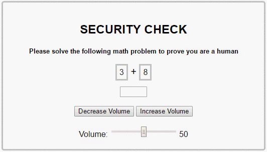](http://blog.thecell.eu/wp-content/uploads/2017/06/8bnjhfcslh1z.gif)

Volume Snake ([https://www.reddit.com/user/Jaeyuuji](https://www.reddit.com/user/Jaeyuuji)) [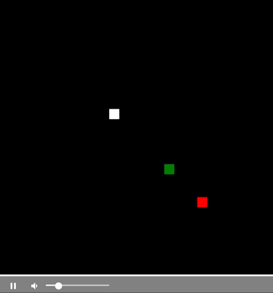](http://blog.thecell.eu/wp-content/uploads/2017/06/volumesnake.gif)

Volume control for mathematicians ([https://www.reddit.com/user/luiz\_eldorado](https://www.reddit.com/user/luiz_eldorado)) \[video width="544" height="304" webm="http://blog.thecell.eu/wp-content/uploads/2017/06/LastingIllfatedHedgehog.webm"\]\[/video\]

My volume slider is working properly ([https://www.reddit.com/user/guihori](https://www.reddit.com/user/guihori)) [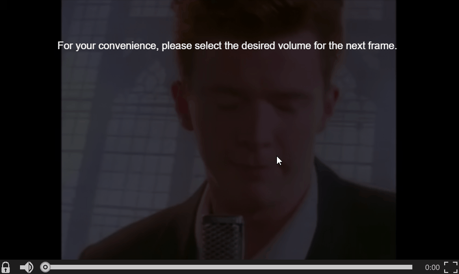](http://blog.thecell.eu/wp-content/uploads/2017/06/1-X86Cof3.gif)

Evasive Volume Slider ([https://www.reddit.com/user/TromezHuezar](https://www.reddit.com/user/TromezHuezar)) \[video width="648" height="650" webm="http://blog.thecell.eu/wp-content/uploads/2017/06/BlackandwhiteAggressiveGalapagostortoise.webm"\]\[/video\]

Hope your screen size isn't too small ... ([https://www.reddit.com/user/downiedowndown](https://www.reddit.com/user/downiedowndown)) [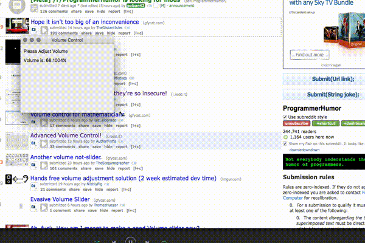](http://blog.thecell.eu/wp-content/uploads/2017/06/iz63eho4uk1z.gif)

Adjusting volume should be exciting ([https://www.reddit.com/user/nimbim](https://www.reddit.com/user/nimbim)) [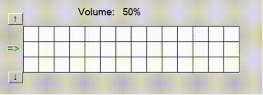](http://blog.thecell.eu/wp-content/uploads/2017/06/aMZwG2a-Imgur.gif)

Advanced Volume Control! ([https://www.reddit.com/user/AuthorFilms](https://www.reddit.com/user/AuthorFilms)) [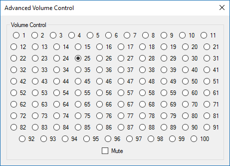](http://blog.thecell.eu/wp-content/uploads/2017/06/t3_6f2c4v.png)

No need to overcomplicate things with the volume sliders. The classic approach is surely the best. ([https://www.reddit.com/user/MKorostoff](https://www.reddit.com/user/MKorostoff)) 

Picking the volume you want shouldn't be easy! ([https://www.reddit.com/user/jasperarmstrong](https://www.reddit.com/user/jasperarmstrong)) \[video width="424" height="312" webm="http://blog.thecell.eu/wp-content/uploads/2017/06/PoorFeminineAmberpenshell.webm"\]\[/video\]

Secure Volume Slider ([https://www.reddit.com/user/spilla](https://www.reddit.com/user/spilla)) [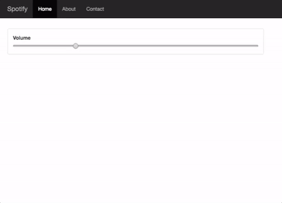](http://blog.thecell.eu/wp-content/uploads/2017/06/9bnjlKy.gif)

Volume in digits of Pi ([https://www.reddit.com/user/renixreborn](https://www.reddit.com/user/renixreborn)) \[video width="894" height="320" webm="http://blog.thecell.eu/wp-content/uploads/2017/06/UnconsciousSaltyKitfox.webm"\]\[/video\]

I hate when people don't think before operating my volume selector ([https://www.reddit.com/user/acidr4in](https://www.reddit.com/user/acidr4in)) \[video width="900" height="466" webm="http://blog.thecell.eu/wp-content/uploads/2017/06/VastEllipticalGrassspider.webm"\]\[/video\]

Volume Generator in dB ([https://www.reddit.com/user/CrilleMega](https://www.reddit.com/user/CrilleMega)) 

Enterprise-grade volume control solution ([https://www.reddit.com/user/MrBlub](https://www.reddit.com/user/MrBlub)) [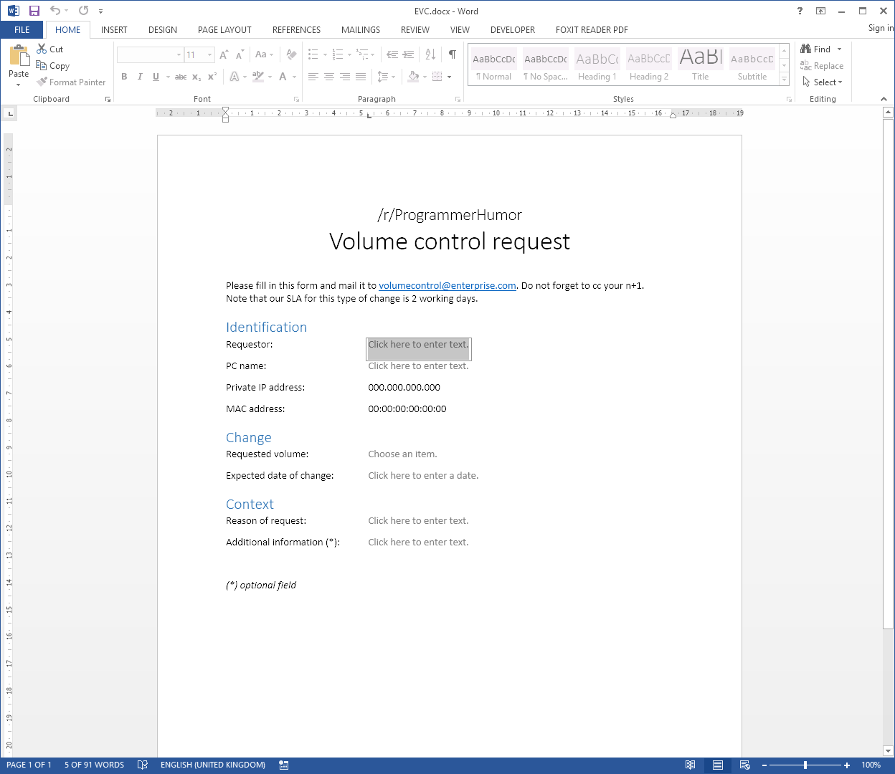](http://blog.thecell.eu/wp-content/uploads/2017/06/rsZTtTh.png)

intuitive volume control ([https://www.reddit.com/user/flurrux](https://www.reddit.com/user/flurrux)) \[video width="518" height="213" webm="http://blog.thecell.eu/wp-content/uploads/2017/06/BlackandwhiteScholarlyHart.webm"\]\[/video\]

Beautiful, courageous, innovative volume slider ([https://www.reddit.com/user/kamaln7](https://www.reddit.com/user/kamaln7)) \[video width="556" height="804" webm="http://blog.thecell.eu/wp-content/uploads/2017/06/SizzlingMaleHoverfly.webm"\]\[/video\]

Single button volume interface ([https://www.reddit.com/user/LinAGKar](https://www.reddit.com/user/LinAGKar)) 

A Secure Volume Slider ([https://www.reddit.com/user/Bacon\_N\_Eggs](https://www.reddit.com/user/Bacon_N_Eggs)) \[video width="700" height="400" webm="http://blog.thecell.eu/wp-content/uploads/2017/06/HorribleLimpingAnt.webm"\]\[/video\]

Programmer Volume Control ([https://www.reddit.com/user/Nloveladyallen](https://www.reddit.com/user/Nloveladyallen)) \[video width="1268" height="804" webm="http://blog.thecell.eu/wp-content/uploads/2017/06/CarelessNiftyDutchshepherddog.webm"\]\[/video\]

7-segment volume input with a twist ([https://www.reddit.com/user/LinkFixerBot](https://www.reddit.com/user/LinkFixerBot)) \[video width="365" height="336" webm="http://blog.thecell.eu/wp-content/uploads/2017/06/AccurateDeafeningDugong.webm"\]\[/video\]

Am I missing something obvious? ([https://www.reddit.com/user/lukaseder](https://www.reddit.com/user/lukaseder)) 

Tetris Volume ([https://www.reddit.com/user/nickypy](https://www.reddit.com/user/nickypy)) \[video width="976" height="1080" webm="http://blog.thecell.eu/wp-content/uploads/2017/06/BronzeSomeBagworm.webm"\]\[/video\]

Volume control - now in typing format ([https://www.reddit.com/user/multiplicand](https://www.reddit.com/user/multiplicand)) \[video width="620" height="240" webm="http://blog.thecell.eu/wp-content/uploads/2017/06/ObeseLastingDachshund.webm"\]\[/video\]

Let's show telephone numbers some more love even though we're focused on volume sliders currently! ([https://www.reddit.com/user/SaeculumObscure](https://www.reddit.com/user/SaeculumObscure)) [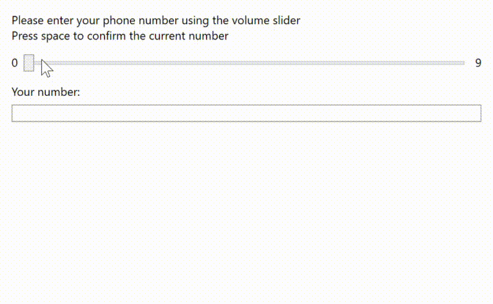](http://blog.thecell.eu/wp-content/uploads/2017/06/Sv8bGoj-Imgur.gif)

A Microsoft approach on volume change ([https://www.reddit.com/user/TheSadalsuud](https://www.reddit.com/user/TheSadalsuud)) \[video width="712" height="658" webm="http://blog.thecell.eu/wp-content/uploads/2017/06/FeistyThickAfricanhornbill.webm"\]\[/video\]

Wifi based volume control ([https://www.reddit.com/user/lintaba](https://www.reddit.com/user/lintaba))

<iframe width="560" height="315" src="https://www.youtube.com/embed/P5K83wlB5iw" frameborder="0" allowfullscreen></iframe>

So I heard we are doing volume controls now ([https://www.reddit.com/user/UnknownDeveloper](https://www.reddit.com/user/UnknownDeveloper)) [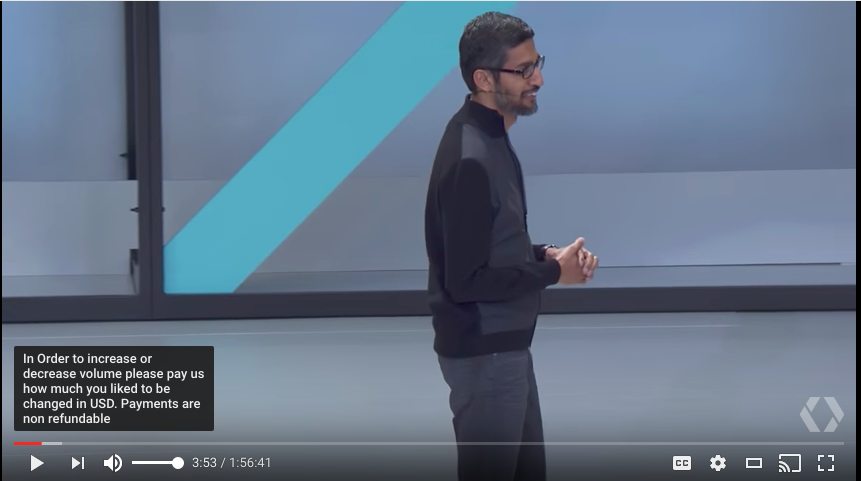](http://blog.thecell.eu/wp-content/uploads/2017/06/xj3kie0ron1z.png)

My single step solution for security validation and volume control ([https://www.reddit.com/user/beartrapqueen](https://www.reddit.com/user/beartrapqueen)) [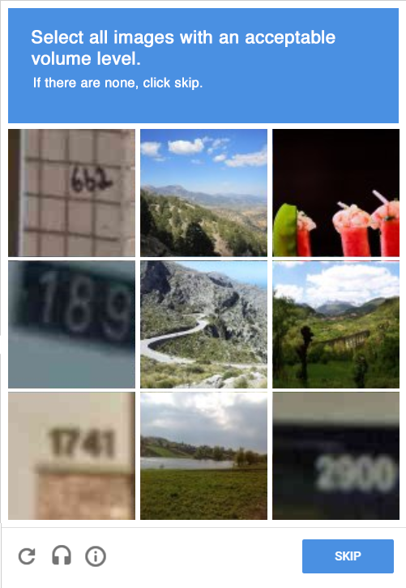](http://blog.thecell.eu/wp-content/uploads/2017/06/gsvcuYh.png)

something something volume control ([https://www.reddit.com/user/boomerangbro10](https://www.reddit.com/user/boomerangbro10)) [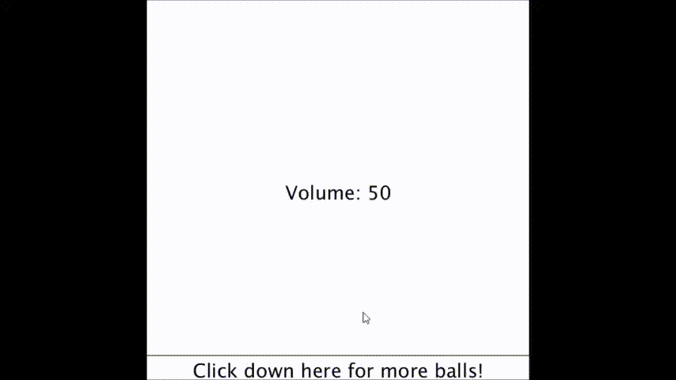](http://blog.thecell.eu/wp-content/uploads/2017/06/sSBzhAz.gif)

Volume slider? Oh, I thought you said slider volume... ([https://www.reddit.com/user/Dustin-](https://www.reddit.com/user/Dustin-)) \[video width="1280" height="720" webm="http://blog.thecell.eu/wp-content/uploads/2017/06/AcrobaticKlutzyGrunion.webm"\]\[/video\]

I made an interactive volume slider for you to play with. Visual only; it doesn't actually adjust volume ([https://www.reddit.com/user/Breadsecutioner](https://www.reddit.com/user/Breadsecutioner))

See the Pen <a href="https://codepen.io/Breadsecutioner/pen/jwOXdL/">Volume "slider"</a> by Breadsecutioner (<a href="https://codepen.io/Breadsecutioner">@Breadsecutioner</a>) on <a href="https://codepen.io">CodePen</a>.

Volume slider - npm edition ([https://www.reddit.com/user/Zegrento7](https://www.reddit.com/user/Zegrento7))

Ah, fuck. How am I meant to make a good Volume slider now? ([https://www.reddit.com/user/Ethanol-10](https://www.reddit.com/user/Ethanol-10)) [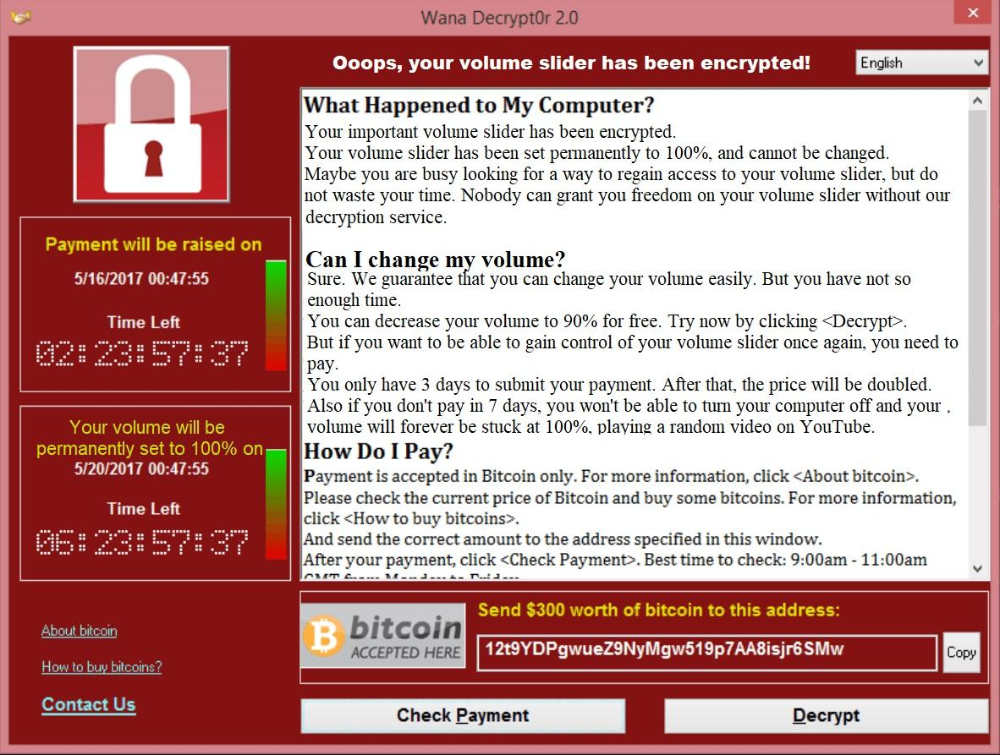](http://blog.thecell.eu/wp-content/uploads/2017/06/6iwmt9ojzf1z.jpg)

Hands free volume adjustment solution (2 week estimated dev time) ([https://www.reddit.com/user/NibblyPig](https://www.reddit.com/user/NibblyPig)) [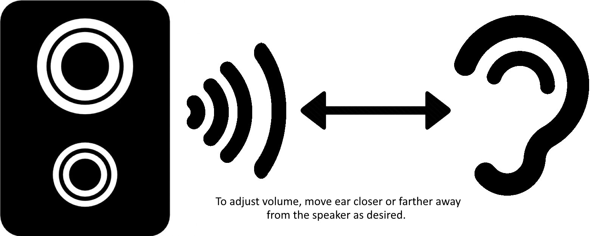](http://blog.thecell.eu/wp-content/uploads/2017/06/AtCmhRt.png)

One button volume control! ([https://www.reddit.com/user/RiderAnton](https://www.reddit.com/user/RiderAnton)) \[video width="640" height="480" webm="http://blog.thecell.eu/wp-content/uploads/2017/06/LeadingCrazyFalcon.webm"\]\[/video\]

"Volume" slider ([https://www.reddit.com/user/theillini19](https://www.reddit.com/user/theillini19)) 

Obligatory Volume Slider ([https://www.reddit.com/user/systoll](https://www.reddit.com/user/systoll)) [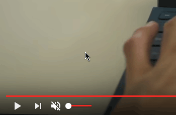](http://blog.thecell.eu/wp-content/uploads/2017/06/ook7pv5hjc1z.gif)

"Non-Intrusive" ([https://www.reddit.com/user/UnderNatural](https://www.reddit.com/user/UnderNatural)) \[video width="1920" height="1080" webm="http://blog.thecell.eu/wp-content/uploads/2017/06/IlliterateShamelessGrizzlybear.webm"\]\[/video\]

Adjust volume using your own voice ([https://www.reddit.com/user/sanduhackerman](https://www.reddit.com/user/sanduhackerman))

<iframe width="560" height="315" src="https://www.youtube.com/embed/LRe1ndmpshQ" frameborder="0" allowfullscreen></iframe>

The Volume Slider That Works With Your Loudness ([https://www.reddit.com/user/pfannkuchen\_gesicht](https://www.reddit.com/user/pfannkuchen_gesicht)) \[video width="428" height="504" webm="http://blog.thecell.eu/wp-content/uploads/2017/06/OldDependableHuman.webm"\]\[/video\]

Sliders are overrated. I humbly present: Volume Bricks. ([https://www.reddit.com/user/BluFoot](https://www.reddit.com/user/BluFoot)) 

<iframe height="265" scrolling="no" title="Volume Bricks" src="//codepen.io/Ortemis/embed/dRymaK/?height=265&amp;theme-id=0&amp;default-tab=js,result&amp;embed-version=2" frameborder="no" allowtransparency="true" allowfullscreen="true" style="width: 100%;">See the Pen <a href='https://codepen.io/Ortemis/pen/dRymaK/'>Volume Bricks</a> by Alex (<a href='https://codepen.io/Ortemis'>@Ortemis</a>) on <a href='https://codepen.io'>CodePen</a>.</iframe>

Volume "Slider" ([https://www.reddit.com/user/Auxilery](https://www.reddit.com/user/Auxilery)) \[video width="682" height="196" mp4="http://blog.thecell.eu/wp-content/uploads/2017/06/fb720ea96f9899770eb1267cd2622f97.mp4"\]\[/video\]

I made a volume slider which is a bit longer ([https://www.reddit.com/user/rebane2001](https://www.reddit.com/user/rebane2001)) \[video width="1280" height="720" webm="http://blog.thecell.eu/wp-content/uploads/2017/06/SaltyEuphoricBear.webm"\]\[/video\]

Volume Control v1 ([https://www.reddit.com/user/smaxxx1337](https://www.reddit.com/user/smaxxx1337)) [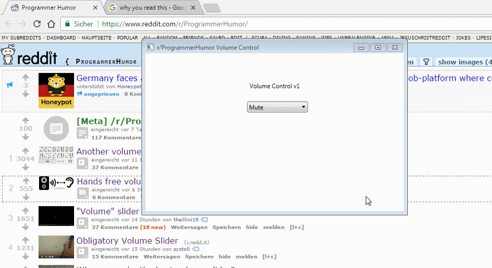](http://blog.thecell.eu/wp-content/uploads/2017/06/c7kwq8uj1h1z.gif)

We're no strangers to volume sliders ([https://www.reddit.com/user/omgmog](https://www.reddit.com/user/omgmog)) [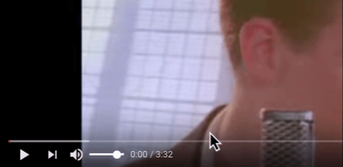](http://blog.thecell.eu/wp-content/uploads/2017/06/t3_6f07rj.gif)

At least it's continuous ([https://www.reddit.com/user/Cabbagenom](https://www.reddit.com/user/Cabbagenom)) \[video width="1280" height="720" webm="http://blog.thecell.eu/wp-content/uploads/2017/06/EmbellishedPoliteLadybug.webm"\]\[/video\]

Who can make the best volume slider? ([https://www.reddit.com/user/PM\_ME\_YOUR\_WATERMELO](https://www.reddit.com/user/PM_ME_YOUR_WATERMELO)) [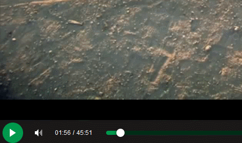](http://blog.thecell.eu/wp-content/uploads/2017/06/t3_6evbfd.gif)

I made this Volume"slider" a while ago. Hope it still counts. ([https://www.reddit.com/user/Splamyn](https://www.reddit.com/user/Splamyn))

<iframe width="560" height="315" src="https://www.youtube.com/embed/EgNRoO5OKaE" frameborder="0" allowfullscreen></iframe>

Eight Queens: the Volume Slider ([https://www.reddit.com/user/Madoka\_the\_Goddess](https://www.reddit.com/user/Madoka_the_Goddess)) \[video width="260" height="320" mp4="http://blog.thecell.eu/wp-content/uploads/2017/06/7lpoo\_1.mp4"\]\[/video\]

Volume sliders are way too outdated. Sorry. ([https://www.reddit.com/user/j\_selby](https://www.reddit.com/user/j_selby)) \[video width="1100" height="480" webm="http://blog.thecell.eu/wp-content/uploads/2017/06/EnviousPertinentBrownbear.webm"\]\[/video\]

Because the user doesn't need a slider! ([https://www.reddit.com/user/beardedcroughton](https://www.reddit.com/user/beardedcroughton)) [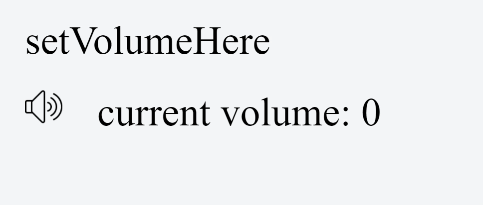](http://blog.thecell.eu/wp-content/uploads/2017/06/t3_6exy5l.gif)

You vs the guy she tells you not to worry about ([https://www.reddit.com/user/GeneReddit123](https://www.reddit.com/user/GeneReddit123)) [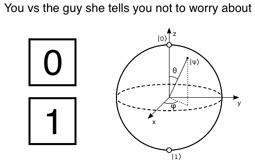](http://blog.thecell.eu/wp-content/uploads/2017/06/g1sg3miold1z.png)

Frustration makes it louder ([https://www.reddit.com/user/XelJel](https://www.reddit.com/user/XelJel)) 

I hear we're doing volume sliders now ([https://www.reddit.com/user/nimbim](https://www.reddit.com/user/nimbim)) 

Binary volume selector anyone? ([https://www.reddit.com/user/LinkFixerBot](https://www.reddit.com/user/LinkFixerBot)) https://codepen.io/stackola\_/full/QgWOrL/

I too can make a bad volume slider. ([https://www.reddit.com/user/pileOfSchist](https://www.reddit.com/user/pileOfSchist)) [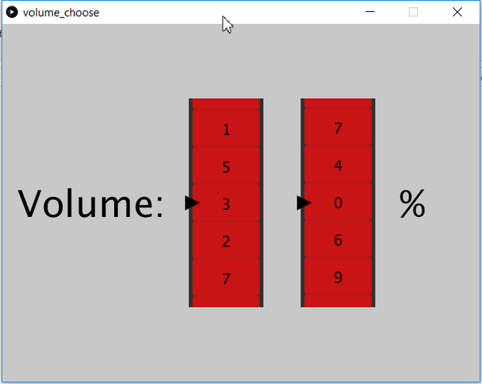](http://blog.thecell.eu/wp-content/uploads/2017/06/miSduSQ.gif)

Repost of my entry for volume sliders (now working example) ([https://www.reddit.com/user/Dragoncraft89](https://www.reddit.com/user/Dragoncraft89)) [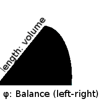](http://blog.thecell.eu/wp-content/uploads/2017/06/legende.png)

Volume Control At Its Finest ([https://www.reddit.com/user/TheDuckOnQuackers](https://www.reddit.com/user/TheDuckOnQuackers)) [https://codepen.io/anon/pen/LLYxrQ](https://codepen.io/anon/pen/LLYxrQ)
