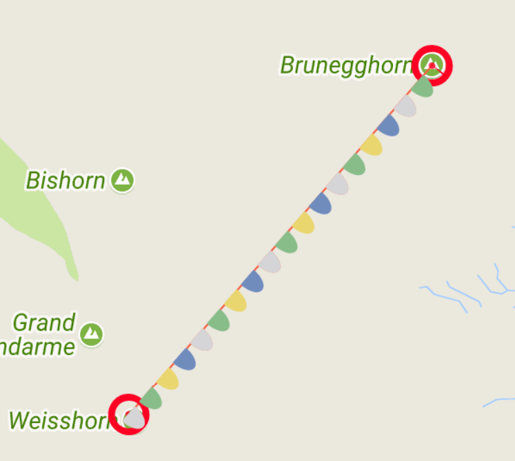
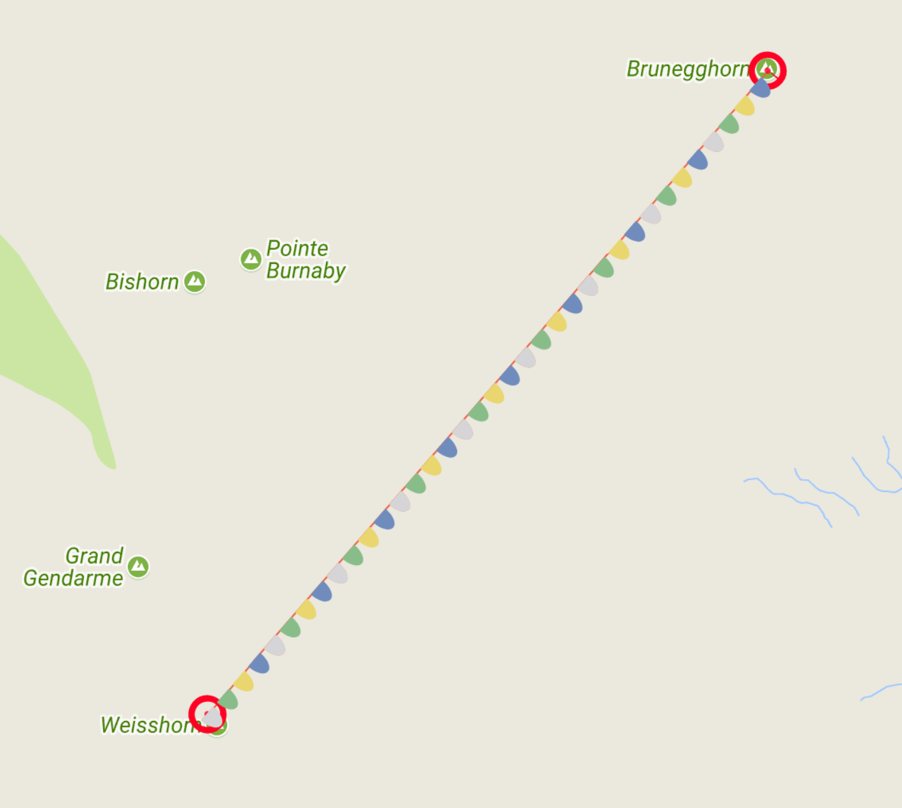
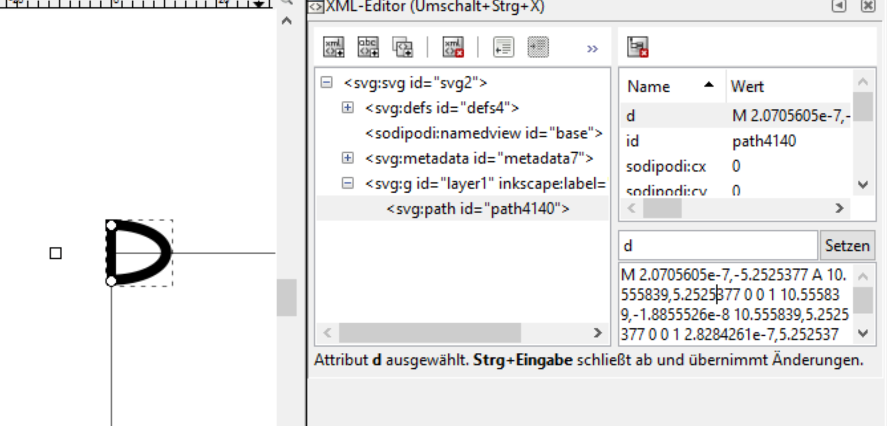

**TL;DR** The Github Example: [https://github.com/TheCell/devSpace/tree/master/googleMapsExample](https://github.com/TheCell/devSpace/tree/master/googleMapsExample) and the Website in Action: [http://dev.thecell.eu/mapsWithPolylines/](http://dev.thecell.eu/mapsWithPolylines/)

### Create Map

The Google Map needs a Container Div and respects a couple of parameters. You'll need a maps API Key, thats not covered here. Take a look at [https://developers.google.com/maps/documentation/javascript/get-api-key](https://developers.google.com/maps/documentation/javascript/get-api-key)

\[code language="javaScript"\] <!DOCTYPE html> <html> <head> <title></title>  </head> <body> 
 
 

 \[/code\] Some Common Options are zoom, center, styles, disableDefaultUI, and even a cursor image encoded in base 64:

\[code language="javaScript"\] let options = { zoom: 13, center: new google.maps.LatLng(46.125312, 7.728664), heading: 90, styles: mapStyleJson, scrollwheel: false, disableDefaultUI: false, draggableCursor: "url('data:image/png;base64,iVBORw0KGgoAAAANSUhEUgAAACAAAAAMCAYAAAADFL+5AAAABHNCSVQICAgIfAhkiAAAAAlwSFlzAAAA3AAAANwBohRA4wAAABl0RVh0U29mdHdhcmUAd3d3Lmlua3NjYXBlLm9yZ5vuPBoAAAGCSURBVDiNvZQ/SytBFMXP7G52k8zM7sPGJhBWEPwCgmAp2NpYpRCLV9qIf/Hb+IlS7ZK4JEWadCHZYv5md1/zCEk0EsV4YKozDL87955L0jR9nU6nVwDgui4opWCMgTEGQgh2LQ9A0mw237TWh0VRkDzPkec5HMdZgXEcZycAixKTJPE9z/urtb4RQhyVZbnwCCGo1+vgnINzDs/ztnp8MplgNBohjmNEUfQ5wLKyLAuttQ/W2o6UMl6GAYAgCMAYQxiG8H1/I8BwOMR4PEa73Uar1doeYFndbvdPEAR31tqOEOKgqqoV3/d9cM5BKUWj0VjxyrLEbDZDFEUbW/ilKUuSZI8QcmuMuRZCvCupVquBUro42wzxt8c8TdN2VVUvxpgLpdT++s9sm6gfyVmv14uLonjeBEMIAaV00SrXdX8WYFmDweBQKXWvtb5USu2t++uJ2umm6ff7x/P5/EVKeWaM4R/d2f2q+68sy06UUo/GmDOtdfjrAGsw51LKJ2PM6T/my6goOGMl0gAAAABJRU5ErkJggg=='), auto" }; \[/code\]

#### Cursor

The Cursor takes a Base64 string representing an image like the code above. You can get base64 codes by having a canvas, draw an image on it and then use javascript to get the base64 encode like this:

\[code language="javaScript"\] <canvas id="iconCanvas" width="16" height="16"></canvas>

 \[/code\]

Or use a Website like [https://www.base64-image.de/](https://www.base64-image.de/) that does basically the same for you. The draggableCursor needs the base64 surounded by `url('..')` and `, auto`. If the auto is not there it won't render.

#### Map Style

The Map can be styled to any extend imaginable. Visit [https://mapstyle.withgoogle.com/](https://mapstyle.withgoogle.com/) to set your style and after that you can get a url or just copy the json and add it to the options: \[code language="javaScript"\] // this is an extremely incomplete example! let mapStyleJson = \[ { "elementType": "geometry", "stylers": \[ { "color": "#ebe3cd" } \] } \]; \[/code\] Just add the mapStyleJson to the options list under `styles`

### Polyline

Polylines have a wide variety of options, take a look at the (underwhelming) documentation: [https://developers.google.com/maps/documentation/javascript/examples/polyline-complex](https://developers.google.com/maps/documentation/javascript/examples/polyline-complex). I will only cover the drawing on the Line part here. It is possible to add SVG's on to the Lines. It accepts an array of icon objects:

\[code language="javaScript"\] // add custom Line Drawings // https://developers.google.com/maps/documentation/javascript/reference?#IconSequence let iconsequ = \[\]; // SymbolPath https://developers.google.com/maps/documentation/javascript/reference?#SymbolPath let circle = { "path": "M -2,0 C -1.947018,-2.2209709 1.9520943,-2.1262691 2,0.00422057 2.0378955,1.3546185 1.5682108,2.0631345 1.4372396e-8,2.0560929 -1.7155482,2.0446854 -1.9145886,1.0142836 -2,0.06735507 Z", "fillColor": "#ff0024", "fillOpacity": 0.8, "strokeColor": "#ff0024", "strokeWeight": 20, "scale": 1 };

// add Point at the start of the Line iconsequ.push( { icon: circle, offset: "0%", repeat: "0" });

// add Point at the end of the Line iconsequ.push( { icon: circle, offset: "100%", repeat: "0" });

// create polyline between points, add start and end point // https://developers.google.com/maps/documentation/javascript/symbols let poly = new google.maps.Polyline( { path: \[{"lat": 46.101707, "lng": 7.715639}, {"lat": 46.125801, "lng": 7.745851}\], strokeColor: "#f45f42", strokeOpacity: 1.0, strokeWeight: 1, icons: iconsequ });

poly.setMap(map); \[/code\]

repeat: 0 = turn repeat off. 25% = show the symbol every 25% of the Line. 25px = show the symbol every 25px Note: The % will make sure that the symbol is visible a fixed amount of time (if there is enough space on the line).

### SVG Paths

For the SVG Paths take a look at the w3schools Path examples: [https://www.w3schools.com/graphics/svg\_path.asp](https://www.w3schools.com/graphics/svg_path.asp) or for more technical information consider [https://developer.mozilla.org/en-US/docs/Web/SVG/Tutorial/Paths](https://developer.mozilla.org/en-US/docs/Web/SVG/Tutorial/Paths). You can use Inkscape aswell (https://inkscape.org/de/). Open it up and enable the XML viewer (Edit > XML-Editor). On the Right you can inspect the svg paths drawn.

However it is important to note, that you can only use the paths d= value. This means you'll have to consider the list of possible commands:

M = moveto L = lineto H = horizontal lineto V = vertical lineto C = curveto S = smooth curveto Q = quadratic Bézier curve T = smooth quadratic Bézier curveto A = elliptical Arc Z = closepath
