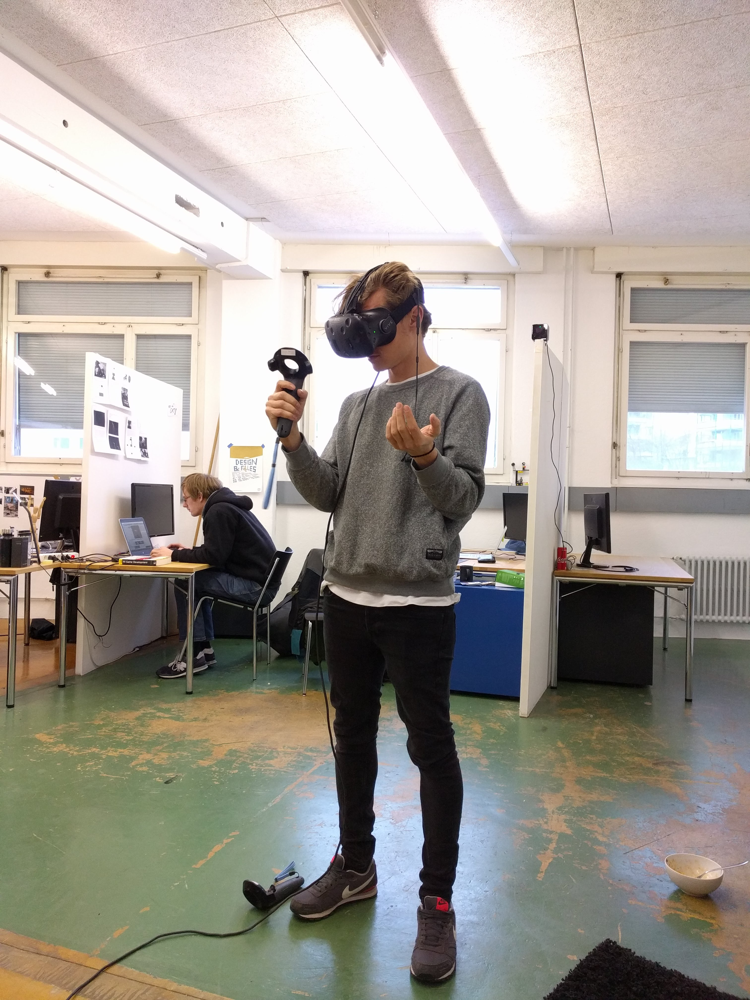
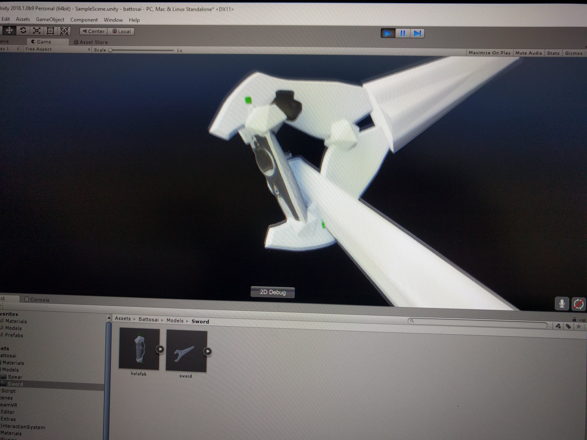
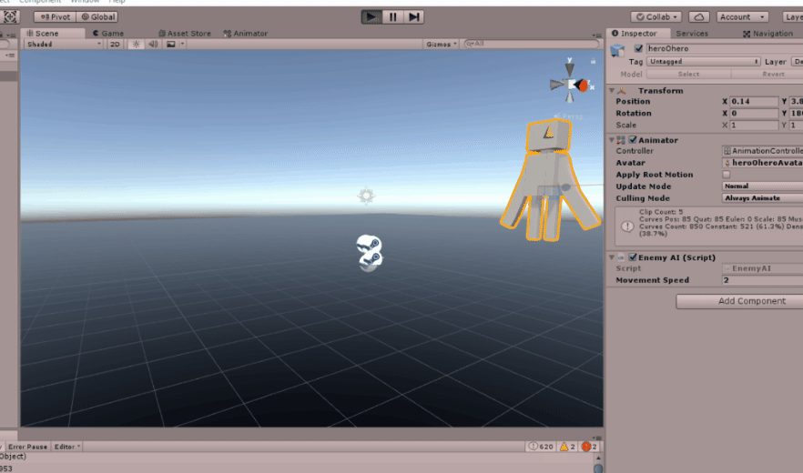
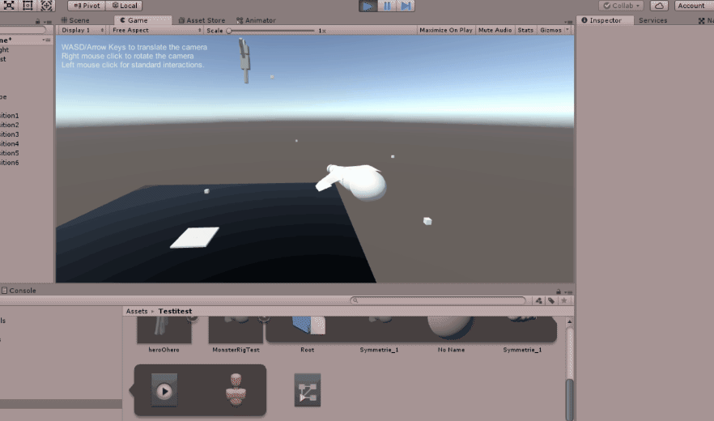
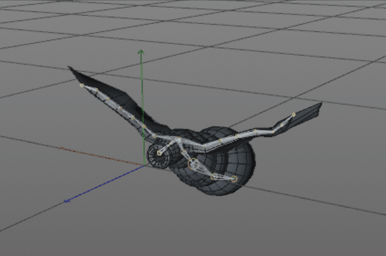
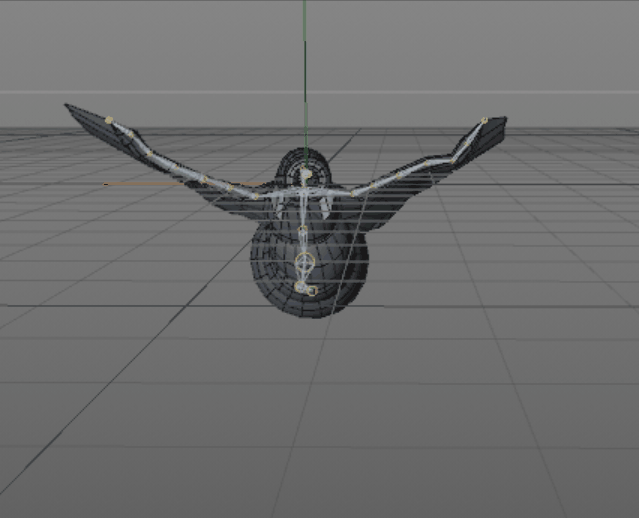
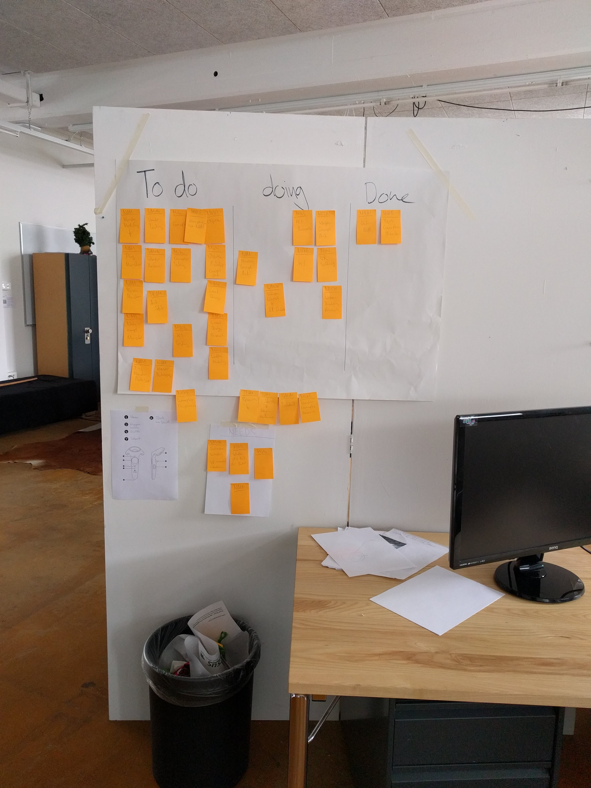

This is just a copy of the Blogpost I wrote over on [https://blog.hslu.ch/games/](https://blog.hslu.ch/games/):

Rückblick Woche 1: Die Gruppenbildung entstand im Verlauf des ersten Tages. Jeder hat am Anfang Ideen eingebracht und wir haben uns dann für verschiedene Teams entschieden. Unser Team besteht aus 4 Personen: Nam Pham, Michael Schürmann ([@mikepatternbeat](https://twitter.com/mikepatternbeat)), Mike Amacker ([@AmackerMike](https://twitter.com/AmackerMike)), Simon Hischier ([@TheCell](https://twitter.com/TheCellch)). Tag 1 und Tag 2 bis Mittags war fürs Brainstorming und Ideenfinden reserviert. Es hat eine weile gedauert, bis wir uns über die Spielidee im klaren waren.

Unsere Spielidee besteht aus Bosskämpfen in VR. Wir haben uns die Woche mit Projektaufsetzen, ersten Models, Animationen, VR testing usw. beschäftigt. Dabei haben wir erste Waffenmodelle ins Spiel geladen und zusammen getestet, verschoben, vergrössert bis es sich gut angefühlt hat.  

In der Zwischenzeit wurde auch ein erster Bossgegner gemacht und animiert. Bis Freitag konnte dieser auch schon durch die Spielwelt fliegen. 

Ein schnelles einfügen eines Schiessskriptes bei dem wir die VR Skripte ignoriert hatten, hat nur halb zum Ziel geführt. Auch nach einem halben Tag Debuggen und probieren gings da nicht weiter. Übers Wochenende werden wir uns deshalb wohl genauer mit den vorhandenen VR Skripten auseinandersetzen.

Zur Projektverwaltung haben wir ein Kanban Board aufgehängt und setzen uns jeden Tag in einer Standupmanier zusammen um die Zwischenstände zu besprechen. 
