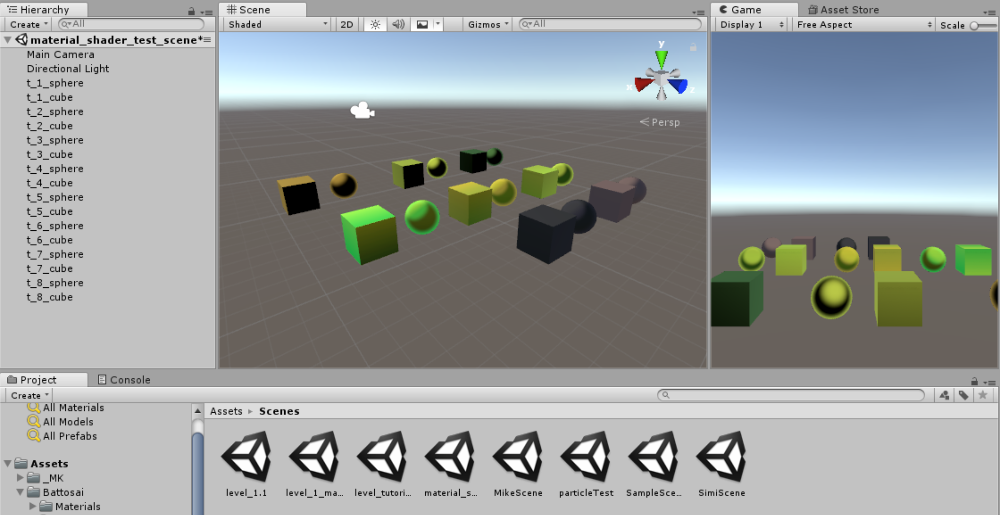

This is just a copy of the Blogpost I wrote over on [https://blog.hslu.ch/games/](https://blog.hslu.ch/games/):

Rückblick Woche 2 der Gruppe Nam Pham, Michael Schürmann ([@mikepatternbeat](https://twitter.com/mikepatternbeat)), Mike Amacker ([@AmackerMike](https://twitter.com/AmackerMike)), Simon Hischier ([@TheCell](https://twitter.com/TheCellch)): Wir waren die Woche äusserst produktiv und haben uns in verschiedenen Gebieten weit vorgearbeitet.

Wir haben die Farbwahl festgelegt und einen Toonshader mit Farbverläufen gewählt für die Materials: 

Der erste Bosskampf ist fürs erste schonmal geskriptet und hat verschiedene Phasen. Der Boss fliegt in den ersten 2 Phasen über dem Spieler und schiesst während dem auf den Spieler. Dank den Animationen und dem "geriggten" Boss sieht das ganze schon sehr organisch aus. In der letzten Phase gibts einen Atemstoss dem man ausweichen muss.

<iframe width="560" height="315" src="https://www.youtube.com/embed/6iGaaGhJ6ME" frameborder="0" allow="autoplay; encrypted-media" allowfullscreen></iframe>

<iframe width="560" height="315" src="https://www.youtube.com/embed/C1YNDwkeZCQ" frameborder="0" allow="autoplay; encrypted-media" allowfullscreen></iframe>

Die Waffen sind nun im Spiel, Waffen wechseln ist möglich und Interaktion mit der Umgebung ist drin. Hier ein kleines Video indem wir damit etwas spielen.

<iframe width="560" height="315" src="https://www.youtube.com/embed/cO6MDbQooKI" frameborder="0" allow="autoplay; encrypted-media" allowfullscreen></iframe>
