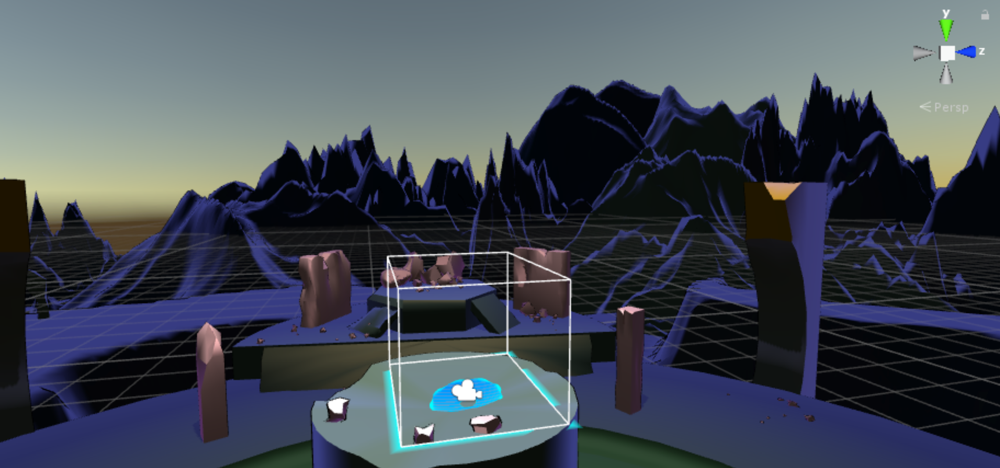
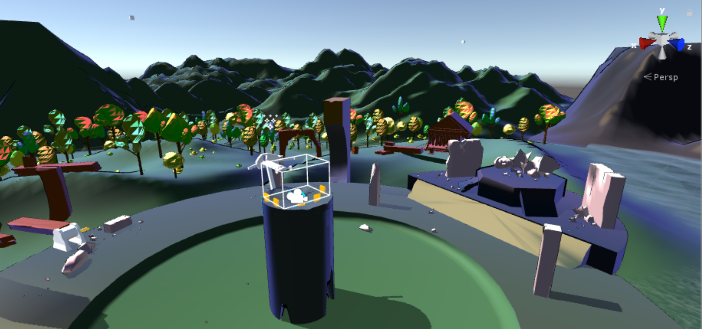
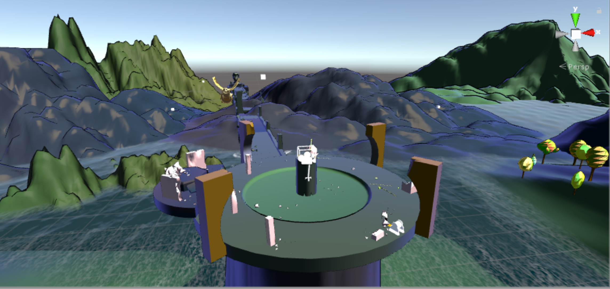
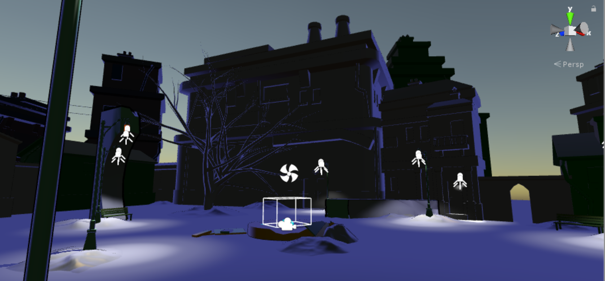
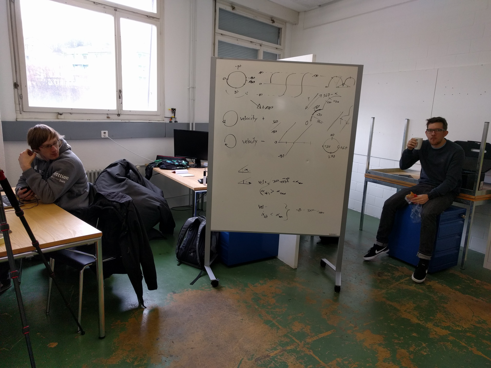
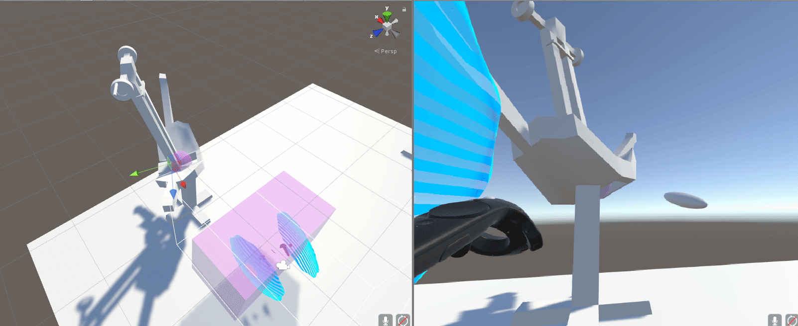

Rückblick Woche 3 der Gruppe Nam Pham, Michael Schürmann ([@mikepatternbeat](https://twitter.com/mikepatternbeat)), Mike Amacker ([@AmackerMike](https://twitter.com/AmackerMike)), Simon Hischier ([@TheCell](https://twitter.com/TheCellch)):

Die Woche war sehr kurz weil am Dienstag morgen Standup meeting und "Physik in games" Input war. Freitag war dann Modulabschluss (Rube Goldberg Machine) der Klasse #Bubbles. Nichts­des­to­trotz gibt es viel neues (Wochenendarbeit etc.). Das erste Level wurde komplett neu gemacht, mehrfach überarbeitet und in verschiedenen Variationen getestet. Dazu gehört Nebel, Lichtspiel und diverse Partikel. Level 2 wurde gebaut und hat eine kalte düstere Atmosphäre erhalten. Die Levels wurden mit vielen Objekten gefüllt und ausgefleischt. Zwischenzeitlich gab es auch Performanceeinbrüche, wir sind noch unsicher woher diese stammen. Ein Laptop neustart hat diese bisher immer gefixt. Wurde aber schlussentlich nicht so umgesezt, da wir schon Level 2 dunkel haben und das Spiel primär eher hell sein sollte. Der Cellshading look fügt auch schon bei hellen Levels viel dunkle Stellen hinzu.

Level 1 in der Nacht variation. 

Screenshots vom Level 1 wie es nun steht.  

Level 2: 

Der erste Boss wurde noch weiter mit Gesichtsanimationen belebt und erhielt noch Material, damit er in die Welt passt. Der Erste Boss wurde fertig geskriptet und funktioniert schon von Anfang bis Ende. In der Ersten Phase muss er mit den Pistolen abgeschossen werden, in der zweiten Phase per Ballista ein Enterhacken am Boss befestigt werden. Nach dem platzieren des Hackens wird der Boss dann auf den Boden gezogen per Kurbel. Da fängt die letzte Phase an in der er Feuer spuckt und der Spieler wieder per Pistolen den Boss töten.

Das Konzept für den 2. Boss steht und der zweite Boss wird sehr Audiovisuell. Der Boss wird unsichtbar sein und kurz bevor er durch den Spieler rennt wird er sichtbar. In der Zwischenzeit gibt er Geräusche von sich damit der Spieler in Orten kann. Der Boss kann jedoch in der unsichtbaren Form nicht verletzt werden, es werden aber schiessende Illusionen erscheinen damit der Spieler sich nicht nur auf den Boss konzentrieren kann. Die Mechaniken sind soweit schon programmiert. Es fehlt noch die Schwertattacke, Bossmodel und passende Geräusche.

Die interaktionsmöglichkeiten sind nun ausgebaut. Hinzu kam eine Ballista, Kurbel und Schilder. Um den Winkelunterschied vom vordern zum neuen Frame zu rechnen hat es dann doch etwas mehr Mathe benötigt, als ursprünglich erhofft. Hier einige (bewegt-)Bilder zur veranschaulichung.

 \[video width="1612" height="646" mp4="https://blog.thecell.eu/wp-content/uploads/2018/03/shootingShields.mp4"\]\[/video\] \[video width="1612" height="646" mp4="https://blog.thecell.eu/wp-content/uploads/2018/03/BalistaShootingBolts.mp4"\]\[/video\] \[video width="1612" height="646" mp4="https://blog.thecell.eu/wp-content/uploads/2018/03/shootingCrank.mp4"\]\[/video\]
