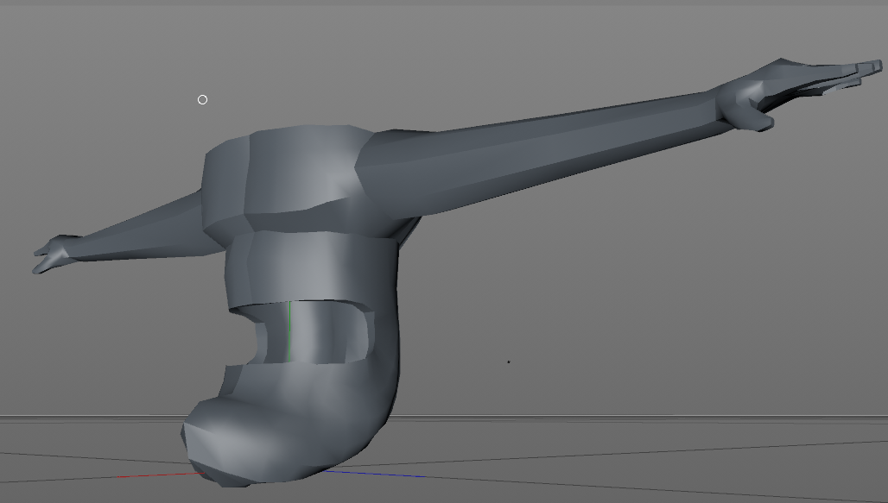

Rückblick Woche 3 der Gruppe Nam Pham, Michael Schürmann ([@mikepatternbeat](https://twitter.com/mikepatternbeat)), Mike Amacker ([@AmackerMike](https://twitter.com/AmackerMike)), Simon Hischier ([@TheCell](https://twitter.com/TheCellch)):

Woche 4 heisst für uns: Nur noch 2 Tage Studio Game Modul. Diese Woche hatten wir am Donnerstag Game Modul, die nächsten (und letzten) 2 Wochen jeweils am Dienstag. Wobei das 2. mal auch gleich Abschlusspräsentation sein wird. Die News werden etwas knapper auch weil es nun mehr ans polishen geht.

Diese Woche wurde viel gefixt und weniger neues implementiert. Die Kernmechaniken laufen alle (bis auf den Schwerthieb). Mike hat sich mit dem ersten Boss beschäftigt: Der Boss hat nun ein anderes Flugmuster für die 2. Phase, einen neuen Feuerstrahl für die 3. Phase. Desweiteren konnte er viele dinge im Level probieren, ändern und fixen.

Michi hat sich diese Woche mit den Sounds beschäftigt und das Spiel wird nun Musikalisch unermalt. Der Waffenwechsel und das Schiessen besitzen nun Geräusche.

Nam ist mit dem Konzept für den 2. Boss fertig und hat mit dem Modellieren begonnen. Der Boss besteht hauptsächlich aus einem Oberkörper / Mund mix. Ein Screenshot sollte erklärt dies sehr gut (WIP): 

Ich (Simon) habe noch eine Laserverbindung programmiert. Der Laser erscheint sobald man mit der Ballista den Boss getroffen hat und hat zum Zweck, dass der Spieler versteht wo die Kurbel ist und wie der Zusammenhang zwischen Kurbel und Boss ist. Die von Michi erstellten Sounds wurden in verschiedene Skripte integriert und funktionieren nun auch im Spiel. Der Tag war desweiteren noch gefüllt mit Bugfixes. \[video width="3808" height="1722" mp4="https://blog.thecell.eu/wp-content/uploads/2018/03/Laserconnection2.mp4"\]\[/video\]

Desweiteren gibt es teilweise Performanceinbrüche denen wir auf den Grund gehen möchten. Leider ist trotz Profiling unklar woher die Schwankungen kommen. Teilweise löst ein Neustart des Laptops die Probleme und es ist generell schwierig festzustellen was den nun die Ursache ist.
