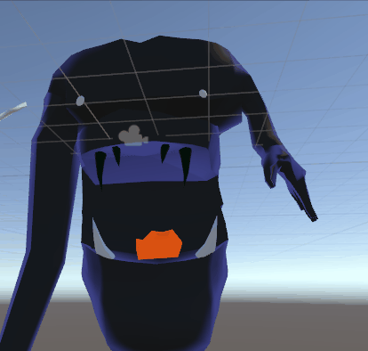
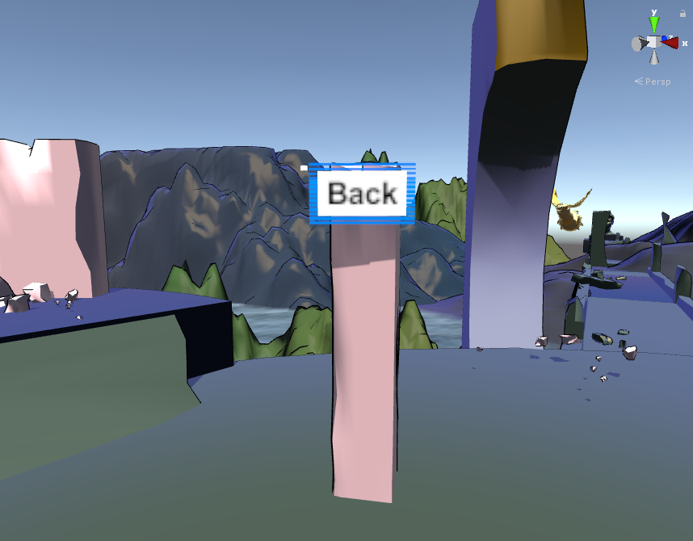

Rückblick Woche 4 der Gruppe Nam Pham, Michael Schürmann ([@mikepatternbeat](https://twitter.com/mikepatternbeat)), Mike Amacker ([@AmackerMike](https://twitter.com/AmackerMike)), Simon Hischier ([@TheCell](https://twitter.com/TheCellch)):

Woche 5: Die 5 Woche und somit auch gleich der letzte Blogbeitrag zum Spiel Battosai. Diese Woche gabs keinen neuen Gameplay Content. Der Fokus für Mike und mich lag beim fixen von allem was uns so über den Weg lief. Michi hat sich ans Soundscape gemacht und Nam hat den 2. Boss gemodelt. Der 2 Boss hat ein Rig erhalten und lässt sich animieren, ein erster Test gibts hier:

Mike hat den 2 Boss implementiert (ist aber noch nicht alles ganz so final). Er hat auch lange am Boss 1 gefeilt (Movement Speed, Kurbeldauer, Positionswahl usw.) Der Feueratem funktioniert nun mit den Schilden und die hitdetection ob man im Feuer steht ist auch eingebaut.

Michi hat sich ganz mit Sounds beschäftigt, das ist somit auch die grösste Contenterweiterung. Waffen machen nun geräusche, im Hintergrund läuft Musik. Als Beispiel die Hintergrundmusik vom Boss 1:

\[audio mp3="https://blog.thecell.eu/wp-content/uploads/2018/03/ambient\_sound\_1.mp3"\]\[/audio\]

Die Pistole hat auch einige Schusssounds erhalten, dazu habe ich (Simon) ein Skript geschrieben, welches zufällig aus den vorhandenen Schusssounds einen abspielt. Das hilft dabei, die Schüsse nicht zu repetitive zu finden.

Ich (Simon) habe mich um einen Spielbeginn und Levelübergänge gekümmert. Es gibt nun in jeder Welt einen Button, den man abschiessen kann und der einen zurück ins Menü führt. Im Menü gibts dann eine Levelauswahl. Die Buttons sehen im Spiel so aus:

 Damit man sieht was alles hinter den Kulissen passiert liste ich meine Stichworte für den Blogbeitrag.

- Waffenwechsel bei Balista
- Buttons in den Levels für zurück ins Menü
- Levelwechsel nach Sieg
- fixed Weapon swaping broken after loading new scene
- bullet collider & mass edit
- fixed debug objects showing
- changed gunswap x to cross
- balista audio
- multiple audiofiles rng for shots
- audio programatically
- balista prefab edit (bigger trigger)
- sound on weps set to 3d
- intro only has gun now
- Level 1 hat nun Steine zum abschiessen, boss hat Flügelschlag sound

Eventuell gibts dann noch ein Update mit den Präsentationsfolien vom Abschluss. Da wird dann unser Abenteuer kurz Zusammengefasst :)

€: Die Präsentationsfolien sind da: [battosai\_presi](https://blog.thecell.eu/wp-content/uploads/2018/03/battosai_presi.pdf)
