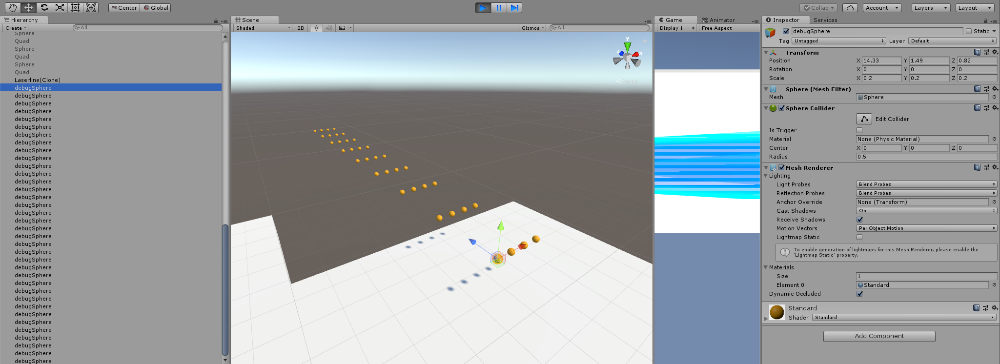
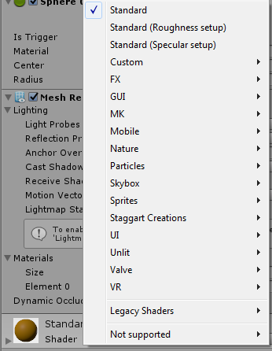

A quick guide on how to create Objects and Materials at Runtime. I use it for debug objects etc. This is how it looks like when I use it: 

`// creating a Primitive GameObject debugSphere = GameObject.CreatePrimitive(PrimitiveType.Sphere); debugSphere.name = "debugSphere"; // set the position to your objects position and scale it down debugSphere.GetComponent().position = new Vector3( transform.position.x + xPosition, transform.position.y + 0, transform.position.z + zPosition); debugSphere.GetComponent().localScale = new Vector3(0.2f, 0.2f, 0.2f); // create a temporary Material and color it Material debugMaterial = new Material(Shader.Find("Standard")); debugMaterial.color = new Color(1.0f, 0.7f, 0.0f); debugSphere.GetComponent().material = debugMaterial;`

For what you can choose as PrimitiveType see [https://docs.unity3d.com/ScriptReference/PrimitiveType.html](http://PrimitiveType Doc) (At the point of writing it was: Sphere, Capsule, Cylinder, Cube, Plane, Quad)

For what you can choose as Material (Standard etc.) create a material and click on the Shader dropdown. For Shaders in Subfolders (ex. FX) you write "FX/Water" etc.
