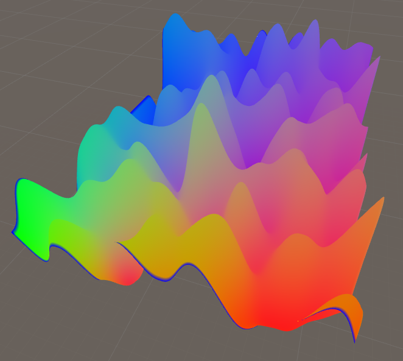
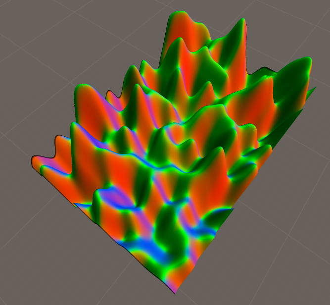

I'm very busy working at the moment. Nevertheless I started a little learning experience with a VR Project. The goal is to make some sort of multiplayer VR game based on the idea of the old Windows Game BangBang

<iframe src="https://www.youtube.com/embed/Y89ByQPqODk" allow="autoplay; encrypted-media" allowfullscreen width="560" height="315" frameborder="0"></iframe>

The 2 Players should have a platform (or multiple?) with canons and must shoot over hills to take eachother out. Not figured everything out yet but I worked some evenings on this and have some stuff figured out!

What I've figured out so far: Level generation, Normal Maps, Shader for Textures and [triplanar](https://www.voxelab.fr/en/2015/11/triplanar-shader/) texture uv, Canon VR Controll.

Let's back this statement up with some media: Procedural Level generation. I get perlin noise vertex points, combine them to triangles and create a mesh out of it.

\[video width="1108" height="632" mp4="https://blog.thecell.eu/wp-content/uploads/2018/07/levelgen.mp4"\]\[/video\]

As I was trying to get the normals right I had an interesting fail. This reminds me of the old music players visualizing the songs or something along the lines.

And here is the shader displaying the working normals for the mesh. yay. 

\[video width="868" height="656" mp4="https://blog.thecell.eu/wp-content/uploads/2018/07/impact.mp4"\]\[/video\]

Next up in the TODO list- Working Canon
- impact size
- Ground Texture Shader (Blending)
- Ground Texture Shader (display impact)
- Figuring Multiplayer?
