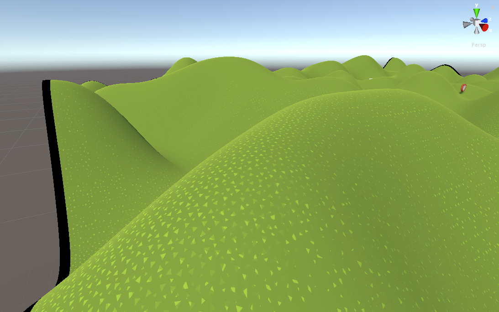

Previously on BangBangVR: [https://blog.thecell.eu/blog/2018/07/29/some-gamedev-progress-on-a-little-project/](https://blog.thecell.eu/blog/2018/07/29/some-gamedev-progress-on-a-little-project/) And here is an update on the sideproject. Lets look at the previous Todo list:

- Working Canon
- impact size
- Ground Texture Shader (Blending)
- Ground Texture Shader (display impact)
- Figuring Multiplayer?

<figure>

<figcaption>

Mesh Impact size

</figcaption>

</figure>

<figure>

<figcaption>

Terrain Shader at the moment. (edge is not ok and textures are not good at some faces)

</figcaption>

</figure>

And that's about it for things I've done when I've given an outlook on it. But wait, there's more.

<figure>

<figcaption>

Inputs for the console

</figcaption>

</figure>

I created 2 Input elements for the command console. A launch button still missing and adaptation for the steam vr controllers. But this should be less work than before.

I felt like the loop shoot a cannon, adjust, shoot again is a bit too short. Therefore I took my balista controll script from Battosai VR and reimplemented it in this game to controll a flak cannon. The goal is to have something defensive to try and shoot enemy bombs down before they hit the player. In the meantime I implemented a clay pigeon thrower and clay pigeons (clay discs really). Here are some impressions from that:

<figure>

<figcaption>

The Flak controlls

</figcaption>

</figure>

[Fflak cannon in action](https://blog.thecell.eu/wp-content/uploads/2018/08/flakCannonControlls.mp4)[Download](https://blog.thecell.eu/wp-content/uploads/2018/08/flakCannonControlls.mp4)

Before gathering infos for this post I felt like I haven't progressed much but seeing the progress since last post encouraged me quite a bit. Bad thing first: University (well school for applied science really) will start again in 13 days and I have to bring the htc vive back soon after. I still have a lot left to do, the list changed and grew a bit:

- working cannon
- Ground Texture Shader (display impact)
- optimize impact deform performance
- optimize impact size
- ground texture blend for big hills
- Figuring Multiplayer?
