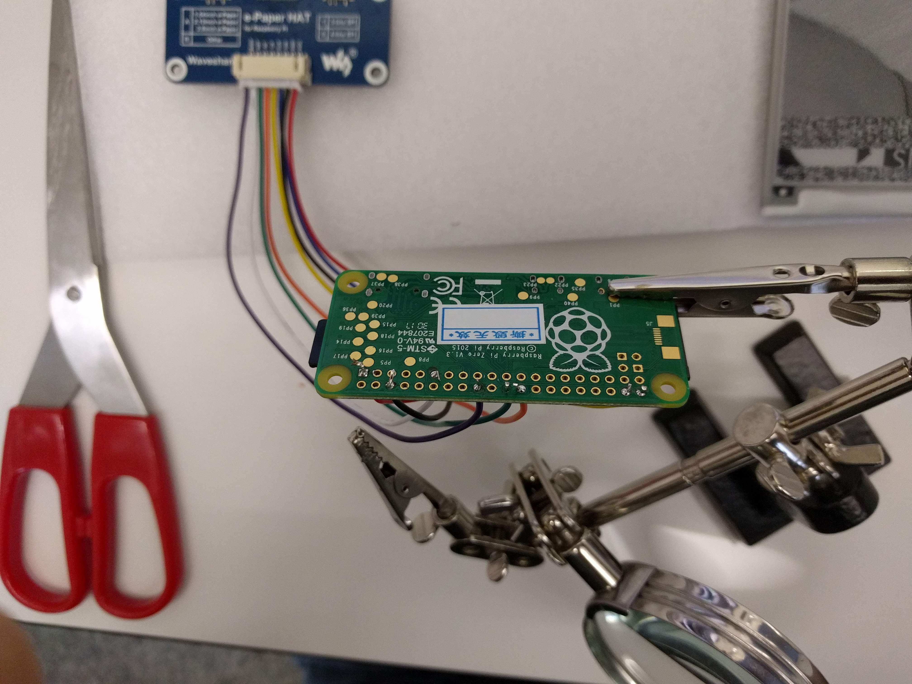
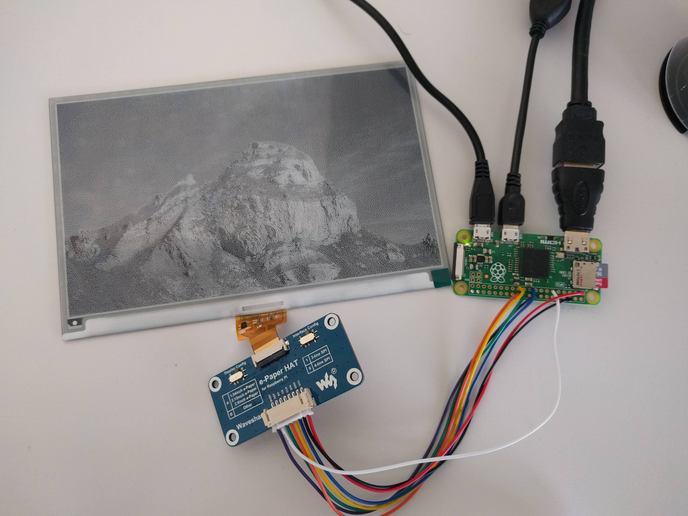
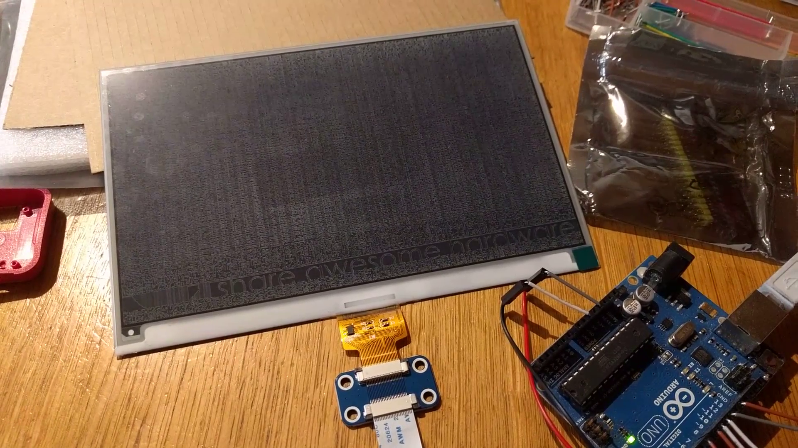
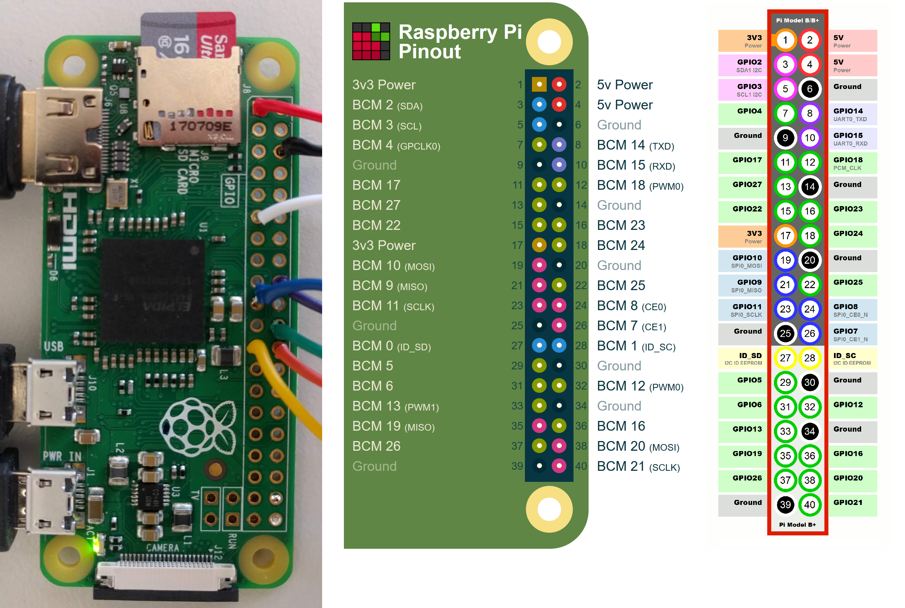
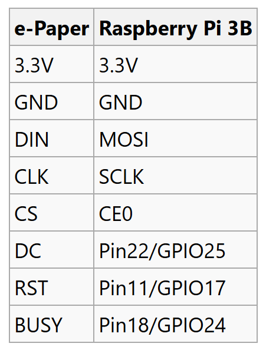
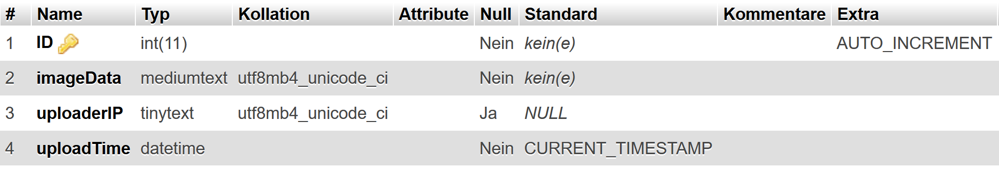

<iframe src="https://www.youtube.com/embed/vr5Pb5gnyHw" allowfullscreen width="560" height="315"></iframe>

This is a project based on a Raspberry and an ePaper. I added a Server inbetween so you will need:

- Waveshare 640x384 7.5inch E-Ink HAT e-paper display ([Aliexpress](https://www.aliexpress.com/item/Waveshare-640x384-7-5inch-E-Ink-HAT-e-paper-display-supports-Raspberry-Pi-Arduino-STM32-Two/32831845043.html))  
    
- Raspberry Pi Zero, SD card, power, HDMI adapter, mini USB adapter ([Aliexpress](https://www.aliexpress.com/store/product/2018-Raspberry-Pi-Zero-W-Starter-kit-Acrylic-Case-Heat-Sink-20-pin-GPIO-Header-Screwdriver/615778_32872349541.html?ws_ab_test=searchweb0_0,searchweb201602_4_10065_10068_5726820_10059_10884_10887_10696_100031_5726920_10084_10083_10103_10618_10307_10134,searchweb201603_60,ppcSwitch_0&algo_expid=f22f917b-4441-4d72-b393-d2e8d659f89d-6&algo_pvid=f22f917b-4441-4d72-b393-d2e8d659f89d&priceBeautifyAB=0)) check that you have a raspi with wlan  
    
- optionally an arduino to test your ePaper display first. The code is in my repo. If you want to test your own image be mindfull that 4 bits = 1 pixel but the arduino sketch uses HEX which is 16 pixel. So this makes 4 Pixel per hex value.

- 
- 
- 

The raspberry soldering should look like the following. More information can be found here: [https://www.waveshare.com/wiki/7.5inch\_e-Paper\_HAT](https://www.waveshare.com/wiki/7.5inch_e-Paper_HAT) the Pinlayout can be found [https://pinout.xyz/](https://pinout.xyz/)  



<figure>



<figcaption>

The Layout can be found on the ePaper Wikipedia ([https://www.waveshare.com/wiki/7.5inch\_e-Paper\_HAT](https://www.waveshare.com/wiki/7.5inch_e-Paper_HAT))

</figcaption>

</figure>

# installation on the Raspberry

Install the Raspbian OS on to an SD card and start it up. The Image can be found here: [https://www.raspberrypi.org/downloads/](https://www.raspberrypi.org/downloads/). First of all the most important command:

```
sudo apt-get update
sudo apt-get upgrade
```

1. install bcm2835 ([link](https://www.airspayce.com/mikem/bcm2835/))

```
# download the latest version of the library, say bcm2835-1.xx.tar.gz, then:
tar zxvf bcm2835-1.xx.tar.gz
cd bcm2835-1.xx
./configure
make
sudo make check
sudo make install
```

1. install wiringpi ([link](http://wiringpi.com/download-and-install/))

```
cd
tar xfz wiringPi-98bcb20.tar.gz
cd wiringPi-98bcb20
./build
```

1. setup sci on raspi

```
sudo raspi-config
select 5 Interfacing Options
P4 SPI set to Enabled
```

1. Download the project from my Github ([https://github.com/TheCell/ePaperCanvas](https://github.com/TheCell/ePaperCanvas)) and extract the Folder "raspberryProgram"

1. install node.js

```
sudo apt-get install nodejs
```

2\. install npm

```
sudo apt-get install npm
```

change the directory to the raspberryProgram directory with command "cd" now we have to install a python shell callable from Node and an ajax solution.  

```
npm i python-shell
npm i xhr2
npm i pngjs
```

Python 3.X is already installed on the Raspberry. However you need to install the Image library for the script to work. Thats done like this ([link](https://pillow.readthedocs.io/en/latest/installation.html)):

```
pip install Pillow
```

then run node main.js

```
node main.js
```

# [](https://github.com/TheCell/ePaperCanvas/blob/master/README.md#installation-on-the-website)installation on the website

1. setup a database where you can save base64 string **Update: I wrote my own data format and save it as json because base64 uses a filter in google chrome and no filter in firefox ending up on nodejs not recognizing chrome images!** (yes there are better ways (see binary if interested) but I don't care for this project :)) Here is my example:  
    



1. upload the folder webinterface and edit the dbauth.php everything should work now  
    

If you want to learn more about ePaper Displays I can recommend the very nice video from Applied Science

# Further (optional) Raspberry configurations  

To configure the wlan of the raspberry pi I had to go the extra mile because I use a university wlan which is an enterprise grade solution. After a day of trial and error I got it working with this helpfull guide: [https://kerneldriver.wordpress.com/2012/10/21/configuring-wpa2-using-wpa\_supplicant-on-the-raspberry-pi/](https://kerneldriver.wordpress.com/2012/10/21/configuring-wpa2-using-wpa_supplicant-on-the-raspberry-pi/)

<iframe src="https://www.youtube.com/embed/MsbiO8EAsGw" allowfullscreen width="560" height="315"></iframe>
