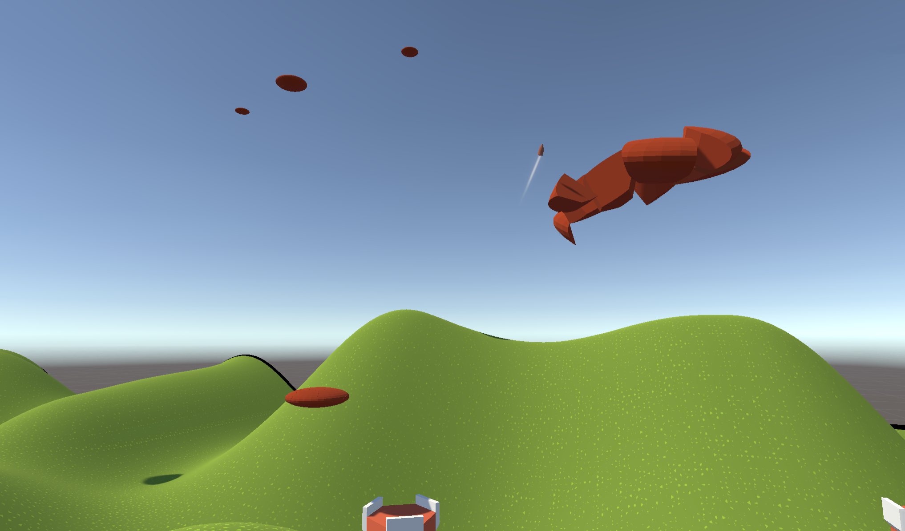

<iframe src="https://www.youtube.com/embed/7b12Oimz1Po" allowfullscreen width="560" height="315"></iframe>

Ok first things first: Here is a download link [https://thecell.itch.io/bangbangvr](https://thecell.itch.io/bangbangvr)

- 
- 
- 
- 

Now what happened inbetween. As Posted in my previous update I was going to hold this project for the time beeing because University started again. We are several weeks into the semester and a neat opportunity just opened up: 2 VR games are going on display at the [Grafik18](http://www.grafik-schweiz.ch/) from 26.10 to 28.10 and it's my educational course of studies (Digital Ideation) who is going to provide these. We have Battosai VR from last semester and some of our 3rd. semester gamedevs are doing another VR game. Meanwhile my summerproject came up in a discussion and they asked me if I would want to showcase my game in case our 3rd semesters would not want to show it or have a build ready.

Of course I said yes and with that the pressure was on. I had to come up with a build somehow. So I took my working elements and made a little highscore clay pigeon shooter. I have 2 dispensers and a gameloop where you get back to the startup scene after the dispensers are empty. Additionally I added a score system where each clay disk gives 5pts (3pts after 2 seconds in air) and finished is the minimal playable build.  

