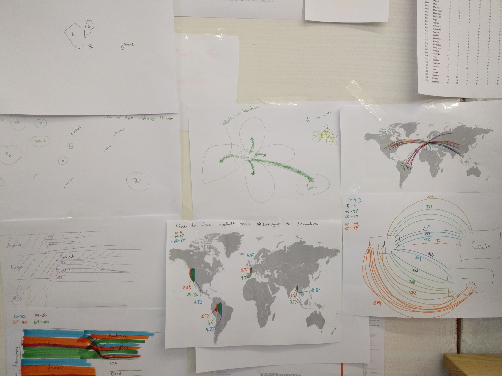

Zu allererst: Das ist nur ein repost des Blogposts unter: [https://blog.hslu.ch/informatik/digital-ideation-wie-man-aus-daten-storys-zeichnet/](https://blog.hslu.ch/informatik/digital-ideation-wie-man-aus-daten-storys-zeichnet/) also lest den Post bitte dort, falls er noch online ist. Ich habe mich entschieden den Post hier nochmals zu veröffentlichen damit meine Arbeiten an einem Ort etwas gesammelt werden.  

**Storytelling ist ein Buzzword und kommt auch bei der Erstellung von Infografiken zum Einsatz. Der Digital Ideation-Student, Simon Hischier, berichtet von den Höhen und Tiefen im Modul «Information Aesthetics & Engineering»**.

Unsere Modulklasse aus dem Studiengang [Digital Ideation](https://www.hslu.ch/de-ch/informatik/studium/bachelor/digital-ideation/) erhielt im Modul «Information Aesthetics & Engineering» die Aufgabe, aus einem Datensatz des Bundesamtes für Statistik, eine gute Infografik zu erarbeiten. Das hörte sich einfach an – kam aber wie so oft ganz anders. Doch alles von Anfang an:

Gestartet haben wir das Modul mit Papier und Schere. Die Aufgabe bestand darin, mit einem Satz verschiedene Bedeutungen auszusagen, indem wir die einzelnen Wörter an verschiedenen Stellen platzierten.

Dabei lernten wir: «Ausdrucken» und «Konzepte auf Papier ausarbeiten» gehören zu den wichtigsten Arbeitsmethoden unserer Gastdozenten Nicole Lachenmeier, Darjan Hil und Danilo Wanner von [YAAY](http://yaay.ch/) (Informationsdesign Agentur).

> _Information Aesthetics & Engineering: Dieses Modul untersucht die Rolle von Informationsgrafiken für eine verständliche Kommunikation und somit auch Fragen der Ästhetik sowie visuellen Gestaltung von informativen Darstellungen._

Nach dieser simplen Übung freuten wir uns auf die Arbeit mit grossen Datenmengen. Als nächstes lernten wir, nach Stories zu suchen. Hörte sich spannend an, die Ernüchterung folgte nach kurzer Zeit mit einer Einführung in Excel und Tableau (Visualisierungssoftware). Es wäre zu schön, um wahr zu sein, hätten wir einfach einen «find-story-button» klicken können und schon entsteht eine schöne Info-Grafik.

Wir lernten, was Storytelling in der Statistik bedeutet, was verschiedene Grafen unterscheidet und wofür welche Grafen geeignet sind. Das Wichtigste für eine gute Grafik ist, dass verschiedene Informationen ausgedrückt werden können und dass der Leser die Grafik «erforschen» möchte.

> _Was hatten wir auch von Story kreieren erwartet, einen «find story»-Knopf drücken und fertig?_

# Modularbeit mit viel Fleiss und Schweiss

Nach diesen Einführungen starteten wir mit der Modularbeit. Um uns einen Überblick zu verschaffen, durchstöberten wir als erstes den Datenwürfel des Bundesamtes für Statistik. Meine Klasse einigte sich darauf, dass alle aus dem Datengebiet [«Bevölkerung»](https://www.pxweb.bfs.admin.ch/pxweb/de/?rxid=ba7df8a0-4240-4336-a90a-0a14fb2c9f26) Zahlen herauspickten und daraus eine Infografik entwickelten.

Daraufhin hiess es für uns, zurück an den Arbeitsplatz und Ideen aufs Papier bringen. In regelmässigen Abständen trafen wir uns in der Klasse und präsentierten den Projektstand. Durch die Diskussionen im Plenum erhielten wir weitere Ideen und Ansätze. Die Gastdozierenden, welche mit etlichen Tricks und Vorgehensweisen aus der Praxis auftrumpfen konnten, standen uns dabei tatkräftig zur Seite.

Wie typisch für Studierende wurde gegen Ende die Zeit immer knapper und alle arbeiteten mit Hochdruck an der Umsetzung – so auch ich.

# Die Schwierigkeit sich festzulegen

In meinem Fall konnte ich mich bis zum Schluss nicht für einen Datensatz festlegen und verfolgte deshalb mehrere Ziele. Auf Drängen der Dozierenden entschied ich mich für eine konkrete Basis. Leider hatte ich mir in den Kopf gesetzt, mit Skripten (kleine Computerprogramme, die die Arbeit automatisieren) für die Umsetzung zu arbeiten.

Dies brachte bis zum Schluss eigentlich nichts, denn es war das falsche Programm für die Visualisierung. Am Abend vor der finalen Präsentation liess ich das Skripten schliesslich sein und versuchte mich mit dem Illustrator (ein Grafikprogramm zum Erstellen von Vektorgrafiken). Ich stellte fest, dass ich mich verzweifelt ans Skripten geklammert hatte, damit ich Illustrator nicht auf die Schnelle lernen musste. Zum Glück war das Modul gemischt mit Studierenden aus dem [Fokus Design](https://www.hslu.ch/de-ch/design-kunst/studium/bachelor/details/bachelor-digital-ideation-studiendetails/) und dem [Fokus Informatik](https://www.hslu.ch/de-ch/informatik/studium/bachelor/digital-ideation/studiendetails/).

Meine designaffinen Mitstudenten konnten mir die wichtigen Funktionen schnell beibringen. Und so sass ich bis in die Nacht hinein an der Arbeit und war am nächsten Tag nicht wirklich zufrieden.

# Studenten und Deadlines

Studenten und Deadlines

Am letzten Tag des Modul-Unterrichts fanden die Präsentationen statt. Am Vormittag war die letzte Gelegenheit, um die Arbeit fertigzustellen. Sofort holte ich mir einen Dozenten, mit dem ich meine Arbeit durchgehen konnte. Wir stellten fest, dass meine Arbeit nicht überzeugend war – am Präsentationstag! Deshalb erarbeitete ich gemeinsam mit dem Dozierenden eine neue Idee und ich fing nochmals bei der Umsetzung an. Es reichte mir gerade so bis zum Präsentationstermin, die neue Idee auszuarbeiten. An der Präsentation fehlte dann etwas der Feinschliff, glückerweise nicht nur bei mir. Deshalb erhielten wir später die Gelegenheit YAAY in Basel zu besuchen und die überarbeitete Version vorzustellen.

Mein Fazit aus dieser Projektarbeit ist, dass ich vermehrt das Fachwissen von Studierenden und Dozierenden nutzen werde. Ebenfalls versuche ich, wann immer möglich, Neues auszuprobiere.
