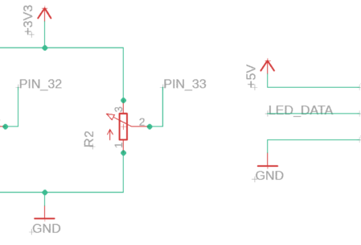
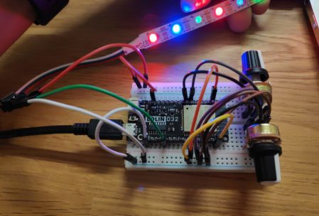

https://youtu.be/k6p53sLCxyI

Today I participated in a workshop at the Swiss Game Festival Ludicious and we got to keep the hardware afterwards. So I "finished" the tetris game. Here is some info and Images. The Code can be found in my GitRepo: [https://github.com/TheCell/devSpace/tree/master/LED\_Workshop\_Ludicious](https://github.com/TheCell/devSpace/tree/master/LED_Workshop_Ludicious)  

Tetris is the game our Team of 2 made during the Ludicious19 Workshop by [@Robin\_B](https://twitter.com/Robin_B/)  
You can swap colors and brightness. Have 4 leds with the same color and brightness in a row to get a combo  
The game will get faster after each combo  
it restarts after you lost (the stripe is full)

You need:  
1x esp32 micro board  
2x potentiometer  
1x 1 meter 30 led stripe 5 Volts (search for: "WS2812B")  
1x breadboard  
1x mini USB

download uPyCraft ([https://github.com/DFRobot/uPyCraft](https://github.com/DFRobot/uPyCraft))

the potentiometers have 3 pins. The two outer pins are for +3V and GND (doesn't matter which way). The inner Pin is the data. I plugged my 2 potentiometer data Pins into ESP32 board pin 32 and 33

The LED Stripe has 3 connections. The stripe has little arrows on it that shows in which direction the led stripe is counting his LED's. You should connect the side where the arrows are pointing away from the board if plugged in. The cable should have marks where the +5V, GND and Data (D1) has to be connected. On my stripe it's red for +5V, white for GND and green for Data. LED\_Data should be connected to micro controller Pin 4. 





```
import machine
import neopixel
import time
import random

amountOfLeds = 30
leds = neopixel.NeoPixel(machine.Pin(4), amountOfLeds)

brightness = machine.ADC(machine.Pin(33))
color = machine.ADC(machine.Pin(32))
brightness.atten(machine.ADC.ATTN_11DB)
color.atten(machine.ADC.ATTN_11DB)

class Block:
  def __init__(self, pos, color):
    self.pos = pos
    self.color = color

  def draw(self, leds):
    leds[int(self.pos)] = self.color


def map(x, in_min, in_max, out_min, out_max):
  return (x - in_min) * (out_max - out_min) / (in_max - in_min) + out_min

def chooseColor(colorInput, brightness, colorSettingsArr, brightnessSettingsArr):
  if brightness == brightnessSettingsArr[0]:
    brightVal = 1
  if brightness == brightnessSettingsArr[1]:
    brightVal = 20
  if brightness == brightnessSettingsArr[2]:
    brightVal = 150

  if colorInput == colorSettingsArr[0]:
    return (brightVal,0,0)
  if colorInput == colorSettingsArr[1]:
    return (0, brightVal,0)
  if colorInput == colorSettingsArr[2]:
    return (0, 0, brightVal)
  if colorInput == colorSettingsArr[3]:
    return (brightVal, brightVal, 0)

def resetLeds(ledArr, blockArr):
  for x in range(len(blockArr), amountOfLeds):
    ledArr[x] = (0, 0, 0)
    ledArr.write()

def drawBlocks(ledArr, blockArr):
  for x in range(0, len(blockArr)):

      blockArr[x].draw(ledArr)
      ledArr.write()

def checkAndRemove(blockArr):
  if len(blockArr) <= 1:
    return

  hasRemoved = False
  amountTheSameColor = 0
  for x in range(1, len(blockArr)):
    prevItem = blockArr[x - 1]

    if blockArr[x].color == prevItem.color:
      amountTheSameColor = amountTheSameColor + 1
    else:
      amountTheSameColor = 0

    if amountTheSameColor == 3:
      for i in range(blockArr[x].pos, blockArr[x].pos - 4, -1):
        blockArr.pop(i)
      hasRemoved = True
  return hasRemoved

def shuffleArray(arr):
  newArr = []
  while(len(arr) > 0):
    randomVal = random.choice(arr)
    newArr.append(randomVal)
    arr.remove(randomVal)
  return newArr

def playTetris():
  lost = False
  blocks = []
  colorSetting = [0, 1, 2, 3]
  brightnessSetting = [0, 1, 2]
  lastDroppedPosition = -1
  dropPosition = amountOfLeds
  tetrisDelay = 150

  while not lost:
    brightVal = int(map(brightness.read(), 0, 4095, 0, len(brightnessSetting) - 1))
    colorVal = int(map(color.read(), 0, 4095, 0, len(colorSetting) - 1))
    dropPosition -= 1

    if dropPosition == lastDroppedPosition + 1:
      block = Block(dropPosition, chooseColor(colorVal, brightVal, colorSetting, brightnessSetting))
      blocks.append(block)
      lastDroppedPosition = dropPosition
      dropPosition = amountOfLeds - 1
      colorSetting = shuffleArray(colorSetting)
      brightnessSetting = shuffleArray(brightnessSetting)


    if (lastDroppedPosition == amountOfLeds - 2):
      lost = True

    # draw gameparts
    resetLeds(leds, blocks)
    drawBlocks(leds, blocks)
    leds[dropPosition] = chooseColor(colorVal, brightVal, colorSetting, brightnessSetting)
    leds.write()

    if checkAndRemove(blocks):
      lastDroppedPosition = lastDroppedPosition - 4
      if tetrisDelay > 10:
        tetrisDelay -= 10
    time.sleep_ms(tetrisDelay)


# call to action
inGameLoop = True
while inGameLoop:
  playTetris()
```
