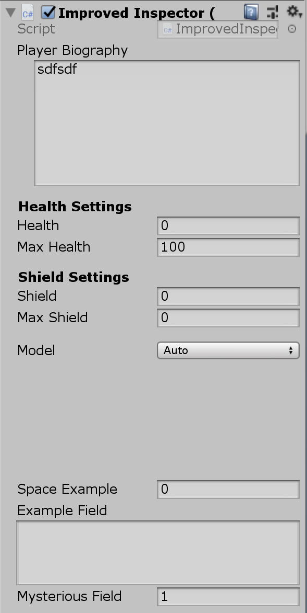
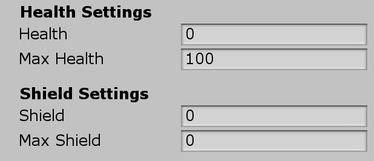
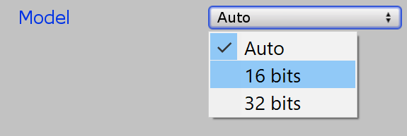
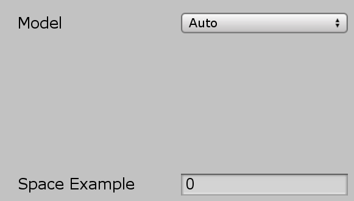
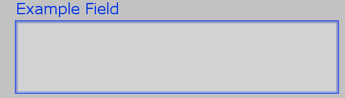
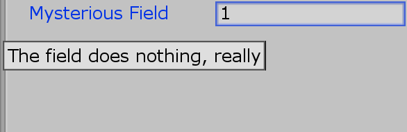

To improve Inspector windows of scripts I summarized and created screenshots for several useful fields. A more advanced list of things can be found here: [https://champview.wordpress.com/2014/12/12/a-summary-of-unity-attributes/](https://champview.wordpress.com/2014/12/12/a-summary-of-unity-attributes/) The whole script looks like this when watched in the inspector



```
public class ImprovedInspector : MonoBehaviour
{
	//[ContextMenuItem("Reset", "ResetBiography")]
	[Multiline(8)]
	[SerializeField] private string playerBiography = "";
	/*
	[ContextMenu("This script is intended to help you style your scripts")]
	private void ContextMenu()
	{
		Debug.Log("Do Something");
	}
	*/
	[Header("Health Settings")]
	[SerializeField] private int health = 0;
	[SerializeField] private int maxHealth = 100;

	[Header("Shield Settings")]
	[SerializeField] private int shield = 0;
	[SerializeField] private int maxShield = 0;

	[HideInInspector]
	public int changeAbleFromOutside = 1; // this will not show up in the inspector

	[Space(10)]
	[SerializeField] private ModelImporterIndexFormat model;
	private enum ModelImporterIndexFormat
	{
		Auto = 0,
		[InspectorName("16 bits")]
		UInt16 = 1,
		[InspectorName("32 bits")]
		UInt32 = 2,
	}

	[Space(100)]
	[SerializeField] private int spaceExample = 0;
	[TextArea(4, 8)] // or just [TextArea]
	[SerializeField] private string exampleField;
	[Tooltip("The field does nothing, really")]
	[SerializeField] private int mysteriousField = 1;
}
```

## Serialize Field

With Serialize Field you can display private properties in the inspector. This means you can make classes which are well encapsulated from a programming point of view but still be customizeable from the Editor.  
[https://docs.unity3d.com/ScriptReference/SerializeField.html](https://docs.unity3d.com/ScriptReference/SerializeField.html)

```
[SerializeField] private int health = 0;
```

## Header Fields



Header fields are nice to group fields.  
[https://docs.unity3d.com/ScriptReference/HeaderAttribute.html](https://docs.unity3d.com/ScriptReference/HeaderAttribute.html)

```
[Header("Health Settings")]
[SerializeField] private int health = 0;
[SerializeField] private int maxHealth = 100;
```

```
[Header("Shield Settings")]
[SerializeField] private int shield = 0;
[SerializeField] private int maxShield = 0;
```

## Hide Attributes

This is very nice if you need to have public attributes which should not show up in the Inspector. The normal approach would be to go with private by default and mark viewable fields with Serializefield. [https://docs.unity3d.com/ScriptReference/HideInInspector.html](https://docs.unity3d.com/ScriptReference/HideInInspector.html)

```
[HideInInspector]
public int changeAbleFromOutside = 1; // this will not show up in the inspector
```

## Inspector Name



If you want custom names for the enumerations in your inspector this is a good way to do it.  
[https://docs.unity3d.com/ScriptReference/InspectorNameAttribute.html](https://docs.unity3d.com/ScriptReference/InspectorNameAttribute.html)

```
[SerializeField] private ModelImporterIndexFormat model;
private enum ModelImporterIndexFormat
{
	Auto = 0,
	[InspectorName("16 bits")]
	UInt16 = 1,
	[InspectorName("32 bits")]
	UInt32 = 2,
}
```

## Space



The Space attribute allows to add visual space in between inspector elements.  
[https://docs.unity3d.com/ScriptReference/SpaceAttribute.html](https://docs.unity3d.com/ScriptReference/SpaceAttribute.html)

```
[Space(100)]
[SerializeField] private int spaceExample = 0;
```

## Text Area



TextAreas are helpful if you want to put in a lot of text and still be able to see it. Optional you can define what the minimal lines are (here 4) and how many lines it should display before adding a scrollbar (here 8). [https://docs.unity3d.com/ScriptReference/TextAreaAttribute.html](https://docs.unity3d.com/ScriptReference/TextAreaAttribute.html)

```
[TextArea(4, 8)] // or just [TextArea]
[SerializeField] private string exampleField;
```

## Tooltip



Tooltips are a great way to explain what these attributes really do. Activated by hover over it.  
[https://docs.unity3d.com/ScriptReference/TooltipAttribute.html](https://docs.unity3d.com/ScriptReference/TooltipAttribute.html)

```
[Tooltip("The field does nothing, really")]
[SerializeField] private int mysteriousField = 1;
```
