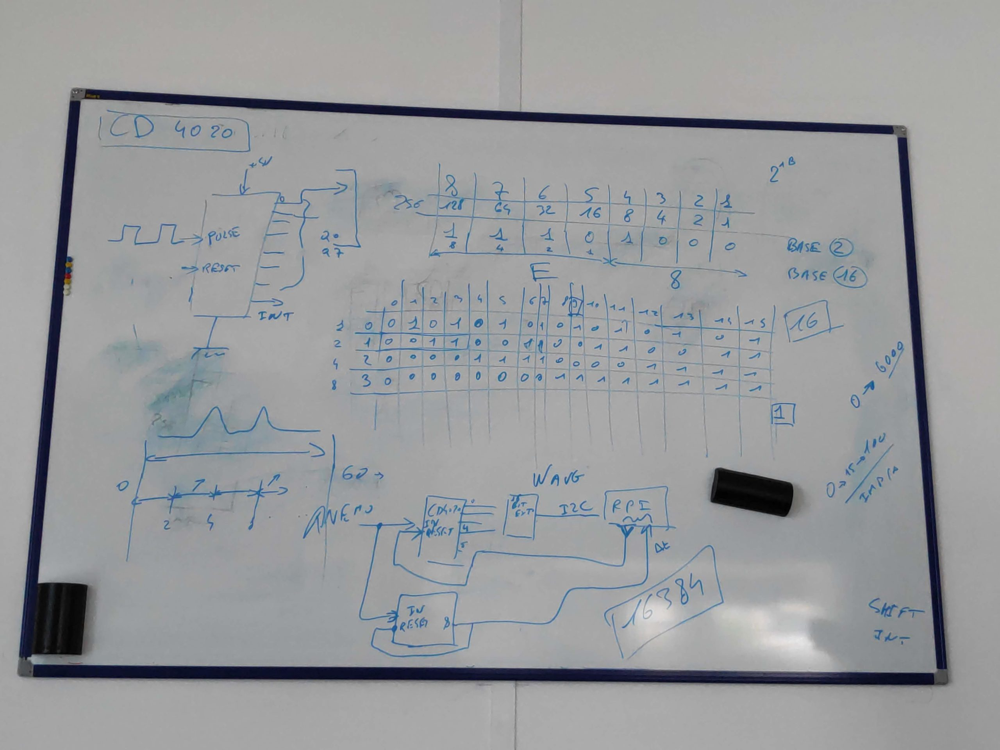

At work I started participating in a D.I.Y. club where we will build a weather station. This should reflect the weekly progress and what we are working on. Additionally this should in the end be a tutorial for a complete weather station based on a Raspberry and everything should work with the I2C protocol. Let's start.

First we got an introduction by Brice Giboudeau on how an anemometer works. There are various options on how they work. [Here](https://www.explainthatstuff.com/anemometers.html) is a list on what else is out there, but we looked into one that counts impulses. Basically there is a magnet attached to the rotating top and in the inner part is a reed switch that closes whenever the cup makes a rotation and passes the switch. We will want to count these and calculate the wind speed from there. Because we want to create a low power solution we will not count these with the Raspberry directly and instead have a little circuit that updates the raspberry occasionally.

For the Windspeeds we want to meassure average speed and also wind ghusts. This we will do via a ripple-carry binary counter: [https://www.google.com/search?q=cd4020](https://www.google.com/search?q=cd4020) Of course 14 bit is way overkill but we can reset the counter with any bit convenient.

We go for **30 km/h average speed** and want to meassure **up to 150 km/h** windspeeds. Resulting in Windspeed Ws: 150000m/3600s = 41.66 m/s. First we calculate how many impulses this will generate which we have to count:  
If we have an anemometer with 0.15m diameter and we want to know how many turns it rotates per meter we calculate:  
The [circumference](https://en.wikipedia.org/wiki/Circumference) C of our anemometer: C = diameter \* π = 0.15 \* π = 0.471239. This means our anemometer has a circumference of 0.47 meter.  
Based on this we can calculate what our circuit must be able to support. [Revolutions](https://en.wikipedia.org/wiki/Revolutions_per_minute) (T for turns) per second: Ws / C = 41.66 / 0.471239 = 88.6 turns / second. For our project we will calculate with **100 T/s** to be safe.

If we want to pull windspeed data only every minute this means that we need to count up to 6000 Turns per minute. Additionally we will want to display wind ghust speeds. We will do this via interrupt, a second CD4020 will update the Raspberry whenever it counts 256 rotations and the Raspberry will track time between interrupts. Luckily our CD4020 is a 14 bit counter resulting in 2^14 (16384) counts before overflowing.

<figure>

<figcaption>

Whiteboard explanation by Brice Giboudeau

</figcaption>

</figure>

<figure>

<figcaption>

Whiteboard explanation by Brice Giboudeau

</figcaption>

</figure>
