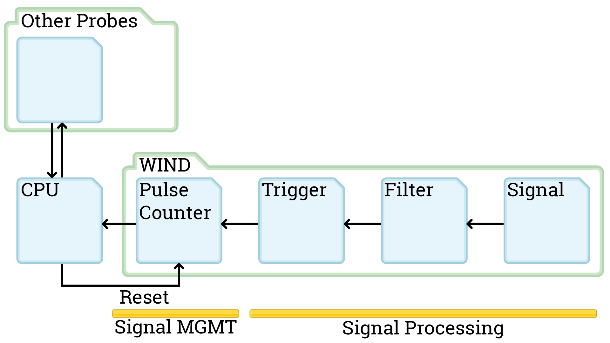
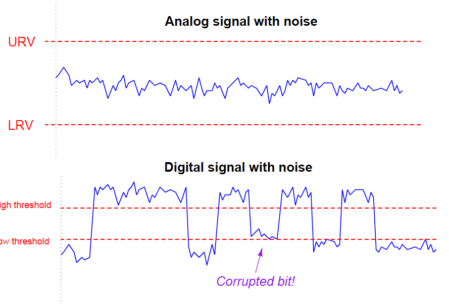
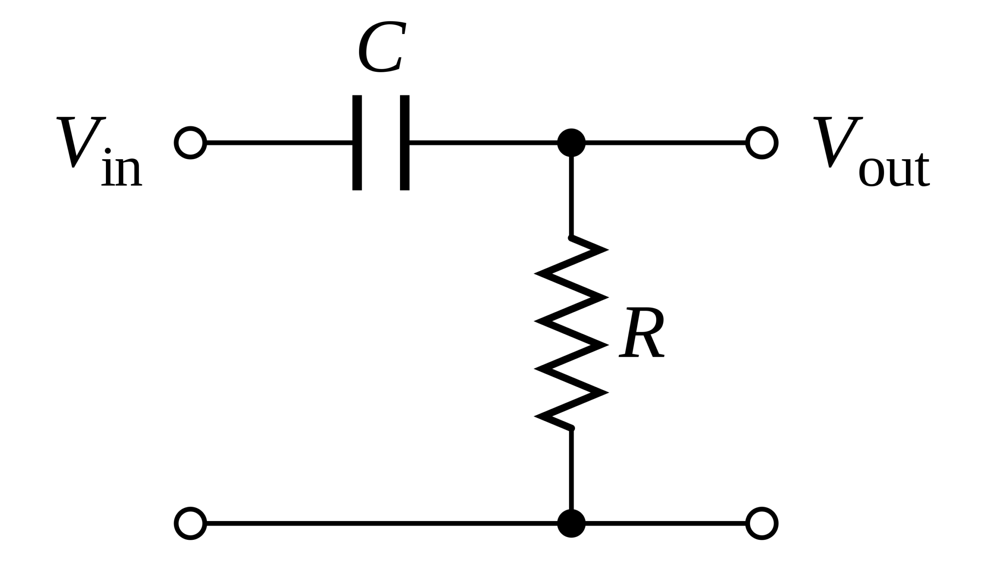
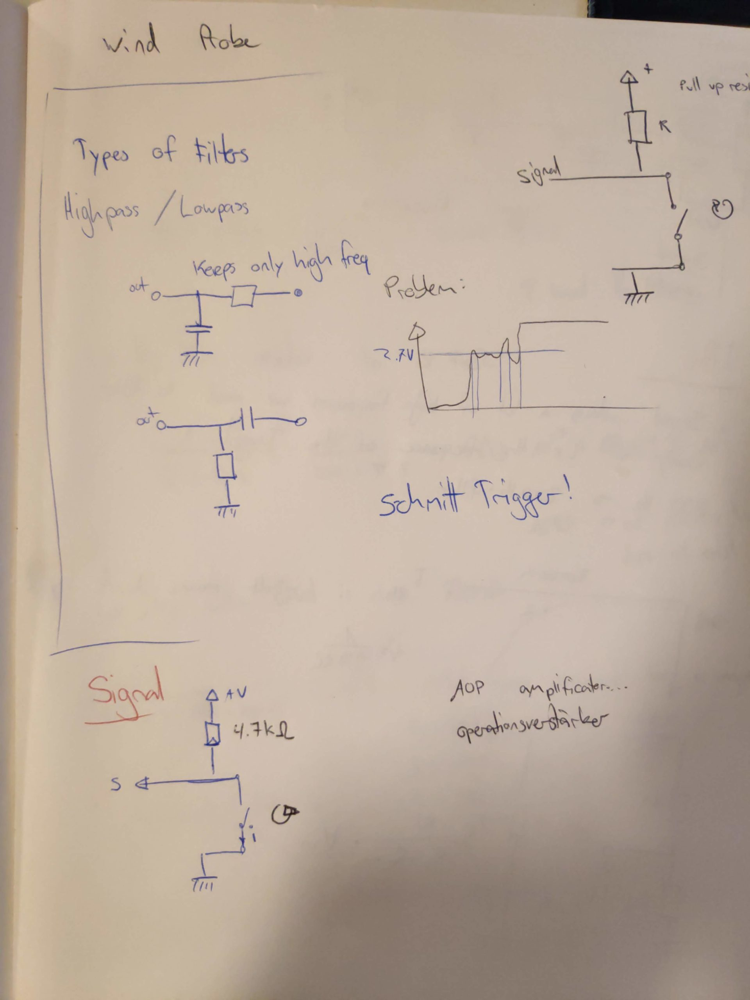
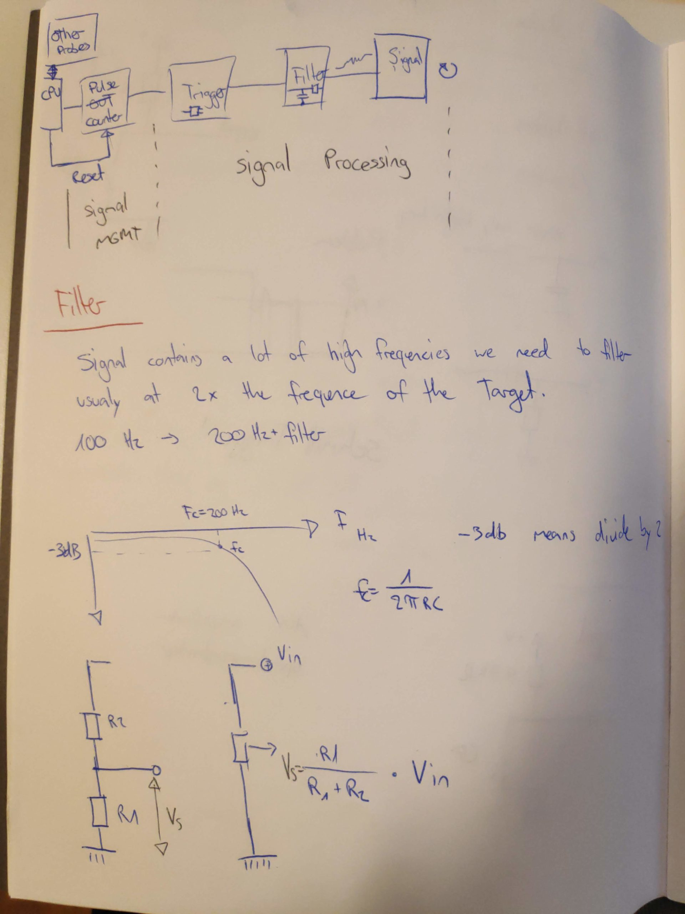
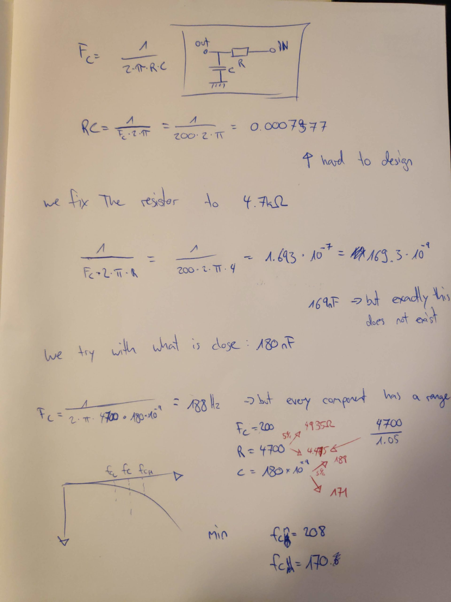

Today we specify a part of the signal processing for the wind measure: Signal Filtering. This is needed because we are going from analog to digital and that comes with problems. Namely corrupted bits. With signal processing we want to get rid of problems arising when energy currency switches from 0 Volts to 3.3V where for example the circuit is switching from a 0 bit to a 1 bit at 2.7V but analog is not always so definite.

As a first step we want to filter out wrong bits. They get generated when the powersource switches from 0V to 3.3V and from noise in the energy currency. It is possible for our circuit to read multiple switches from 0 bit to 1 bit and back until the analog energy currency is at a stable 3.3V. This would go a bit too for the blog though. There is noise on the power source that can generate these errors. Next week we will work on the schmitt trigger to ensure that a digital bit is a stable 0 or 1 until the voltage is way over the circuit treshold.

<figure>

<figcaption>

Source: https://instrumentationtools.com/signal-coupling-cable-separation/

</figcaption>

</figure>

For more information on the problem see: [https://instrumentationtools.com/signal-coupling-cable-separation/](https://instrumentationtools.com/signal-coupling-cable-separation/)

To get rid of most of the noise we take a look at what we designed our system to read: 100 Turns/second or 100Hz. We want to filter out noise thats around 2x the frequency and higher. For this we will use a high pass filter. (Just for completion there exists a low pass filter aswell).

<figure>

<figcaption>

High pass filter

</figcaption>

</figure>

For this to be useful we already know some properties we want to have:

- 100 Hz frequency
- filter around 2x the frequency and higher (200Hz)
- The formula frequency Fc = 1 / ( 2\*π\*R\*C ) ([https://en.wikipedia.org/wiki/High-pass\_filter](https://en.wikipedia.org/wiki/High-pass_filter))

Now we need to find what electronic elements we need. We fix the resistor to a widely used number: 4.7kΩ or 4700Ω this leaves only one unknown number in our formula, the capacitor. C = 1 / (2 \* π \* R \* Fc) = 1 / (2 \* π \* 4700 \* 200) = 1.693 \* 10^(-7). Our ideal capacitor therefore should have 169 nF (nano Farad). This electronic element does not exist so we look for the closest electronic element: 180 nF. Now we know all electronic parts for this part of the circuit. One more problem: Electronics have a range and not an exact value, manufacturers therefore always provide the parts with a ± 5% or ± 10% guarantee. To be sure our high pass filter will not filter out the frequency we are aiming for we have to calculate the worst case frequencies the high pass will filter.

Resistance R = 4700Ω ± 5% = 4935Ω; 4476Ω  
Capacitance C = 180nF ± 5% = 189nF; 171nF  
(to calculate the lower number we need to calculate value / 1.05 and not value \* 0.95)

We now plug these values back into the frequency formula to see what the worst case circuit would filter out. This results in 170Hz to 208Hz. From experience we can say that 170Hz is far enough away from the 100Hz to not filter out our maximum frequence we were aiming for.

And with this we have our first circuit part defined, the filter is ready to be tested on a breadboard. For completeness I included the notes from our meeting. Thanks again Brice Giboudeau and Francois Moutou for this great lunchbreak.

