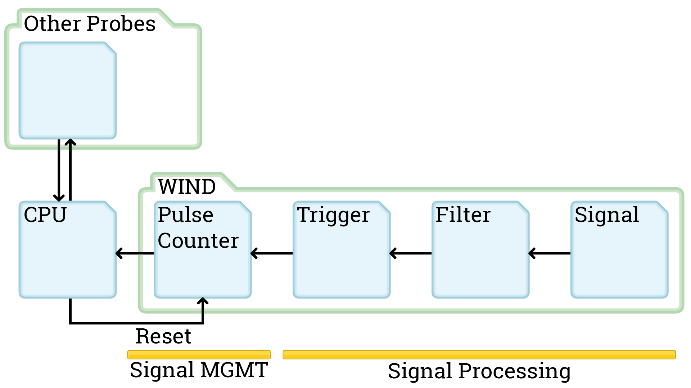
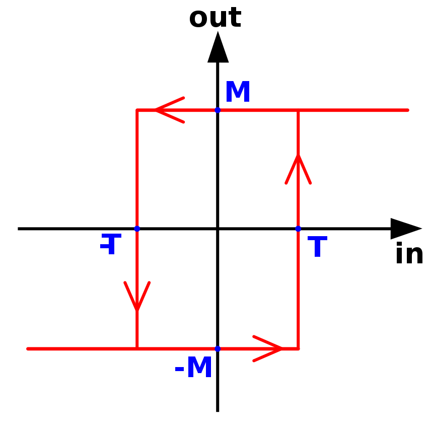
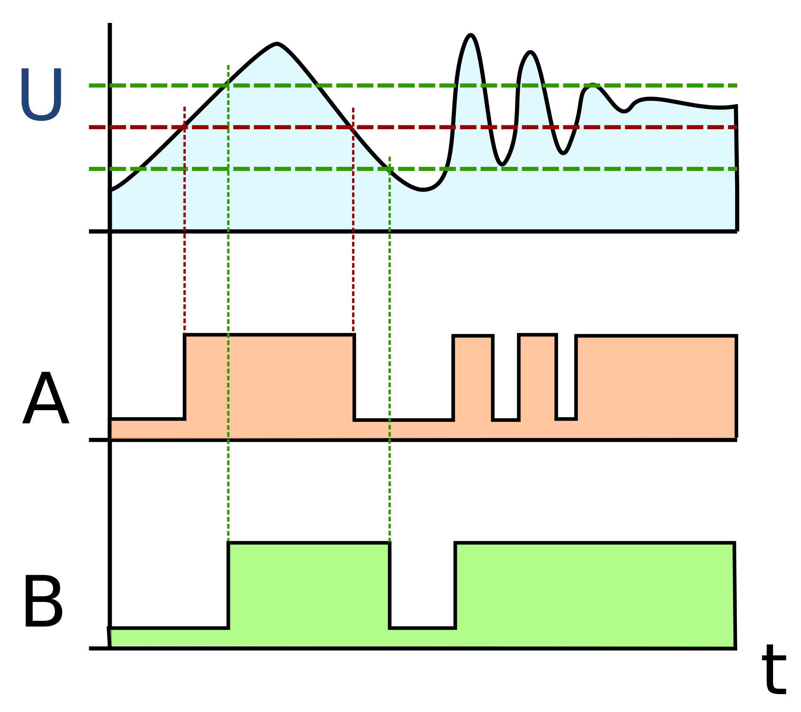
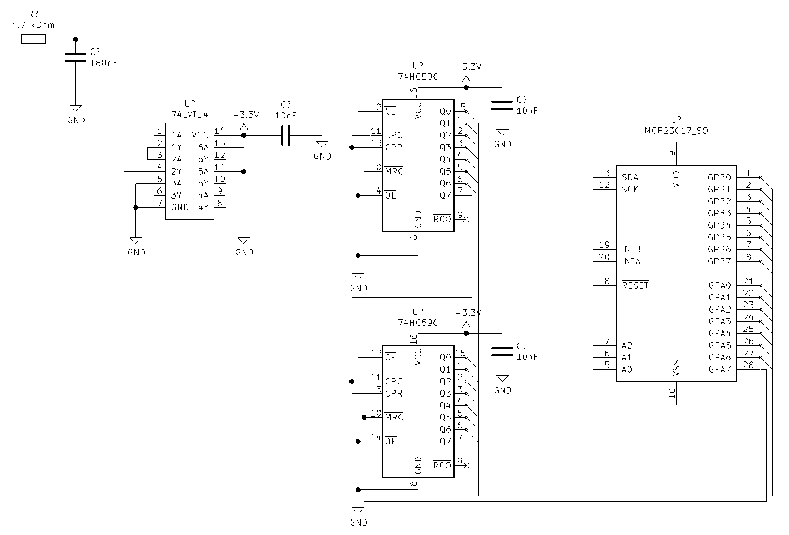
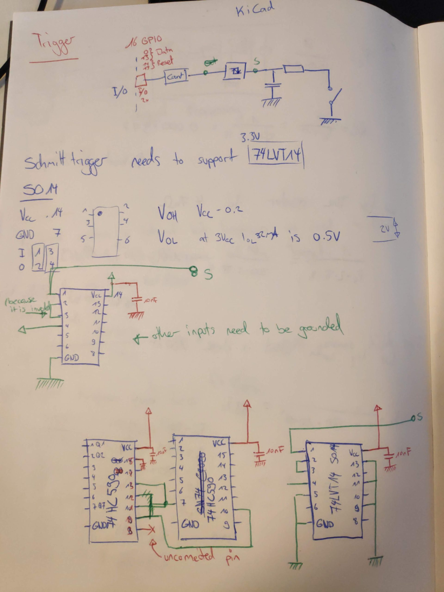
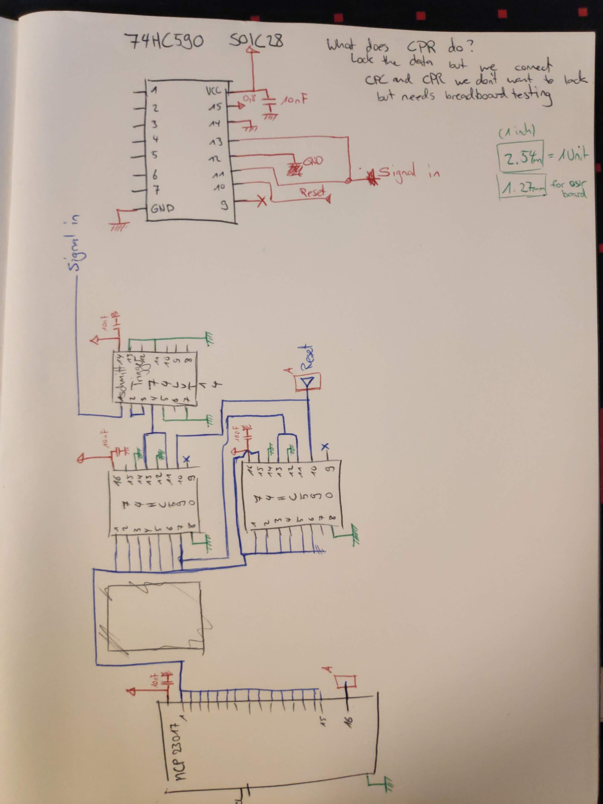
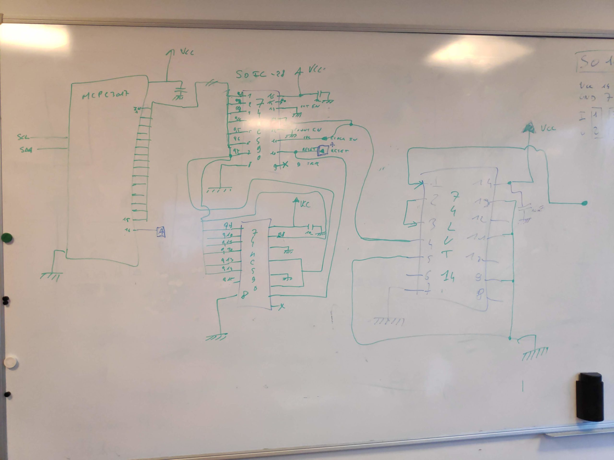
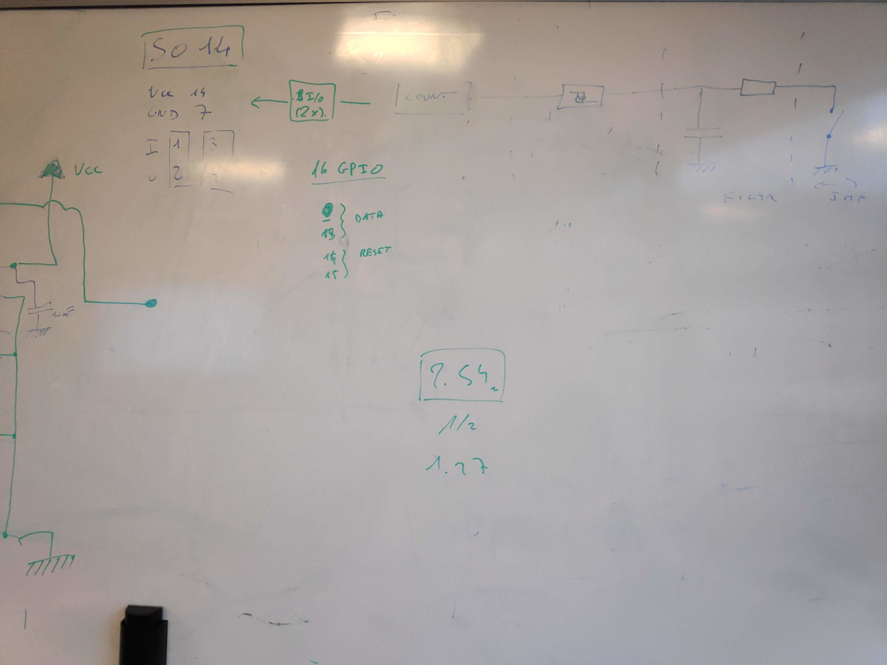

Today: The pulse counter. We had a look at how the schmitt trigger works and searched for the right component. Then we continued to draw the electrical diagram. We are now almost done with the diagram and are done with the component search. But first lets take a look at the schmitt trigger:

The schmitt trigger works as a secondary filter for our analog to digital wind speed measure. With the high-pass filter we can smooth the biggest highcups in switching from 0V to 3.3V. The Schmitt trigger is then responsible to get rid of voltage fluctuation around the point where our circuit switches from 0 to 1. Schmitt triggers have a different voltage to turn to 1 then they have for turning back to 0. Sounds weird, here is an example: We (probably) use the 74LVT14 ([https://assets.nexperia.com/documents/data-sheet/74LVT14.pdf](https://assets.nexperia.com/documents/data-sheet/74LVT14.pdf)) and this element outputs a 1 when the voltage applied is 3.3V - 0.2V so at 3.1V and it keeps the output 1 until the input voltage lowers to at least 0.5V. If you want to read more on schmitt triggers please look at [https://en.wikipedia.org/wiki/Schmitt\_trigger](https://en.wikipedia.org/wiki/Schmitt_trigger)

And now to the electrical diagram. We kept looking at the datasheets of our chosen elements and had to adjust some parts accordingly. We (or rather Brice) drew the circuit on the whiteboard and we checked the datasheets. This lead to a first yet incomplete diagram. We work internally on a diagram and I started a github repo for people who want to see more of it. We are using KiCad as a free and very good tool to draw the electrical diagram, PCB design etc. You can find the Github repository here [https://github.com/TheCell/Weatherstation](https://github.com/TheCell/Weatherstation).

And for completeness here are my notes and the whiteboard photos.

