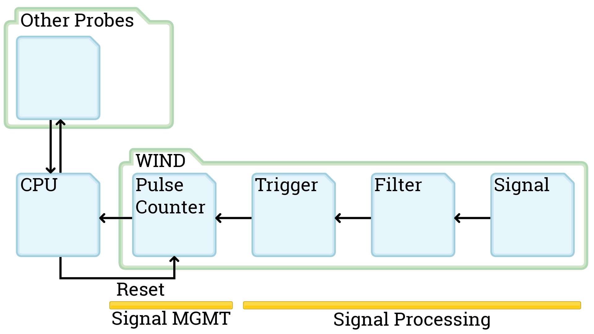

This Session we finalized the schematics for the windprobe. The Diagram shown is tested in kicad and the electrical connections are all good. We changed how the interruptors are handled and what gets managed by the Raspberry. The Signal Management works over a I²C bus now.

What is I²C and how does I²C work? I²C is a data bus protocol that allows us to have multiple probes communicating via I/O expander over the same line to the raspberry. More details can be found on [Wikipedia](https://en.wikipedia.org/wiki/I%C2%B2C).

First of all, how do we know which I/O expander is sending the data to the raspberry? We take a look at the MCP23017 Datasheet and we look at the A0 to A2 pins. The Datasheet (found in the [github repo](https://github.com/TheCell/Weatherstation)) on page 15 gives more details: Our Device has a 7 bit slave addressing. **4 fixed bits, 3 user-defined** **(A0 - A2)**. With these we can have multiple different I/O expander on the same line and identify every one of these separately. If you take a look at the bottom right of the schema, that's why there are jumpers drawn there. When we set the jumper configuration differently on all I/O expanders on the same line we always know which device we are talking to.

Now for the communication: How the communication works is very well explained in this video starting at 7 min 20 s. The embeded video should start at that time.

https://youtu.be/IyGwvGzrqp8?t=440

We will take a look at how everything is programmed later on when we have the parts and have everything working on a breadboard.

